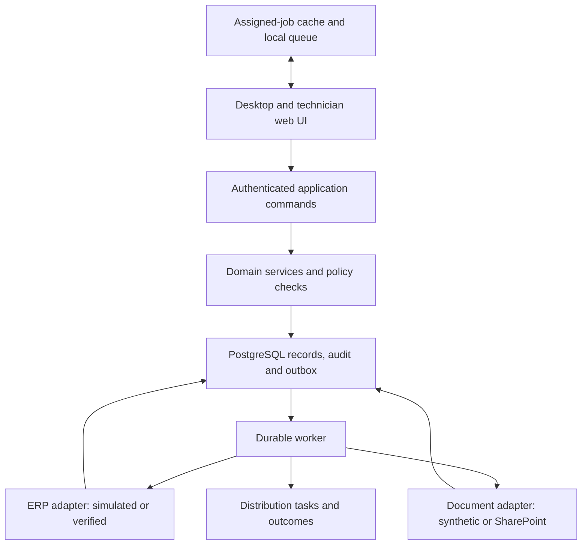

# BP-02 — Platform Solution Architecture

**Edition:** r02 · **Date:** 5 September 2026 · **Scope:** PP-01 synthetic planned-service prototype.

**Status:** Architecture/build contract; bounded P01 implementation and evidence are recorded in [ADR-0006](../decisions/ADR-0006-p01-local-foundation.md). Not production approval. [Package index](../prototype/README.md) · [Data dictionary](../contracts/service-data-dictionary.md) · [API contracts](../contracts/service-api.md).

## 1. Architecture decision

Use a **modular monolith**: one application codebase and transactional database, with explicit domain services and separate adapter boundaries. A web process serves the desktop/mobile interface and authenticated commands. A worker from the same codebase handles durable document generation and integration tasks. Separate deployment of the worker is an operational option, not a requirement to invent independent microservices.

Recommended prototype stack: **TypeScript, React/Next.js App Router, PostgreSQL, SQL migrations, and Playwright for workflow verification**. Use a maintained PostgreSQL driver and parameterised queries behind repositories; select and pin the driver, validation and authentication libraries during P01 after licence/security/compatibility checks. Package-manager and runtime versions are pinned in the implementation commit, not fabricated in this document.

Use a browser service worker plus IndexedDB for a deliberately limited field queue. Offline is an explicit subsystem with recovery tests; it is not implied by responsive design. Use Microsoft Entra-compatible OIDC for the future corporate identity path. The first local-only synthetic build may use a development identity adapter, with server-side role enforcement and an explicit non-production marker. Remote access requires real authentication before exposure.

Use simulated ERP and document adapters initially. Finance follows the specified manual queue. A future SharePoint adapter must preserve supported stable identifiers and exact issued content; a future MYOB adapter must be proven against the actual configured tenant.

See [ADR-0003](../decisions/ADR-0003-prototype-architecture.md) and [ADR-0004](../decisions/ADR-0004-service-authority-and-offline-scope.md). These select the design basis under the requested architecture task while retaining implementation and operational evidence gates.

## 2. Constraints and alternatives

| Option | Advantages for this product | Costs/limitations | Decision |
|---|---|---|---|
| TypeScript/Next.js + PostgreSQL | Shared language for browser/server contracts; suitable interactive planner; portable Node/container deployment | Must enforce server boundaries; caching, background jobs and offline correctness require deliberate engineering | Recommended initial stack |
| ASP.NET Core + React or Blazor + PostgreSQL/SQL Server | Coherent Microsoft-oriented server option; suitable if a C# maintainer is committed | React split adds two language/tool chains; disconnected field use still needs explicit client state/sync design | Viable alternative if actual delivery/support skills favour C# |
| Managed backend platform plus React | Can reduce initial provisioning work | Identity/data policies, job execution, backup/egress and provider coupling need evaluation; does not remove domain integrity work | Reconsider if hosting/support requirements justify it |
| Power Platform extension | Potential reuse of Microsoft components and existing CREMS knowledge | Licensing, deployment model, complex planner/offline customisation and requested web-app independence need account-specific assessment | Retain existing sources; not chosen as new prototype foundation |
| Microservices from the outset | Independent scaling/release boundaries | Distributed consistency, deployment and diagnosis overhead before scale or separate teams are established | Defer until measurable ownership/scaling need |

This is a qualitative assessment. No developer skill survey, supplier quote, load benchmark or corporate licence assessment has been completed. P01 records the selected dependency declarations in its [inventory](../testing/p01-dependencies.json). The recommendation favours a coherent, maintainable first implementation. A stack change is inexpensive before P01 and increasingly costly after persistence/offline contracts are implemented; record any change in a superseding ADR.

Next.js documents Node/container self-hosting and associated operational considerations. ASP.NET Core supports component-based web applications. These capabilities support the options assessment; they do not prove this application's feasibility or your licences. [Next.js self-hosting](https://nextjs.org/docs/app/guides/self-hosting), [ASP.NET Core Blazor](https://learn.microsoft.com/en-us/aspnet/core/blazor/?view=aspnetcore-10.0).

## 3. Logical topology

The diagram describes logical trust and execution boundaries. No service is currently provisioned. Browser code never receives ERP credentials, unrestricted database credentials or app-only Graph tokens.

## 4. Module boundaries

| Module | Owns | May read/request | Does not own |
|---|---|---|---|
| Customer context | Relationship enrichment, contacts, effective site/operator links and owned activities | Verified ERP account references; permitted project/service summaries | Debtor ledger, credit status or ERP account creation |
| Service | Ticket, approved scope, attendance, field evidence, report and follow-up in synthetic mode | Technical releases, material readiness, approved coverage | Stock posting, financial posting or unverified technical authority |
| Scheduling | Appointment proposals, crew reservations, availability and change requests | Service scope/readiness; future project demand | Automatic rewriting of project baselines or labour actuals |
| Documents | Business-object links, manifest, issue/acknowledgement and distribution evidence | Exact repository content through an authorised adapter | Native CAD authoring; unmanaged permission bypass |
| Finance handoff | Review queue, approved allocation, target-line mapping and reconciliation evidence | ERP-owned account/transaction observations | Independent ledger, revenue recognition or bank/payment processing |
| Platform | Identity, permissions, audit, operation receipts, outbox, configuration and recovery | Domain-approved policies | Automatic business approval for administrators |

Other domain modules are future packages. No generic all-purpose entity table should substitute for typed business records. Cross-module commands use explicit service interfaces; a UI component cannot modify another module's tables directly.

## 5. Data model and identifiers

Use UUID internal primary keys generated before offline capture where needed. Human display numbers such as SYN-PPO-WO-000001 are separate, unique within their documented scope, and never substitute for an ERP key. Every record has `workspace_id`; ERP mappings additionally require `erp_connection_id`, `erp_company_id`, `entity_type` and `external_id`. The prototype uses one private workspace but tests two ERP-company references to prevent accidental name-based linking.

Use typed relational tables, foreign keys, unique constraints and explicit junction tables. Many tickets can relate to many work orders; one work order has many appointments; appointments have multiple resource assignments and asset/scope links. Site/operator and asset location/configuration changes are effective-dated. Approved scope, issued documents and reviewed entry sets preserve snapshots.

The [dictionary](../contracts/service-data-dictionary.md) is the field/enum authority for PP-01. Descriptive prose does not silently introduce additional state values. JSON payloads are permitted for validated versioned snapshots, field-type-specific evidence and event metadata; they are not a substitute for relational keys or finance allocation constraints.

Store instants in UTC with an IANA site timezone for display and recurrence context. Store date-only business dates as dates. Money uses exact decimals with ISO currency and an explicit tax basis; quantities use exact decimals and a controlled UOM. Do not use binary floating-point for Finance reconciliation. Names, phone numbers and serials are text. An unknown value is null plus an explicit reason/status where business meaning requires it; zero is a known number.

## 6. Ownership by phase

| Record family | Synthetic prototype | Later operational model |
|---|---|---|
| ERP accounts/items/invoices | Fixture observations, explicitly synthetic | Read from MYOB with verified company/key/cutoff; ERP owns changes |
| Relationship/site/asset enrichment | Platform synthetic records | Field-family ownership agreed under D-011; effective history preserved |
| Tickets/work orders/appointments/time | Platform-owned synthetic records | D-007 chooses ERP-owned extension or platform operational authority; never both writable |
| Financial outcomes | Simulated returned references and reconciliation | MYOB/manual or proven API; Finance owns posting and correction |
| Business documents | Private local synthetic object store outside Git | Approved SharePoint location/version/snapshot policy under D-012 |
| Technical CAD content | Synthetic published-reference documents | Native authoring remains in the validated Engineering environment |

**ERP-owned alternative:** the app drafts requests and extends source records with permitted preparation/mobile evidence; authorisation/confirmation waits for the verified authoritative source outcome where required.

**Platform-owned alternative:** the app owns service operations and submits approved financial/material consequences to MYOB; source references remain explicit. This is the chosen simulation model only. An operational selection needs actual MYOB capability, licences, process-owner acceptance and transaction mapping. Do not silently switch existing in-flight records between models.

## 7. Command, transaction and concurrency model

Every material command includes object identity, expected version and a unique operation ID. The server resolves the authenticated actor and company/site scope; a client-supplied actor or role is never trusted. It validates policy, state, data and source readiness in the same authoritative command path used by desktop and mobile.

Within one database transaction: acquire required locks, check the expected aggregate/policy versions, update the record, append its audit event, insert durable outbox events and store the operation receipt. Commit all or none. A retry with the same identity and payload returns the recorded result. Reuse of an operation ID with different content is rejected. See command contract for retention and partial attachment semantics.

Booking confirmation/movement reserves every crew member atomically. Use database-enforced non-overlap for active resource time ranges and a consistent resource-lock order to avoid crew races. Proposed appointments do not reserve resources. Availability/leave/calendar/skill edits use the same resource lock order and re-evaluate affected future bookings; checking only the booking write path is insufficient. Working-time, competency and travel checks are additional rules; non-overlap alone does not prove readiness. Use half-open intervals `[start,end)` so adjacent visits are allowed only if the explicit travel/buffer reservation also fits.

PostgreSQL range/exclusion constraints support database enforcement of non-overlapping reservations. The implementation must prove the chosen `tstzrange`/resource-key constraint and any required extension on the selected host; the rest of the scheduling policy remains application logic. [PostgreSQL range constraints](https://www.postgresql.org/docs/current/rangetypes.html).

Expected-version checks apply to edits of one booking and its current assignment. Cross-booking resource conflicts require the reservation constraint, not just a row version. A rejected move leaves the original booking unchanged and returns a conflict result with the user's proposal retained for review.

## 8. Reads, caching and updates

Authenticated customer, schedule, financial and document responses are private and must not enter shared public/static caches. Server-side query helpers must apply record scope and return purpose-specific DTOs. UI hiding alone is insufficient. Next.js security guidance supports server-only data access and careful transfer of client-visible data; this design additionally mandates domain-specific authorisation on every action. [Next.js data security](https://nextjs.org/docs/app/guides/data-security).

Initial planner updates use explicit refresh plus a configurable short polling interval while the page is visible. Push notifications or server events may be added after correctness is established; they are hints to refresh, never booking authority. Every mutation rechecks current state even if the view looks current. Query responses show `observed_at`, record version, completeness and any source-as-at.

External refresh writes a new observation/import-run status. It cannot rewrite an approved historical snapshot. An incomplete or failed refresh does not replace the last good data with empty data or zero balances. Show the last successful observation with its age and explicit current failure. Material commitments require source verification according to the policy; the prototype does not invent a universal freshness threshold.

## 9. Background processing and integration recovery

Use a PostgreSQL-backed outbox/work queue initially. Jobs have type, payload version, correlation/operation IDs, status, attempts, lease expiry, next attempt time and last classified error. A worker claims jobs transactionally, renews or releases its lease and records the result. Recover expired leases after process failure.

Delivery is at least once. Consumers deduplicate by durable identity; there is no claim of universal exactly-once delivery. Bounded retries apply to confirmed transient read/generation failures. Permanent validation/access errors enter an owned exception queue. Any external command with an unknown outcome is quarantined for lookup/reconciliation before another equivalent command.

Separate `ErpReadAdapter`, `ErpCommandAdapter`, `DocumentStoreAdapter` and `DistributionAdapter`. Simulation mode is explicit in configuration, records, badges and exported evidence. A feature flag cannot make an unverified endpoint production-ready. In PP-01 the command adapter simulates outcomes only; manual Finance processing records operator-entered synthetic results.

Interface rollout evidence must include exact endpoint/entity/action, authentication/grants, source version, request/response examples, pagination/delta/reversal handling, rate limits, external idempotency capability, timeout recovery, least privilege and reconciliation. No Acumatica endpoint name or ERP record number is asserted here.

## 10. Identity and access design

Use opaque server-managed sessions in secure HTTP-only cookies for the web application, with appropriate CSRF/origin checks for mutations and session expiry/re-authentication. A maintained OIDC implementation should handle protocol details. Entra tenant/client/grants/MFA configuration remains D-020; no application registration is created by this package.

Authorisation combines permissions with workspace/company/site/assignment scope. Role grants and business approval delegations are separate. A Systems administrator is not automatically a Finance reviewer or technical approver. Use typed capabilities such as `service.scope.authorise`, `schedule.confirm`, `pack.issue`, `field.capture.own`, `report.issue`, `finance.review`, `finance.process` and `finance.reconcile`.

Apply the same boundary to APIs, search suggestions, downloads, preview thumbnails, export jobs, notifications and support views. Do not disclose the existence/title of inaccessible files. Where an app-only document credential can access more than a user, the application must independently enforce user/document scope and must not offer arbitrary repository browsing.

The local development identity adapter must be disabled unless the environment is explicitly local and synthetic. Reject startup with that adapter in a remote/shared environment. Role switching in a local demo changes the server session and audit actor; a browser-only role selector is not an authorisation test.

## 11. Offline boundary and durability

The first offline scope is assigned job-pack/history reading, pack acknowledgement intent, local attendance intent and capture of time, parts, observations, checklist results, photos and report-response evidence. Issuing packs/reports, confirming bookings, approving scope, Finance processing and source refresh require the server. Offline customer response binds an already-issued/cached report revision; local draft work can instead be acknowledged as a draft evidence snapshot with an explicit label and later review.

Local IndexedDB stores operation envelopes and approved cached metadata; attachment blobs are staged with size/hash and upload dependencies. Request persistent storage and check available quota. Report a save as **Saved on this device** only after the local transaction succeeds. If quota/write fails, retain the form in memory where possible, show the failure and stop claiming durability. Browser storage can be evicted or cleared; persistence requests are not guaranteed. Real device validation remains essential. [Browser storage limits](https://developer.mozilla.org/en-US/docs/Web/API/Storage_API/Storage_quotas_and_eviction_criteria).

Use one outbox coordinator per profile with a lock/lease; a second tab can view status but cannot duplicate submission identity. Server receipts remain the final deduplication control. A service worker upgrade must not clear unsent data. Payloads include schema versions; incompatible operations are retained and migrated by a tested routine or quarantined with an export/recovery path.

On reconnect, re-authenticate and revalidate permissions, assignment, pack/scope versions and cancellation. Original capture time, server receipt time and cached authority evidence remain distinct. If the actor still has access but the assignment changed, capture is preserved as `ReviewRequired`; it does not authorise new work. If ordinary business access was revoked, a narrowly scoped recovery route may accept only the actor's previously issued upload capability and original evidence into a restricted queue. Without that separately authorised recovery capability, keep encrypted/device-protected evidence locally and direct the user to the approved recovery process; do not open a general revoked-user API.

Cache policy for synthetic testing: at most two downloaded upcoming appointments, explicit cache age display, and a configurable simulated expiry of 24 hours. This is a test parameter, not a field-service promise or approved retention rule. Expiry blocks claiming current authority; it does not delete unsent evidence. Real device management, encryption, offline duration and revocation controls remain D-016/D-020.

## 12. Documents and file security

Use exact source versions and content hashes at issue time, plus a retained rendered output and manifest. Hashes establish byte identity; they do not themselves enforce retention, authenticity or access. The final issue pointer is committed only when the rendered object is durable and verified. Failed generation/upload leaves an incomplete attempt, not an Issued badge.

Store files outside Git and outside the application container's ephemeral filesystem. For local synthetic development use a private data directory excluded from Git; for later hosting select protected object storage for transient processing and the approved SharePoint repository for business records. Explicitly expire staging files according to policy after durable issue confirmation; preserve referenced issue content under approved retention/hold.

Allowlisted upload types, size limits, content inspection, safe rendering, malware scanning/quarantine and authorisation precede publication. Never fetch arbitrary user URLs from the server. File access uses authorised stable IDs; short-lived download URLs are not persisted as durable identities or logged with tokens.

Microsoft Graph exposes selected-permission patterns and version-specific DriveItem operations. Actual consent/resource grants and available historical versions need tenant tests. Do not equate ordinary version history with guaranteed immutable retention. [Selected permissions](https://learn.microsoft.com/en-us/graph/permissions-selected-overview), [DriveItem versions](https://learn.microsoft.com/en-us/graph/api/driveitemversion-get?view=graph-rest-1.0).

## 13. Deployment recommendation and cost model

| Environment | Recommended form | Data/access | Current status |
|---|---|---|---|
| Local development | Node application and PostgreSQL, optionally reproducible containers; local synthetic document store | Synthetic only; local identity adapter permitted | P01 local shell/database implemented; document store remains a stub |
| Automated test | Disposable PostgreSQL and isolated test data/files; browser tests | Synthetic identities and simulated adapters | P01 PostgreSQL/HTTP/browser CI executed; see the handover |
| Private remote prototype | Container-capable hosting plus managed PostgreSQL, real authentication, protected file staging, logs and backup | Synthetic only until separately authorised | Azure Container Apps is the preferred option to assess; no purchase/deployment selected |
| Operational pilot/production | Separately provisioned and approved environment with real identity/source contracts/support | Approved users and data | Out of current implementation authority |

Compare Azure container hosting/managed PostgreSQL with a managed Next.js host plus PostgreSQL provider. Microsoft alignment may simplify support ownership if the business already uses Azure, but that subscription and capability are unverified. A single VM can reduce service count but transfers patching, database backup and recovery work to its operator. Static-only hosting cannot fulfil this transactional design.

The cost worksheet must price: web instance/runtime, worker execution, database compute/storage/backup, file staging, network egress, logs/retention, identity/licences, domain/certificates, CI usage and support labour. Record region, currency, GST basis, hours/minimum replicas, storage growth, backup retention and quote date. Calculate monthly total from those priced quantities and separate once-off development from recurring spend. **No defensible monthly total is available without those inputs; no paid service or budget is approved.**

P01 is explicitly local-only under Dean's implementation instruction. Defer hosting selection and costed deployment to a separately authorised remote increment; P01 includes no remote provisioning or publishing.

## 14. Application structure to create during implementation

| Proposed path | Responsibility |
|---|---|
| `src/app/` | Routes, layouts, server entry points and page composition |
| `src/modules/customers/` | Customer/site/asset/context services and scoped DTOs |
| `src/modules/service/` | Tickets, scope, packs, field evidence, reports and follow-up |
| `src/modules/scheduling/` | Reservations, policy evaluation, planner queries and change requests |
| `src/modules/finance/` | Handoff review, allocation, mappings and reconciliation |
| `src/platform/` | Session/authz, database transaction helpers, audit, operations and outbox |
| `src/adapters/` | Simulated and future source-specific adapters |
| `src/components/` | Shared accessible visual components; no business authority logic |
| `src/offline/` | Local store, queue, migrations, upload dependencies and recovery |
| `db/migrations/` | Reviewed forward migrations and recovery notes |
| `tests/fixtures/` | Synthetic deterministic seed definitions |
| `tests/integration/`, `tests/e2e/` | Database/API and full browser workflow tests |

This table is a proposed structure; empty code folders are not created by the package. The existing Python foundation checker remains a documentation utility and does not dictate the application stack.

## 15. Testing and measurable targets

Use meaningful unit tests for pure policy/state/quantity calculations; PostgreSQL integration tests for concurrency, deduplication and allocation; browser tests for end-to-end workflow, role boundaries and interrupted capture; representative real-device tests for storage/offline/lost-connectivity behaviour. Browser emulation alone cannot prove actual device durability.

Playwright can test network/offline conditions, but service workers can affect interception and test behaviour. Run explicit service-worker-enabled offline tests in addition to ordinary isolated tests; do not disable the very subsystem whose behaviour is being asserted. [Playwright service workers](https://playwright.dev/docs/service-workers).

| Target | Synthetic measurement contract | Operational status |
|---|---|---|
| Core read performance | Candidate p95 ≤3 s for customer, work order, planner and My Jobs; 1,000 customers, 5,000 assets, 10,000 appointments, 10 simulated concurrent users, controlled network; record hardware/build and cold/warm distinction | Candidate from NFR-04; benchmark not run |
| Booking integrity | Two competing confirmations/moves cannot reserve overlapping active crew time; no lost update | Hard prototype acceptance PT-08/PT-09 |
| Capture integrity | Replaying 100 identical operations yields 100 original records, not 200; same-key/different-payload rejected | Hard prototype acceptance PT-12 |
| Accessibility | Target WCAG 2.2 AA for selected workflow; keyboard planner/form errors, screen reader names, touch/reflow and focus tests | Proposed target; no conformance claim |
| Restore | Reconstruct database, referenced files, queue and config in clean environment; prove no duplicate handoff on replay | PT-22; operational RPO 15 min/RTO 4 h remain unapproved candidates |
| Offline | Two cached synthetic jobs; reload/browser restart, failed upload, expired cache and assignment change | PT-11/PT-12/PT-24; actual mobile/browser matrix not yet agreed |

Generated PDFs need their own reading-order/contrast/long-content assessment. A browser screenshot test does not establish PDF accessibility. Full audit criteria remain [W3C WCAG 2.2](https://www.w3.org/TR/WCAG22/), used as a proposed product target.

## 16. Audit, monitoring and support

Audit material commands with event ID, actor/session, effective permission, object/version, operation/correlation ID, UTC time, source context, safe before/after summary, reason, outcome and linked evidence. Do not log secrets, access tokens, full customer signatures, unrestricted notes or downloaded file URLs. Append-only application permissions protect audit rows; stronger independent/tamper-evident retention is a later operational design decision.

Expose health and owned queues for document failures, missing acknowledgements, sync conflicts, expired job leases, incomplete imports, Finance returns and unknown external outcomes. Metrics are defined by state and scope; an empty queue due to failed loading is not zero. Support diagnostics reveal correlation IDs and redacted error categories.

A future support model must name business first-line and technical escalation, availability hours, incident severity, dependencies and credential recovery. The private prototype has Dean as owner; no colleague is assigned or notified by this package. No 24/7 service is promised.

## 17. Releases, configuration and recovery

GitHub branches/PRs carry code, schema, contract and test changes together. Pin dependency versions with a lockfile; review security advisories and licences at implementation. CI should check types/lint, build, migrations, meaningful tests and dependency risks when code exists. Documentation checks remain separate evidence.

Version business configuration independently of software. Scheduling policies, pack/report templates, coverage rules and Finance definitions have draft/published versions and effective dates. Publishing identifies affected future work and creates review tasks; it does not silently reprice, reassign or reinterpret issued records.

Use expand/migrate/contract database changes where old clients may still submit. Support a declared minimum offline payload version. Preserve incompatible payloads for controlled migration/review. Deployment rollback does not undo an ERP transaction, customer communication or issued report; reconcile those consequences explicitly.

Backup scope includes database, document objects/manifests, approved configuration, audit/outbox and recovery instructions. Recovery secrets/keys are managed separately. Restore into an isolated environment with external outbound commands disabled; compare record counts, file hashes and processing receipts, then classify outstanding operations before enabling workers. Do not promise the candidate 15-minute RPO without configured backup capability and a measured rehearsal.

## 18. Open architecture evidence and stopping conditions

P01 must prove a reproducible build, migrations, database reservations, the selected identity boundary and basic browser storage on the chosen development environment. P08 proves offline durability before a mobile-ready claim. P10 proves Finance mapping/replay. P12 proves restore and remote authentication before any shared prototype.

D-005/D-006/D-007 block real ERP operation; D-012 blocks real SharePoint issue/retention claims; D-016/D-020 block operational offline access; D-017 blocks verified real financial measures; D-022/D-023 block purchased hosting/production support commitments. None of these prevents writing or testing synthetic code using the explicit adapters and fixtures.

P01 has implemented and verified the bounded local foundation under Dean's authority; see the [handover](../delivery/p01-handover.md). The broader architecture remains a test obligation for subsequent increments. P01 proof does not establish complete workflow, offline or operational readiness.
