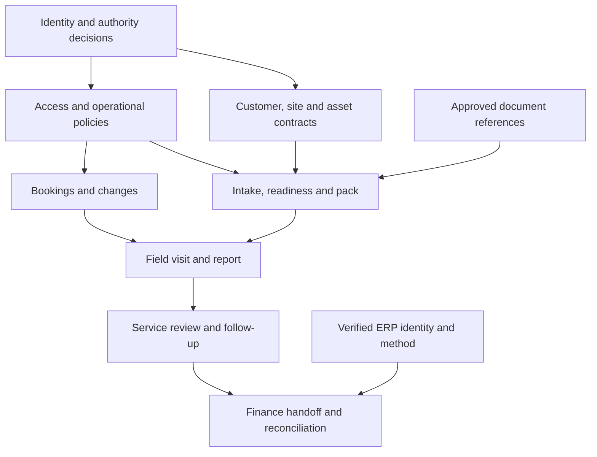

# Powerplants One — Business Operations Platform

## Master Business & Build Blueprint — working r03

### Scope Assurance & Development Planning Edition

**Controlled planning baseline — For business review and scoped discovery**

| Document control | Value |
|---|---|
| Prepared for | Powerplants Australia |
| Requested by | Dean Fiedler |
| Document reference | PPO-BP-01 |
| Version and date | r03 — 5 September 2026 UTC; naming/ownership amendment to issued v02 |
| Document status | Draft target-state blueprint; business and technical approval not yet recorded |
| Authoring basis | User requirements, supplied CREMS materials, prior read-only account observations and selected official sources |
| Intended audience | Executive sponsor, departmental process owners, product owner, solution architect, delivery partners and acceptance reviewers |
| Handling | Recommended internal distribution; contains business-system design information |
| Programme reference | PPO — user-adopted independent private-project code; unrelated SOL008/STD-001 do not govern this project |
| Supersedes | Master Blueprint v01 as the proposed planning baseline; v01 and its audit remain preserved historical records. The CREMS current-state specification remains a separate source |
| Change basis | v02: Audit findings F-01–F-16. r03: user adoption of independent PPO naming and ADR-0005; baseline requirement scope unchanged |
| Working application name | Powerplants One — user-confirmed; private repository foundation and PP-01 design package delivered |
| Authorisation represented | Current amendment implements the user-adopted naming standard in the private repository; application implementation remains a separate task |

> **Working amendment:** [ADR-0005](../decisions/ADR-0005-project-naming-adoption.md) records the naming adoption. The [issued v02](../reference/baselines/GEN_SPC_PPABusinessPlatform_MasterBlueprint_v02.md) remains unchanged and continues to own baseline register wording. [Current status](../STATUS.md) and the [PP-01 package](../prototype/README.md) record later decisions. Historical source discussions below retain their original context.

> **Decision requested:** Review and agree the business direction, operating responsibilities, scope boundaries and discovery priorities in this blueprint. Approval of the document does not authorise production deployment, migration, financial transactions, organisational restructuring or supplier commitments.
>
> **Reading rule:** Unless explicitly identified as a user-confirmed intention or a source observation, the architecture, workflows, requirements, priorities and targets below are proposals for the future platform. They are not claims about existing production functionality.

---

## Contents

1. [Executive direction](#01-executive-direction)
2. [Document purpose and governance](#02-document-purpose-and-governance)
3. [Evidence baseline and current-state interpretation](#03-evidence-baseline-and-current-state-interpretation)
4. [Business scope and design principles](#04-business-scope-and-design-principles)
5. [Operating model and accountability](#05-operating-model-and-accountability)
6. [End-to-end business journeys](#06-end-to-end-business-journeys)
7. [Shared information model and ownership](#07-shared-information-model-and-ownership)
8. [Conceptual platform architecture](#08-conceptual-platform-architecture)
9. [CRM capability blueprint](#09-crm-capability-blueprint)
10. [Estimating and quotation capability blueprint](#10-estimating-and-quotation-capability-blueprint)
11. [Engineering and design control capability blueprint](#11-engineering-and-design-control-capability-blueprint)
12. [Projects and commercial delivery capability blueprint](#12-projects-and-commercial-delivery-capability-blueprint)
13. [Service operations capability blueprint](#13-service-operations-capability-blueprint)
14. [Supply chain capability blueprint](#14-supply-chain-capability-blueprint)
15. [Finance and commercial controls capability blueprint](#15-finance-and-commercial-controls-capability-blueprint)
16. [Documents, knowledge and communications](#16-documents-knowledge-and-communications)
17. [Company-wide assurance and supporting functions](#17-company-wide-assurance-and-supporting-functions)
18. [Cross-module business-rule register](#18-cross-module-business-rule-register)
19. [Integration and update behaviour](#19-integration-and-update-behaviour)
20. [User experience and screen families](#20-user-experience-and-screen-families)
21. [Security and non-functional requirements](#21-security-and-non-functional-requirements)
22. [Business outcomes and measure dictionary](#22-business-outcomes-and-measure-dictionary)
23. [Controlled blueprint and specification set](#23-controlled-blueprint-and-specification-set)
24. [Delivery strategy and release sequence](#24-delivery-strategy-and-release-sequence)
25. [Proposed first operational release](#25-proposed-first-operational-release)
26. [Acceptance and assurance catalogue](#26-acceptance-and-assurance-catalogue)
27. [Migration, coexistence and cutover](#27-migration-coexistence-and-cutover)
28. [Delivery team, commercial evaluation and operations](#28-delivery-team-commercial-evaluation-and-operations)
29. [Decisions, assumptions and programme risks](#29-decisions-assumptions-and-programme-risks)
30. [Immediate work packages and review decision](#30-immediate-work-packages-and-review-decision)

Appendices: [A — Sources](#appendix-a--source-and-evidence-register) · [B — Traceability](#appendix-b--requirement-to-source-and-acceptance-traceability) · [C — Glossary](#appendix-c--controlled-business-glossary) · [D — Document assurance](#appendix-d--document-assurance-and-review-record)

---

## Register navigation

| Reader need | Go directly to |
|---|---|
| Executive decision and change summary | [Decision brief](#15-v02-decision-brief) · [Amendment record](#26-v02-amendment-record) |
| Exact requirement disposition and release | [78-parent traceability](#appendix-b--requirement-to-source-and-acceptance-traceability) |
| Legacy behaviour and CRM parity | [CREMS dispositions](#104-crems-behaviour-disposition-register) · [CRM parity](#93-pipedrive-parity-and-outcome-register) |
| Shared records and ownership | [Pilot data contracts](#75-first-release-logical-data-contracts) · [Transitions](#183-first-release-state-and-actor-contracts) |
| Interfaces and money | [Supply-chain contracts](#196-supply-chain-operation-contracts) · [Finance definitions](#154-release-finance-definition-register) |
| Delivery and acceptance | [Specification work scopes](#234-development-specification-work-scopes) · [Release contract](#255-wave-a-release-contract) · [Additional acceptance](#264-v02-acceptance-elaborations) |
| Outputs and source transition | [Output register](#161-document-output-register) · [Smartsheet transition](#275-smartsheet-asset-transition-register) |
| Development governance and remaining decisions | [GitHub plan](#285-proposed-name-and-github-development-plan) · [Open decisions](#291-open-decision-register) · [Finding response](#d2-audit-finding-response-register) |

---

## 01. Executive direction

### 1.1 Recommended outcome

Powerplants should develop a connected business operations platform supporting the lifecycle of a horticultural customer, facility and equipment installation: enquiry, commercial qualification, technical scoping, estimating, quotation, engineering, procurement, project delivery, commissioning, handover and ongoing service.

The proposed web application provides a consistent working environment across these activities. MYOB Acumatica remains the authoritative ERP. SharePoint remains the controlled business-document repository. Engineers continue to author designs in suitable CAD tools.

The platform should support ordinary product transactions and service visits as efficiently as it supports complex greenhouse projects. Professionalism is defined by usable workflows, reliable information, clear authority, traceable decisions and sustainable operation, as well as visual quality.

### 1.2 Business priorities

| Priority | Business outcome | Initial evidence of improvement |
|---|---|---|
| Prepared field work | Technicians receive an issued job pack and relevant history before attendance | Pack readiness, acknowledgement and dispatch-exception measures |
| Reliable scheduling | Service can see availability, rearrange appointments and identify consequences | Conflicts detected, changes acknowledged and fewer avoidable booking failures |
| Preserved customer context | Staff can identify the customer, actual site, equipment and previous work | Correct record linkage and reduced searching/re-entry |
| Commercial control | Accepted scope, pricing and subsequent changes remain traceable | Approved variations, preserved baselines and reconciled ERP references |
| Controlled delivery | Engineering, procurement, installation and commissioning dependencies are visible | Evidence-backed readiness and staged acceptance |
| Financial confidence | Users see appropriately reconciled account and project measures | Defined measures, source dates and exception visibility |
| Sustainable ownership | Powerplants can support, secure and improve the platform | Named owners, tested recovery and maintained documentation |

These are intended outcomes. Baseline performance and quantitative improvement targets are not yet established.

### 1.3 Immediate recommendation

Complete bounded discovery and validate the highest-risk assumptions before committing to a production architecture or a full replacement programme. Prepare first-pass specifications for all seven business modules; deepen the first-release specifications only after shared responsibilities and integration boundaries are agreed.

The provisional first operational release is the customer/site/equipment foundation plus a complete planned service-visit workflow. This is a recommended starting point because the user has identified concrete service problems. It is not an approved delivery commitment and must pass the release-selection process in Section 24.

### 1.4 Decisions still open in v02

- No development supplier, budget, contract, delivery date or technology stack has been selected.
- No production API, security role, accounting rule or CAD integration has been verified.
- No company reporting line or delegated financial authority has been approved.
- No existing application has been approved for retirement.
- No proposed module is assumed to require its own application, database or microservice.
- No statutory compliance, technical certification or production-readiness determination is made by this document.

### 1.5 v02 decision brief

**Recommendation:** use this edition to agree a bounded discovery and first-release design package. Develop one complete planned-service journey on shared customer, site, asset and document foundations, while retaining MYOB financial authority and current applications until their replacement scope is accepted. Confirm that choice at G1; the scope allocation below is a planning recommendation.

| Review question | Recommended position | Decision still required |
|---|---|---|
| What is the programme? | One integrated business operations platform across seven core domains, with common records and controls | Sponsor mandate and accountable process owners: D-001/D-002 |
| What is retained? | MYOB as ERP authority; SharePoint for controlled business documents; appropriate native CAD tools | Exact field/operation ownership and configuration: D-005–D-008/D-011/D-012 |
| What is built first? | Wave A: prepared and scheduled planned visits, field evidence, reviewed reports and traceable financial handoff | Cohort, authority, devices and measurable acceptance: D-004/D-007/D-015/D-016 |
| How is cost controlled? | Estimate the agreed release by testable vertical slices after critical feasibility evidence; retain later scope as a bounded backlog | Budget, delivery capacity and support commitments: D-023 |
| What is v02 ready for? | Process-owner review, scoped discovery, solution-option evaluation and development planning | G0/G1 endorsements remain unrecorded; G2 build approval requires further evidence |

The main change from v01 is decision precision. All 78 parent requirements now have an individual source, owner, release allocation, dependency, specification home and planned acceptance reference. The new registers make retained behaviour, changed behaviour, manual handoffs and unresolved implementation facts explicit. This is not a declaration of complete Pipedrive parity or a substitute for the missing CREMS formulas and tenant contracts.

For leadership, read Sections 01, 24–25 and 29–30. Domain owners should read their module plus Appendix B. Architecture and delivery reviewers should also read Sections 07, 18–19, 21, 23 and 26–28. Appendix D records document assurance and the remaining closure work for every audit finding.

---

## 02. Document purpose and governance

### 2.1 Purpose

This blueprint creates the common business and build baseline for the future programme. It is suitable for stakeholder review, discovery planning, architecture options, module scoping, delivery-partner briefing and initial acceptance planning.

It is not a physical database schema, final API contract, complete screen specification, employment structure, signed business case or production implementation manual. Those outputs depend on decisions recorded in Section 29.

### 2.2 Evidence labels

| Label | Meaning | Treatment |
|---|---|---|
| UC — User-confirmed intention or issue | Expressly stated in this conversation | Preserve as a business input; it does not prove technical implementation |
| DG — Documented guide behaviour | Described in the supplied CREMS guide | Validate before relying on it for a replacement |
| PO — Prior observation | Observed in an earlier read-only sample in this conversation | Scope- and time-limited; do not extrapolate to the whole organisation |
| ER — External reference | Official/public documentation supporting a design consideration | Does not prove Powerplants licensing, configuration or adoption |
| PR — Proposed requirement or design | Recommended future behaviour | Requires business/technical review at the applicable gate |
| UQ — Unresolved question | Missing fact, policy, threshold or decision | Keep visible with an owner role and closure evidence |

UC, DG and PO are different kinds of evidence. Agreement with a business objective does not approve a database design; a guide statement does not establish that a live integration currently works.

### 2.3 Requirement language

“Shall” in the controlled requirement and rule registers means a proposed acceptance obligation if that capability enters an approved release. “Should” is a recommendation; “may” is optional. Until approval, all new requirement rows are PR.

Requirement IDs belong to this blueprint and are not ERP references. Their families are CRM, EST, ENG, PRJ, SVC, SCM, FIN, DOC and NFR. BR identifies shared business rules; IF identifies integration contracts; AT identifies acceptance scenarios; KPI identifies measures; D identifies open decisions; R identifies programme risks.

IDs remain stable when wording is refined. Withdrawn entries are marked withdrawn with a reason rather than silently renumbered.

### 2.4 Document precedence

For target-state requirements, the approved master scope and decision register take precedence over module proposals. Module specifications add detail within those boundaries. Accepted architecture decisions govern technical implementation. Tests provide evidence of conformity; they do not silently redefine requirements.

The CREMS v05 specification remains a separate guide-derived current-state reference. Its assumptions, proposed enhancements and legacy constraints must not be imported as approved future requirements without review.

### 2.5 Change control

Every material scope or policy change records the reason, affected requirements, data/integration effects, delivery and support impact, decision owner and approval. Changes to security, money, ERP writes, issued documents and booking authority require explicit impact review.

Editorial corrections may be bundled. New versions should be driven by new evidence or decisions, not repeated expansion for its own sake.

### 2.6 v02 amendment record

| Amendment | Concrete change | Audit findings |
|---|---|---|
| AP-01 | Decision brief, register navigation, proposed name and development governance | F-09, F-16 |
| AP-02 | Individual traceability for all 78 stable parent requirements, including release slices and planned acceptance | F-01, F-07 |
| AP-03 | CREMS material-behaviour dispositions and assessed initial Pipedrive capability inventory | F-02, F-03 |
| AP-04 | Shared logical contracts, actor transitions and explicit supply-chain interfaces | F-04, F-05, F-06 |
| AP-05 | First-release contract, dependencies, cohort criteria, permissions and operational targets | F-05, F-07, F-12, F-14 |
| AP-06 | Smartsheet asset transition, dependency semantics and unresolved design-release authority | F-06, F-10 |
| AP-07 | Controlled output register, financial definitions and cross-department reporting catalogue | F-08, F-13, F-15 |
| AP-08 | BP-02/BP-07 work scopes, other module specification packages and specialist workflow inventory | F-11, F-12 and remaining module detail |

The 30 numbered sections and 78 parent requirement IDs are retained. New planning registers use their own prefixes; they elaborate parent scope rather than creating implicit contractual commitments. All proposed owners are role assignments pending named acceptance. All software acceptance scenarios are **planned, not executed**. A document amendment can be complete while its business decision or technical proof remains open.

---

## 03. Evidence baseline and current-state interpretation

### 3.1 What is established

The user has confirmed that Powerplants:

- sells products and services for commercial horticulture and delivers large greenhouse-related projects;
- uses CREMS for pre-order commercial work, Pipedrive for CRM and Smartsheet for project tracking;
- intends to retain MYOB Acumatica as the main ERP and SharePoint for documents;
- has Sales/Commercial, Estimating, Projects, Engineering, Service, and inventory/purchasing/shipping responsibilities;
- needs better issued job packs, visual technician scheduling and contextual service history;
- wants a professional, integrated web application with substantially stronger CRM capabilities.

These statements are UC inputs, not an approved organisation chart.

Powerplants’ professional-services page describes feasibility, design, engineering and project management, including involvement in horticultural developments valued from $2 million to over $40 million. Those are development values, not verified Powerplants contract values. [Powerplants Professional Services](https://powerplants.com.au/products/Professional-Services/) [SRC-06]

### 3.2 CREMS evidence to retain

The guide, stated accurate as of 1 September 2026, describes a controlled enquiry-to-order process with routing, technical questionnaires, estimate and quote versions, approvals, specialised Screen Systems configuration and MYOB conversion. [SRC-02]

The following concepts remain candidates for preservation; Section 10.4 now assigns explicit proposed dispositions:

- different routes for Project, Sales Order and Service Order work;
- separate opportunity, option, estimation revision, estimate and quotation concepts;
- versioned questionnaire definitions and captured answers;
- staged editing, explicit save/discard and locked commercial snapshots;
- catalogue, supplier cost, currency and pricing provenance;
- one-off item resolution before external conversion;
- recorded approval and customer-response evidence;
- recovery when one part of an external conversion succeeds and a later step fails.

The guide’s introductory “three write moments” is a simplified lifecycle explanation. Its detailed master-data and item-resolution behaviour, also discussed in the v05 report, identifies additional ERP writes. The future interface catalogue must enumerate every operation; it must not assume that only three writes exist. [SRC-02; SRC-03, Section 22]

The documented use of a prepayment answer in CREMS routing is not evidence that a deposit has been received or configured in MYOB.

### 3.3 Earlier Pipedrive and Smartsheet observations

Earlier in this conversation, a read-only review inspected Pipedrive stages and a sample of 60 recently updated open deals. Examples included maintenance agreements, controls upgrades, automation and new-facility enquiries. This supports varied work types; it is not a complete feature inventory or a statement of total pipeline size. [SRC-04]

The Smartsheet review inspected the PPA Project Delivery System prototype structure and representative sheets. It found design foundations for project tiers, readiness, deliverables, service intake, competency profiles and finance reconciliation. Some records were explicitly templates, synthetic profiles or migrated historical information. [SRC-05]

The subsequent audit refreshed selected account evidence on 4 September 2026 UTC. Section 3.6 carries those bounded observations into v02; this authoring task does not claim a new live account audit. No live portfolio total, financial total, schedule reliability score or production-adoption claim is asserted.

### 3.4 Review performed for this edition

The v01 preparation rechecked the supplied DOCX’s opening purpose and relevant content, the guide chapter index, existing source extracts, selected routing/update sections of the v05 report and the existing v05 assurance report. Its subsequent audit compared targeted CREMS passages and refreshed selected account observations. This v02 preserves that evidence, implements the sixteen audit findings as planning amendments, and checks requirement/register consistency. It does not repeat a full page-by-page or live-code audit.

The three supplied guide formats represent the same source baseline; they are not three independent confirmations. The prior audit’s conclusion is historical evidence about that report, not certification of the new platform.

### 3.5 Critical missing evidence

Before implementation, obtain the current CREMS solution/configuration exports, calculation and questionnaire rules, actual MYOB endpoints and transaction examples, approved pricing policies, current document templates, SharePoint configuration, CAD file-management details, operating procedures, real device/connectivity information, permissions and financial measure definitions.

Detailed ownership and closure requirements appear in D-001 to D-029. The proposed data contracts and transition tables below make the design reviewable without claiming those decisions have closed.

### 3.6 Evidence carried forward from the audit

The exact v01 and its audit were resolved before preparing this edition. The v01 SHA-256 is `5eb13042a04f1ad6d593ea06e01ca840a82a52f50a93f0f2e405d301eda6426d`; v01 is retained without editing. Sources SRC-15–SRC-19 add the baseline, audit and bounded follow-up observations to the existing source register.

| Evidence carried into v02 | What it establishes | What remains unverified |
|---|---|---|
| Ten Pipedrive stage records across pipeline IDs 1 and 6, retrieved 4 September 2026 UTC | Stage names, order, probabilities and ageing settings in Section 9.4 | Pipeline names, complete account usage, plan/add-ons, automation, custom fields and migration completeness |
| Smartsheet conflict-rule sheet: eight rules marked Design Only and disabled | Useful proposed scheduling checks exist as prototype records | No evidence those checks execute in daily operations |
| Smartsheet project-plan template: 25 rows; native dependencies and legacy predecessor references differ | Dependency migration needs a semantic review; a simple text-chain import would be unsafe | Gantt engine results, every live project, calendars and operational adoption |
| Smartsheet finance-definition sheet: 13 control rows | Some definitions remain unresolved despite other rows showing successful checks | Financial figures and reconciliations were not independently re-performed |
| Targeted CREMS guide comparison | The behaviour distinctions in Section 10.4 are documented or explicitly labelled as proposed improvements | Complete formulas, executable logic, live permissions and actual API contracts |

The historical statement of 83 active projects is user-provided context, not a refreshed portfolio count. The earlier 60-deal sample remains historical context; this edition does not claim that full sample was reproduced. Source inspections in the audit were read-only. No GitHub account, repository or development environment has been configured for this programme.

---

## 04. Business scope and design principles

### 4.1 Programme capability boundary

| Capability | Target treatment | Scope note |
|---|---|---|
| CRM and customer development | Core programme domain | Retain required Pipedrive outcomes; confirm detailed parity/migration needs |
| Estimating and quotations | Core programme domain | Preserve validated CREMS strengths and improve identified workflow gaps |
| Engineering and design control | Core programme domain | Coordinate design work and releases; retain specialist authoring tools |
| Project and commercial delivery | Core programme domain | Proportionate controls for upgrades and major projects |
| Service operations | Core programme domain; first-release candidate | Includes planned and reactive work, job packs, scheduling and history |
| Supply chain coordination | Core programme domain | Integrate with authoritative ERP purchasing and stock |
| Finance visibility and controls | Core programme domain | ERP-backed transactions, definitions and controlled operational forecasts |
| Documents, search, tasks, approvals and notifications | Shared foundation | One coherent user experience with role-appropriate views |
| QHSE, competencies and biosecurity | Shared operational controls | Depth depends on actual activities and jurisdiction |
| Customer/partner portals | Later candidate | Requires external-identity and information-release design |
| Workshop/production and fleet/tool management | Conditional | Confirm business need and existing MYOB capability |
| Telemetry, remote alarms and AI assistance | Later candidate | Separate business case, access controls and supported interfaces |
| Full payroll/HR replacement, CAD editor, ERP ledger replacement | Excluded from initial programme scope | Integrate or retain appropriate systems |
| Autonomous customer-equipment control | Excluded from initial scope | Any later proposal requires a separate approved safety/security design |

### 4.2 Design principles

1. **Business outcomes first.** Each release solves a complete, measurable workflow.
2. **One authoritative owner per information element.** Domain-specific views may differ; ownership and update rights are explicit.
3. **Connected records.** Use stable references across customer, site, asset, commercial and operational records.
4. **Proportionate controls.** Apply complexity, risk and contractual criteria rather than a single financial threshold.
5. **Preserved commitments.** New prices, drawings and forecasts do not silently change previously approved or issued records.
6. **Visible exceptions.** Missing, stale, blocked, failed and unknown are meaningful states; they are not green or zero.
7. **Controlled actions.** Authority is checked for the particular record, action and state.
8. **Usable field experience.** Technicians can prepare, act and record with minimal avoidable re-entry.
9. **Supportable design.** Powerplants retains practical control of code, configuration, data and operational knowledge.
10. **Evidence before retirement.** Existing systems remain available until their replacement scope is accepted and reconciled.

### 4.3 Build, configure, integrate or retain

Each capability receives a documented option assessment. A common user experience may be achieved through custom development, supported MYOB configuration, integration or temporary retention. A full clone of every Pipedrive or Smartsheet feature is not presumed.

Compare functional fit, interface maturity, mobile suitability, security, licensing, delivery risk, whole-of-life cost, data portability and maintainability. Weighted scoring may be used after stakeholders agree the weights; scores must not conceal a disqualifying control failure.

---

## 05. Operating model and accountability

### 5.1 Proposed functional grouping

| Group | Functions | Boundaries |
|---|---|---|
| Commercial & Customer Growth | Sales & Customer Experience; Estimating & Commercial Management | Relationship ownership, qualification, pricing and commercial commitments |
| Engineering & Project Delivery | Engineering & Design; Projects & Delivery, including PMO capability | Technical authority, delivery coordination, project controls and handover |
| Supply Chain & Service Operations | Procurement, Inventory & Logistics; Service Operations & Technical Support | Materials, fulfilment, dispatch, technical support and aftercare |
| Corporate Services & Assurance | Finance & Business Performance; People & Culture; Digital Systems & Data; QHSE | Financial control, capability, systems and company-wide assurance |

This is a proposed allocation of functions. Headcount, reporting lines and job titles remain D-001/D-002 decisions. QHSE requires cross-company reach and direct executive escalation. Strategy is an executive responsibility informed by all functions.

### 5.2 Decision ownership

| Decision | Proposed accountable role | Required contributions/evidence |
|---|---|---|
| Customer relationship and opportunity qualification | Sales/account owner | Customer context and qualification evidence |
| Estimate completeness and cost basis | Estimating lead | Engineering input, supplier evidence and pricing policy |
| Price/contract exception | Delegated commercial approver | Estimating, Finance and delivery impact; authority limits |
| Technical design release | Engineering authority | Review record, defined scope and relevant competent specialists |
| Project scope, plan and handover coordination | Project Manager | Commercial baseline, readiness and acceptance evidence |
| Confirmed technician booking | Service scheduling authority | Availability, skills, travel, readiness and customer arrangements |
| Stock allocation and purchase execution | Supply Chain authority | Approved demand and current ERP information |
| Accounting treatment, invoice release and credits | Finance authority | Authorised transaction and supporting evidence |
| Service case ownership and follow-up | Service case/work-order owner | Symptoms, response commitments and outstanding actions |
| Permission or integration configuration | Designated systems owner | Data-owner authorisation, security review and audit |
| Release to production | Executive/product release authority | Acceptance, support, recovery and cutover evidence |

These process accountabilities do not transfer legal duties or override existing delegations. Names, deputies, thresholds and separation requirements must be confirmed.

### 5.3 Important cross-functional boundaries

- Sales retains the overall account relationship; Projects owns project communications; Service owns case and visit communications.
- Projects requests technician demand. Service owns the confirmed field schedule. Disputes over priorities escalate to a named operational authority.
- For commissioning, Projects coordinates delivery; Engineering approves technical criteria and reviews results; qualified personnel perform the work; Service accepts the support handover.
- Engineering assesses design changes; commercial authority approves commercial commitments; Finance determines accounting treatment.
- Supply Chain administers supplier returns/recovery; Service maintains the customer case; Finance controls credits and financial settlement.
- Business owners govern data meaning and authorised use. IT support does not automatically acquire authority to approve commercial or technical work.

### 5.4 Programme roles

Appoint an executive sponsor, product owner, process owners, solution architect, integration/data owners, acceptance lead and ongoing support owner. Dean Fiedler is the requester and proposed review coordinator; no company-wide executive delegation is inferred from that role.

The operating-model review should resolve deputies and urgent exceptions as well as ordinary approvals. A process must remain workable during leave or an incident.

---

## 06. End-to-end business journeys

### 6.1 Classification

Classify an enquiry by uncertainty, design effort, delivery complexity, labour, customer operating risk and contractual obligations. A commercial project class is distinct from the ERP document type and the current execution stage.

The existing CREMS route rules are DG evidence. Their adoption or amendment must be decided explicitly. Avoid choosing a new ERP target purely to make the interface easier.

### 6.2 Journey J-01 — Product and spare-parts sale

| Element | Target behaviour |
|---|---|
| Entry | Enquiry from an existing or prospective customer |
| Preparation | Resolve legal account, delivery site, item compatibility, quantity, price, tax basis and lead-time evidence |
| Commitment | Record accepted offer/order instructions and required financial clearance |
| Execution | Approved ERP sales-order process, supply allocation, dispatch and delivery tracking |
| Completion | Delivery/exception evidence and appropriate ERP invoice/payment visibility |
| Exceptions | Wrong item, partial delivery, backorder, cancellation, return, price revision or customer-account mismatch |
| Core rule | A forecast or quotation does not reserve stock, create a purchase commitment or establish payment receipt |

### 6.3 Journey J-02 — Planned or reactive service

| Element | Target behaviour |
|---|---|
| Entry | Support request, recurring maintenance occurrence or approved project service demand |
| Preparation | Triage issue, identify site/assets, confirm scope, coverage, urgency and work-order authority |
| Dispatch | Ready check, appointment, technician assignment and issued/acknowledged job pack |
| Execution | Travel/work entries, findings, inspections, parts, photos and required technical escalation |
| Completion | Customer acknowledgement, reviewed service report, follow-up and approved financial handoff |
| Exceptions | No access, unsafe conditions, failed repair, missing parts, extended work, declined sign-off or offline changes |
| Core rule | A ticket, work order and appointment are separate records; one visit can finish while the overall work remains open |

A critical breakdown uses the same evidence model with an authorised urgent pathway. It does not bypass mandatory safety controls or invent customer approval.

### 6.4 Journey J-03 — Equipment upgrade or retrofit

| Element | Target behaviour |
|---|---|
| Entry | Customer need, service recommendation or equipment lifecycle review |
| Preparation | Existing configuration, survey, compatibility, operating restrictions and options |
| Commitment | Approved estimate, accepted quotation and frozen commercial/design assumptions |
| Execution | Engineering package, approved materials, coordinated attendance and controlled configuration change |
| Completion | Tests, as-built updates, software/configuration backup where relevant and service handover |
| Exceptions | Undocumented existing condition, incompatibility, changed customer requirement or interrupted shutdown |
| Core rule | The existing installed configuration and the proposed configuration remain distinguishable |

### 6.5 Journey J-04 — Major greenhouse project

| Element | Target behaviour |
|---|---|
| Entry | Qualified development opportunity or tender |
| Preparation | Feasibility, client brief, business-case assumptions, tender obligations and bid/no-bid decision |
| Commitment | Accepted scope, contractual responsibilities, design basis and authorised delivery baseline |
| Execution | Work packages, design releases, supplier interfaces, procurement, logistics, site readiness and construction coordination |
| Acceptance | Package-specific testing, defect treatment, training and staged customer handover |
| Closeout | Final commercial review, controlled document set, assets, warranty triggers, support ownership and lessons learned |
| Exceptions | Variations, supplier delays, incomplete interfaces, phased operation, disputed acceptance and unconfirmed financial definitions |
| Core rule | A single “complete” percentage cannot substitute for technical acceptance, customer acceptance or commercial closure |

### 6.6 Journey J-05 — Warranty, return or supplier recovery

| Element | Target behaviour |
|---|---|
| Entry | Fault against identifiable equipment or supplied goods |
| Assessment | Confirm purchase/installation evidence, applicable terms, symptoms and cause status |
| Resolution | Authorised repair, return, replacement, loan equipment or further investigation |
| Commercial treatment | Separate customer resolution from supplier claim and any Finance-controlled credit |
| Completion | Customer communication, asset-history update and settlement/recovery status |
| Exceptions | Coverage disputed, no fault found, supplier rejection, replacement before settlement or missing serial number |
| Core rule | Customer goodwill, supplier recovery and warranty entitlement are separate decisions |

### 6.7 Mandatory handover contract

Every handover identifies the source/version, receiving owner, authorised scope, required evidence, open issues, requested dates and acceptance/rejection outcome. “Sent” or “assigned” alone does not prove acceptance.

---

## 07. Shared information model and ownership

### 7.1 Key distinctions

Customer group, legal debtor, site operator and delivery contact can differ. A physical site can contain greenhouses, blocks, functional systems and individual assets. One project can span sites; one site can have many projects and service histories.

Use a shared identity map with domain-specific records. Do not force all business concepts into one universal customer or job table.

### 7.2 Proposed authority matrix

| Information | Proposed authority | Web-platform treatment |
|---|---|---|
| Unqualified prospects and relationship activities | CRM platform, or Pipedrive during coexistence | One writable owner in each migration phase |
| ERP customer accounts, account status and financial terms | MYOB | Read with provenance; approved master-change requests only |
| Relationship contacts and stakeholder roles | CRM domain | Map shared fields explicitly to ERP contacts; prevent competing updates |
| Operational sites, facility areas and assets | Confirm per entity under D-011 | Link ERP locations and any existing equipment records; nominate an owner before production |
| Product codes, units, stock and ERP purchasing records | MYOB | Reference and coordinate; no independent authoritative stock balance |
| Product technical attributes and approved compatibility | Engineering/product owner | Versioned enrichment linked to ERP items |
| Opportunity, estimate and quote records | Current system until approved cutover; future commercial domain thereafter | Stable source links, versions and ERP mappings |
| Project financial master and posted costs/revenue | MYOB | Operational schedule and forecast fields have separately defined owners |
| Design models and native CAD relationships | Supported CAD/design-management environment | Reference controlled sources and published outputs |
| Document file content and controlled published outputs | SharePoint, subject to validated CAD storage exceptions | Metadata, relationships and issue records in the platform |
| Service orders and equipment master, if already managed in ERP | D-007/D-011 decision | Map or extend the chosen authority; avoid duplicate editable service masters |
| Appointments and dispatch | Selected scheduling authority/system | Requests from Projects; confirmed bookings under Service control |
| Actual time and parts submissions | Field capture followed by authorised review | Separate captured, approved and ERP-posted states |
| Invoices, payments, credits, deposits and ledger | MYOB | Role-sensitive visibility and reconciliation; no local accounting override |
| Identity and workforce administration | Existing approved identity/HR systems | Integrate appropriate roles, availability and competency evidence |

“MYOB is the main source of truth” does not require every technical note or design workflow to be stored in MYOB. It requires precise ownership and faithful treatment of ERP-owned information.

### 7.3 Minimum logical record families

| Record family | Minimum business content | Relationships and safeguards |
|---|---|---|
| Organisation/account | Identifier, legal/trading names, company context, status | Parent group, ERP mapping and controlled duplicate resolution |
| Person/role | Identifier, contact methods, role, consent/communication settings | Organisation/site/deal roles and effective dates |
| Site/facility/area | Identifier, address/location, operator, access and operational context | Hierarchy without confusing billing address with work location |
| Asset/system | Identifier, model/serial where applicable, status, configuration | Site, parent system, service history and lifecycle dates |
| Opportunity/option | Pursuit, owner, stage, value basis, alternative option | One forecast treatment for mutually exclusive alternatives |
| Estimate/quote | Revision, line versions, assumptions, approvals and issue | Accepted snapshot, document evidence and ERP target |
| Project/work package | Scope, owner, dates, baseline, dependencies and status | Contract, engineering releases, purchasing and acceptance |
| Case/work order/appointment | Request, authorised scope, visit assignment and state | Separate identities; multiple visits/technicians/assets supported |
| Material demand/shipment | Item, quantity, unit, dates, origin and readiness | Line-level links to projects, service work and ERP transactions |
| Document/revision/issue | Stable file identity, revision, status, purpose and issue manifest | Exact versions and permitted recipients |
| Financial reference/forecast | Source record, company, currency, date, definition and status | Actual/commitment/forecast separation and reconciliation |
| Decision/action/audit event | Actor, time, purpose, outcome and affected record/version | Immutable evidence for material changes; controlled corrections |

Physical names, keys, optional fields and retention periods belong in the architecture and module dictionaries.

### 7.4 Identity and quality controls

Carry internal stable IDs alongside human-readable business references. External mappings include source system, company/tenant, entity type, external ID and current mapping status. Never match financial records by customer name alone.

Required fields vary by lifecycle: a prospect may lack an ERP account, but an ERP order must resolve the correct company and customer. Track proposed, verified, disputed and unavailable information explicitly.

Record asset moves and configuration changes with effective dates. Preserve the historical site/configuration against which earlier work was performed.

### 7.5 First-release logical data contracts

These contracts specify the proposed business fields and lifecycle requirements for Wave A. They are not physical SQL schemas or verified MYOB endpoint fields. **R** means required on creation, **G** means required at the named gate, and **O** means optional with a recorded unknown/not-applicable reason where operationally material. IDs are opaque stable identifiers; monetary values use decimal amount plus currency; quantities use decimal plus unit; timestamps use an unambiguous instant and retain the relevant site timezone. Choice values below are target proposals, not extracted source enums. Final field names, lengths, precision, indexing and reference constraints belong in BP-02/BP-07.

Every managed record carries `id`, `recordVersion`, `createdAt/By`, `updatedAt/By`, authority/source, source-as-at time when imported, and an audit link. External identity is the composite `(system, tenant/company, entityType, externalId)`; a display reference or name is never the join key. Mutations include expected record version and durable operation ID. Financial/source-import records additionally identify import run and completeness status. Empty, unknown, unavailable, disputed and not applicable must not be collapsed into one blank or zero.

| Contract | Required business content and types | Relationships / authority |
|---|---|---|
| DAT-01 Organisation and ERP account | R: organisation ID, display name, relationship status, owner. G before financial handoff: ERP company, customer ID, verified mapping. O: legal name/group and controlled contact details | One organisation may map to several company-specific ERP accounts; account mapping has validity/status. CRM owns relationship enrichment; MYOB owns debtor status/terms. D-011 |
| DAT-02 Site and operator | R: site ID, work-location description, timezone, owner. G before booking: usable address/access instructions and operator/contact or approved exception. O: geolocation, facility/area hierarchy, biosecurity notes with review dates | Site identity is distinct from debtor/delivery address. Operator and billing relationships are effective-dated. One site has many facilities/assets/visits; D-011 decides writable authority |
| DAT-03 Asset and installed configuration | R: asset ID or controlled unresolved-asset reference, site, equipment description, identity status. G before asset-specific work: verified asset or reviewer-approved identification plan. O: serial, model, ERP item/equipment ID, parent system, commissioning/install/warranty dates | Many visits affect many assets through explicit links. History snapshots preserve site/configuration at work time; duplicate or replacement serials require review. D-011 |
| DAT-04 Service ticket | R: ticket ID, received time/channel, requester, symptom/request, site reference or triage-needed marker, priority, triage owner. G before authorisation: impact, coverage assessment and defined scope | Ticket may create zero/many work orders; a work order may address multiple linked tickets. Closure evaluates unresolved issues, not merely visit completion. Proposed service authority D-007 |
| DAT-05 Work order | R: work-order ID, accountable service owner, scope draft, linked ticket/site. G before authorisation: permitted scope, approval evidence, account/coverage basis, asset identification, exclusions and authoritative order reference/model | One work order has many appointments, scope items and asset links. One authoritative operational master chosen under D-007; ERP reference remains distinct from platform display number |
| DAT-06 Appointment and assignments | R: appointment ID, work-order link, proposed start/end instants, site timezone and planner version. G before confirmation: assigned resources/crew roles, availability/travel/competency evaluation, readiness decision and customer-commitment status | One appointment has many resource assignments; a resource has many non-conflicting bookings. Assignment revisions are separate from appointment identity. Service owns confirmation; Projects requests changes |
| DAT-07 Job pack and issue | R: pack ID, work-order/appointment scope, revision, preparer and manifest. G before issue: checked scope, source file/revision refs, readiness/exception evidence, issuer, recipients and issue time | Pack content revision has many issue/distribution events; acknowledgement binds recipient and exact issue/revision. Material amendment creates a new revision and recipient action, not a replacement of history |
| DAT-08 Field entry | R: entry ID, operation ID, appointment, actor, capture time, entry type, original assignment/version and sync state. G before review: task/asset attribution, required evidence and corrections | Types include labour, travel, break, waiting, material, observation, photo/reading and inspection. Each type validates its payload; append correction/version history instead of silently overwriting reviewed entries |
| DAT-09 Service report and acknowledgement | R: report ID, appointment/work-order link, revision, preparer, findings/work performed and unresolved items. G before issue: reviewer, source-entry set, exclusions/redactions and exact output. G for acknowledgement: presented revision, person/role, time and response | A report may have many acknowledgement events; completed signature, reservations, declined, unavailable and disputed remain distinct. Acknowledgement does not automatically approve billing or close the whole case |
| DAT-10 Financial handoff | R: handoff ID, source work/report revision, ERP company/account, submitted-by/time, processing mode and evidence manifest. G before release: reviewed time/material, billing/coverage decision, authorised Finance reviewer | Many source entries can map to one/many ERP transactions through explicit line mappings; prevent reuse beyond approved quantity. Queue owned by Finance; external outcome reconciled before closure |
| DAT-11 Document reference and issue manifest | R: repository/site/drive/item identifiers where supported, display title, access class, content/version reference and linked business object. G at controlled issue: exact immutable snapshot strategy, issue purpose, template/source version and recipients | SharePoint content authority; platform manages business relationships/issue evidence. Mutable URLs are display conveniences. CAD native dependencies remain in the approved authoring environment |

### 7.6 Field constraints and lifecycle choices

| Field family | Proposed validation / allowed interpretation | Gate and recovery |
|---|---|---|
| Mapping status | Unmapped, Proposed, Verified, Disputed, Retired; each change records evidence and actor | ERP commands/handoff require Verified correct company/account; unresolved mapping enters a Data-owner queue |
| Site/operator relation | Effective-from required; effective-to optional; overlapping roles require a reason | Preserve historic operator in completed-work snapshot; new operator does not rewrite old reports |
| Asset identity/lifecycle | Identity: Unverified, Verified, Disputed. Lifecycle: Proposed, Installed, InService, OutOfService, Removed, Decommissioned | Lifecycle movement records reason/date and affected maintenance; warranty dates are separate, never inferred solely from creation |
| Appointment times | End later than start; timezone recorded; overnight/DST cases explicitly tested | Conflicts evaluated at confirmation and material change; show invalid local-time conversion rather than guessing |
| Resource assignment | Person/crew ID, role, start/end, required competence, availability result and assignment version | Expired competence, leave, overlap or unknown readiness prevents confirmation unless policy permits a named exception |
| Time payload | Start/end or duration method, category, unit, actor and task; non-negative duration; overlaps flagged | Actual time is distinct from approved/billable duration; corrections require reason and reviewer if already approved |
| Material payload | Item or unresolved request, quantity, unit, serial/lot when required, source/return context | Capture does not decrement authoritative stock. ERP posting/return outcome must be separately reconciled |
| Reading/inspection payload | Value, unit, method/instrument when applicable, criterion/version and result | Missing limits remain unknown; technician cannot silently invent acceptance thresholds |
| Handoff status | Draft, ReadyForReview, Returned, Approved, AwaitingERP, OutcomeUnknown, Reconciled, Cancelled | Cancellation after ERP processing requires a Finance-approved correction path, not deletion of the handoff |
| Sync status | LocalSaved, Queued, Sending, Synced, Failed, Conflict, ReviewRequired | The UI shows local durability versus server confirmation. Reassignment/conflicting version invokes review; retry keeps original operation ID |
| Acknowledgement response | Acknowledged, AcknowledgedWithReservations, Declined, Unavailable, Disputed | Required detail and follow-up owner captured for reservations/dispute; no forced signature or false completion |

### 7.7 Merge, correction and authority decision rules

Use a reviewed merge map with surviving ID, retired alias, source IDs, reason and actor. Preserve report/transaction references and effective-dated relationships; do not rewrite an issued report to show a newly merged name. Wrong-company links require impact review of all downstream documents and transactions. Do not delete an asset to represent a replacement: link predecessor/successor assets and retain serial, site, work and coverage histories.

D-007 must select one service-order/appointment ownership model after reviewing licensed MYOB functions. Candidate A uses supported ERP service masters with the platform as preparation/experience layer; candidate B uses platform operational masters with controlled ERP handoffs. Neither is approved. Define every writable field and command for the selected model before G2. D-011 similarly resolves site/asset authority. These are pilot blockers, while full CAD automation and CRM replacement are not.

---

## 08. Conceptual platform architecture

### 8.1 Logical structure

The architecture below describes responsibilities, not a selected technology or deployment topology.

~~~mermaid
flowchart TD
    U["Staff web and field workspace"] --> A["Identity and application access"]
    A --> B["Business modules and workflow"]
    B --> D["Operational records and audit"]
    B --> I["Integration and reconciliation"]
    I --> E["MYOB ERP"]
    I --> S["SharePoint documents"]
    I --> C["CAD and approved specialist systems"]
    I --> L["Pipedrive and Smartsheet transition"]
    E --> I
    S --> I
~~~

Connections represent controlled interfaces. They do not grant blanket bidirectional writes. The document-specific ownership matrix and approved IF contracts determine direction and authority.

### 8.2 Shared platform services

The target design should provide identity, record-level authorisation, search, task/action queues, workflow/approvals, document references, notification delivery, audit, configuration versioning, integrations and operational monitoring.

Search and notifications must respect the same permissions as the underlying records. Workflow states and financial totals must not be inferred solely by the browser.

### 8.3 Architecture decisions to evaluate

- A modular web application with explicit internal boundaries is a starting candidate; independently deployed services require a demonstrated reason.
- Evaluate the existing Microsoft environment, developer skills, support capacity, hosting constraints and licensing before selecting the stack.
- Validate mobile/offline needs on actual devices. A progressive web app or companion mobile approach may be needed; neither is assumed sufficient without testing.
- Use supported APIs and controlled integration identities. Do not bypass ERP business rules with direct database writes.
- Provide separate development, test and production environments; any operational pilot requires a controlled release.
- Keep configuration, questionnaire definitions, pricing policies and document templates versioned and deployable.

Microsoft’s architecture guidance recommends mapping business capabilities and their relationships before technology selection. This supports the discovery sequence; it does not mandate a microservices solution. [Domain analysis guidance](https://learn.microsoft.com/en-us/azure/architecture/microservices/model/domain-analysis) [SRC-10]

### 8.4 Feasibility evidence before architecture approval

Demonstrate the difficult boundaries in a non-production environment after separate authorisation: a MYOB read and controlled transaction/recovery example; SharePoint access and exact-version retrieval; offline field capture and resynchronisation; concurrent booking changes; and a representative CAD link/publication workflow.

Document results, unsupported cases, licence dependencies, security assumptions and operating cost implications. A clickable HTML mock-up establishes interaction concepts only.

---

## 09. CRM capability blueprint

**Purpose:** build and maintain customer relationships while connecting commercial opportunities to actual facilities, equipment, projects and service.

**Proposed process owner:** Sales & Customer Experience. **Detailed specification:** BP-03.

| ID | Proposed requirement | Boundary/acceptance intent |
|---|---|---|
| CRM-01 | Manage prospects, organisations, people, sites and stakeholder relationships | Distinguish customer group, legal account and site operator |
| CRM-02 | Manage qualified leads, opportunities, stages, next actions and close outcomes | Stages are defined and mapped; lost reasons and history retained |
| CRM-03 | Link calls, meetings, emails, notes, documents and tasks to appropriate records | Access, filing, deduplication and original message references controlled |
| CRM-04 | Support account plans, territory/sector segmentation, customer visits and follow-up | Include horticultural context and owner accountability |
| CRM-05 | Link alternatives, estimate revisions and orders to one commercial pursuit | Forecast rules prevent double counting mutually exclusive options |
| CRM-06 | Provide approved visibility of projects, service cases, assets and ERP account information | Financial and confidential notes restricted by role |
| CRM-07 | Manage post-delivery reviews, training follow-up, renewals and relevant growth actions | A service observation creates a reviewed opportunity, not an automatic customer commitment |
| CRM-08 | Preserve required Pipedrive capabilities and migration evidence | Complete a feature/data parity register before CRM cutover |

### 9.1 Pipedrive parity assessment

Classify every required feature as retain through integration, replace, improve, defer or retire by approval. Include pipelines, activities, automations, email/calendar behaviour, custom fields, filters, forecasting, permissions, reports, attachments, history and relevant add-ons.

“Same as Pipedrive” is a business aspiration until translated into testable features. The prior stage/deal sample does not establish complete parity requirements or account licensing.

### 9.2 Relationship and communication controls

Keep commercial promises, project updates and service responses in one linked history while preserving their owners. Capture consent and applicable communication preferences. Campaign tools must not turn access to customer records into permission to send marketing.

The initial service release may expose customer context without replacing Pipedrive lead management. A migration phase must nominate one writable owner for each CRM field family.

### 9.3 Pipedrive parity and outcome register

**Parity means preserving required business outcomes and history, with approved improvements.** The user's wish to include Pipedrive features is a programme requirement. It is not evidence that every vendor add-on is used or that all product features should be rebuilt in Wave A. The initial assessment below distinguishes observed configuration, known business needs and unverified feature usage. All target dispositions are proposed; D-013 approves the final keep/change/defer list before CRM cutover. The official product catalogue is an inventory aid, not an account-entitlement record. [Pipedrive products](https://www.pipedrive.com/en/products) [SRC-20]

| Parity ID / parent | Current evidence | Target disposition and release | Migration/acceptance contract | Proposed owner |
|---|---|---|---|---|
| PAR-01 / CRM-01 | UC: existing CRM; contact/group configuration unknown | Preserve organisations, people and relationship roles; A reference, B full | Map IDs, owners, custom fields, duplicate/merge history and permissions; AT-02/AT-25 | Sales/Data |
| PAR-02 / CRM-02 | PO: stage named Lead; separate lead-entity use unknown | Preserve lead qualification outcome; decide separate lead object in B | Map lead versus deal explicitly; preserve conversion link and lost/disqualified reason; AT-25 | Sales |
| PAR-03 / CRM-02 | PO: two pipeline IDs and ten stages | Preserve required separate workflows; B | Approve pipeline names/use, stage map, close status and history; AT-24/AT-25 | Sales |
| PAR-04 / CRM-02 | PO: probabilities and rotting-day settings | Preserve ageing/next-action outcomes; improve approved rules; B | Retain original setting evidence; target probabilities require calibration/approval; AT-25 | Sales/Finance |
| PAR-05 / CRM-03 | UC: stronger CRM; activity usage inventory missing | Preserve calls, tasks, meetings and follow-up; B | Retain activity owner, due/completed times, links and recurring rules if used; AT-25 | Sales |
| PAR-06 / CRM-03 | Email/calendar configuration uninspected | Integrate supported email/calendar scope; B | Inspect mailbox permissions, sync direction, source IDs, attachments and deletions; duplicate-event test AT-25 | Sales/Systems |
| PAR-07 / CRM-04 | UC: customer relationships and horticultural scope | Improve account plans, sites, stakeholder influence, territory and visit preparation; B | Migrate used segmentation fields; data-owner review and account-plan walkthrough AT-25 | Sales |
| PAR-08 / CRM-05 | CREMS alternatives exist; CRM linkage unknown | Integrate opportunities, estimates and mutually exclusive options; B | Preserve identifiers; one forecast basis per pursuit unless explicit additive scope; AT-03/AT-26 | Sales/Estimating |
| PAR-09 / CRM-06 | UC: integrated account, invoice, project/service context | Improve role-sensitive customer view; A minimum, B broader | Show source and as-at time; restricted financial view cannot leak through search/export; AT-01/AT-18 | Sales/Finance |
| PAR-10 / CRM-07 | UC: stronger retention and aftercare | Improve post-delivery follow-up, renewal ownership and reviewed cross-sell; B | Actions link back to source service/project event; no automatic offer or commitment; AT-25/AT-33 | Sales/Service |
| PAR-11 / CRM-08 | Automation inventory unknown | Assess and selectively preserve automations; B | Record trigger, conditions, actor, retry key, pause/replay and historic run evidence; AT-25 | Sales/Systems |
| PAR-12 / CRM-08 | Reporting/dashboard inventory unknown | Preserve approved operational outcomes; B | Reconcile stage, conversion and forecast definitions; REP-01–REP-03 and AT-25/AT-31 | Sales/Finance |
| PAR-13 / CRM-08 | Product/document feature usage unknown | Integrate catalogue and quotation with ERP/Estimating; B | Avoid a competing product price master; migrate issued content and references; AT-20/AT-26 | Commercial |
| PAR-14 / CRM-08 | Mobile sales requirement implicit in parity; current use unknown | Preserve mobile visit preparation, contact lookup, notes/photos and follow-up; B | Test actual sales device and poor-connection cases separately from technician mobile; AT-23/AT-25 | Sales |
| PAR-15 / CRM-08 | Visibility groups/admin settings unknown | Preserve approved access outcomes; A framework, B migration | Export/delete/owner-transfer rights tested; former owner loses access as policy requires; AT-01/AT-34 | Systems/Sales |
| PAR-16 / CRM-08 | Import/export, history and integration inventory missing | Preserve required history and usable exports; B | Inspect contacts, leads/deals, activities, notes, emails, files and relationships; delta/rehearsal evidence AT-21/AT-24 | Data/Systems |
| PAR-17 / CRM-08 | Campaigns, web forms/chat, prospecting, enrichment, document/e-signature or other add-on usage unknown | Assess before disposition; retain/integrate/defer individually under D-013 | For each used add-on record contract, data/consent, owner, business outcome, export and replacement evidence; no automatic purchase/build | Sales/Systems |
| PAR-18 / CRM-08 | Product updates and other connected apps not fully inventoried | Maintain residual feature/integration inventory; B cutover gate | Every used capability must be linked to a target, approved manual process, retained tool or accepted retirement; no orphan integration | Product owner |

PAR-01–PAR-18 are an assessed starting inventory, not a claim of exhaustive vendor or account parity. PAR-17/PAR-18 explicitly own the residual audit. A feature cannot be marked unnecessary solely because it was absent from the stage response. Before G2 for CRM, record actual use, criticality, users/volumes, source fields and exceptions; before G5, demonstrate accepted outcomes and history access for every retained feature.

### 9.4 Observed stage configuration

These values are inherited from the audit's read-only response, not proposed new business policy. Pipeline display names were not established. All returned rows had ageing/rotting enabled. [SRC-17]

| Pipeline ID | Stage ID | Stage | Order | Probability | Ageing days |
|---|---|---|---|---|---|
| 1 | 1 | Lead | 0 | 0% | 30 |
| 1 | 2 | Qualification | 1 | 10% | 30 |
| 1 | 5 | Estimating | 2 | 20% | 21 |
| 1 | 3 | Quote | 3 | 40% | 21 |
| 1 | 34 | Negotiation | 4 | 80% | 14 |
| 1 | 18 | Closing | 5 | 90% | 7 |
| 6 | 35 | Enquiry | 1 | 10% | 5 |
| 6 | 36 | Quoted | 2 | 40% | 7 |
| 6 | 37 | Order Confirmed | 3 | 90% | 7 |
| 6 | 38 | Awaiting Delivery | 4 | 95% | 14 |

A stage named **Order Confirmed** is not proof of an ERP order or a won deal status. The target data model preserves stage, close outcome and external order outcome separately. Migration retains source values and their timestamps even where the approved target pipeline differs.

---

## 10. Estimating and quotation capability blueprint

**Purpose:** convert customer requirements into controlled, traceable commercial offers and appropriate ERP handovers.

**Proposed process owner:** Estimating & Commercial Management. **Detailed specification:** BP-04.

| ID | Proposed requirement | Boundary/acceptance intent |
|---|---|---|
| EST-01 | Route work using approved scope, complexity and commercial rules | Validate existing CREMS routes; record policy version and rationale |
| EST-02 | Manage discovery, design basis, facilities, scope and versioned questionnaires | Required answers, assumptions, deferrals and approved overrides distinguishable |
| EST-03 | Manage options, revisions, estimates and quote versions | Preserve accepted versions and commercial lineage |
| EST-04 | Cost products, labour, freight, subcontractors and other permitted categories | Capture quantity, unit, source cost, currency, effective date and cost basis |
| EST-05 | Apply approved pricing, discount, margin and rounding rules | Margin and markup distinguished; no invented thresholds or hidden refresh |
| EST-06 | Preserve validated specialist configuration, including Screen Systems | Obtain formulas, ranges, parts mappings and reference cases before replacement |
| EST-07 | Route estimate and quote approvals separately where policy requires | Named authority, evidence, rejection, withdrawal and resubmission |
| EST-08 | Generate and issue controlled quotations, record customer response and prepare ERP conversion | Terms, scope and exact issued content preserved |
| EST-09 | Resolve one-off items and track conversion/reconciliation | Unknown external outcomes cannot trigger blind duplicate creation |

### 10.1 Calculation and configuration validation

Maintain a catalogue of formulas and their owners, inputs, units, precision, rounding sequence, version and reference examples. Imported catalogues, FX and supplier quotes need effective dates and provenance.

Screen Systems and questionnaire engines require their actual published definitions and representative accepted results. A user guide does not prove the hidden formula library. Build regression cases for configurations, exceptions, quantity changes, zero/invalid inputs and reruns before retiring the corresponding CREMS function.

### 10.2 Commercial baselines

Estimated cost, proposed selling price, approved price, quoted price and accepted contract value are distinct. New catalogue costs or FX comparisons are advisory until an authorised refresh/new revision is committed.

Technical assumptions and supplier allowances need expiry/review rules. A budgetary estimate or ROI scenario must be labelled separately from a firm offer.

### 10.3 Output and downstream handover

An accepted quote handover includes the exact version, authorised scope, exclusions, relevant site/assets, deliverables, material demand and contractual dates. The ERP conversion target follows validated route policy. Payment terms printed on a document do not establish ERP credit settings or paid deposits.

Post-award changes use the project/service variation process; they do not edit the historical accepted quotation.

### 10.4 CREMS behaviour disposition register

This register makes the material guide behaviours identified by the audit reviewable. DG means directly described guide behaviour; secondary catalogues help locate detail but do not prove code. **Preserve** retains the outcome; **improve** deliberately changes a limitation; **integrate** carries an outcome through another authority; **defer** postpones a capability. Every disposition below is PR pending D-009/D-010 and BP-04 approval. Nothing is silently retired. All EST implementation is Wave B; approved technical-reference documents may be used earlier.

| ID / parent | Guide locator and documented behaviour | Proposed disposition and design obligation | Proof / unresolved input |
|---|---|---|---|
| CRE-01 / EST-01 | Starting an enquiry: ordered routing, including Stop and prepayment-related routing | Preserve approved branch precedence and fixed option route; record answer/rule version and inherited class; unknown prepayment may be clarified under the documented permission. Do not equate it with an ERP deposit | Complete branch cases AT-26; D-010 |
| CRE-02 / EST-01/EST-02 | Starting an enquiry: Full Project starts Scoping; Express begins Estimating | Preserve differentiated discovery effort; confirm target route/class combinations | Full/Express walkthrough, unknown-answer cases; AT-26 |
| CRE-03 / EST-03 | Estimation workspace: parallel lettered options, revisions within each option, one default option | Preserve layered identities and current/default distinctions; forecasts must not multiply alternatives | Revision/default change AT-03; exact freeze semantics D-009 |
| CRE-04 / EST-03/EST-07 | Workspace: option- and opportunity-level branching restrictions around approvals/quotes/conversion | Preserve effective locks; unknown external state blocks unsafe branching pending review | Approved lock matrix, rejection/reopen cases AT-26 |
| CRE-05 / EST-02 | Facilities and scope; Questionnaire: facilities, systems, questions, mandatory/assumed/deferred/confirmed context | Preserve scope-linked answers and rationale; no invented question catalogue | Full published definitions/choices/visibility/rule export under D-009; AT-27 |
| CRE-06 / EST-02 | Workspace: re-snapshot to newer questionnaire; removed answers retained; incompatible answer type blocks | Preserve compatibility check, old audit answers and blank new questions; compare before commit | Type-change, removed/new question and locked-state tests AT-27 |
| CRE-07 / EST-04 | Cost estimate: catalogue, one-off, labour/freight/other lines and staged editing | Preserve staged save/discard with explicit dirty state and provenance | Full category/field inventory and valid edit examples; AT-26 |
| CRE-08 / EST-04/EST-05 | Change the rest of a line: positive quantity, landed-cost allocation, currency conversion | Preserve validated arithmetic; distinguish unit and line freight/duty and conversion basis | Golden examples and rounding/FX order from owner; AT-04 |
| CRE-09 / EST-05/EST-07 | Same costing locator: below cost blocks save; below minimum sell needs approval; below target margin advises | Preserve distinct block/escalate/warn outcomes after approved policy review | Threshold precedence, roles and messages D-010; AT-26 |
| CRE-10 / EST-05 | Working lines may be affected by current pricing policy | Improve explicit policy-version visibility and deliberate reevaluation; issued/accepted snapshot remains immutable | Decide draft repricing trigger, effective dates, expiry/reapproval and audit; AT-26 |
| CRE-11 / EST-04 | Staged saves and totals refresh can complete separately | Preserve successfully committed lines; mark totals stale and repair without repeating writes | Line commit followed by totals failure; AT-26 |
| CRE-12 / EST-04/EST-06 | Work-package sections, Express free-text sections and configuration group membership | Preserve permitted hierarchy and source membership; no free quote restructuring | Source/target section and membership mappings; AT-28 |
| CRE-13 / EST-06 | Screen Systems: inputs, computed values, overrides/reset, diagnostics and preview | Preserve computation provenance; errors block, warnings require visible treatment; no-purchase parts remain priced as documented | Complete input/range/formula/item map and reference cases; AT-04/AT-28 |
| CRE-14 / EST-06 | Screen Systems drafts: device-local restore and formula-version warning | Improve durable authorised drafts where justified; preserve intentional blanks, overrides and formula-change review | Version-change/restart cases; source limitation distinguished from target; AT-28 |
| CRE-15 / EST-06 | Apply: group, parts and configuration answers saved; totals can fail afterwards | Preserve compound result tracking and partial-failure recovery; establish actual transaction boundary | Failure injection and correlation evidence; AT-28 |
| CRE-16 / EST-06 | Change applied configuration: added/updated/removed comparison; matched manual edits preserved; replacement can lose unmatched edits | Improve explicit conflict approval before destructive replacement; retain comparison and recoverable prior revision | Hand-edited/moved/unmatched lines and cancelled rerun; AT-28 |
| CRE-17 / EST-06 | Wizard rerun differs from published-recipe Refetch Latest Version | Preserve distinct update actions; do not use a recipe refresh as a substitute for wizard mathematics | Correct/incorrect refresh-path tests; AT-28 |
| CRE-18 / EST-07 | Getting estimate approved: submission, approval and return/rework gates | Preserve attributable approval of exact content; separate estimate approval from quote issue authority | State/role matrix, material-change invalidation and delegation D-010; AT-26 |
| CRE-19 / EST-08 | Building quote: inclusion changes commercial total; document visibility controls printed detail; annex is a separate output choice | Preserve separate price/include/print/annex flags; hidden parts can remain priced; zero quote unit price is a distinct quote rule | Reconcile totals and visible output; AT-26/AT-36 |
| CRE-20 / EST-05/EST-08 | Quote configuration: group discount replaces part discounts; excluded parts untouched | Preserve replacement semantics and allowed memberships; validate rounding and net-price rules | Before/after fixtures including excluded/hidden parts; AT-26 |
| CRE-21 / EST-09 | Sending to MYOB: item resolution, controlled push/conversion and close outcome | Integrate supported operations with MYOB; include customer/contact/location and item create/reactivate writes where authorised | Per-operation endpoint/auth/key/result contract; AT-05; D-005/D-006 |
| CRE-22 / DOC-03/EST-02 | Documents/reporting: answered and blank questionnaire exports follow selected scope | Preserve scope manifest, question states/flags and selected facility/filter; internal estimate PDF/CSV also registered | OUT-01–OUT-07 and AT-27/AT-36 |
| CRE-23 / CRM-03/DOC-05 | Documents, notes, tasks and reporting: linked working content and communications | Integrate approved filing, tasks and history without exposing internal commercial data | Output/access/retention mapping; AT-20/AT-25 |
| CRE-24 / EST-01/NFR-09 | Troubleshooting/phone: interrupted creation may leave records while transient resume context is lost | Improve durable operation/resume record and duplicate prevention; do not clone a known recovery limitation | Leave/reload/retry with partial records; AT-26 |
| CRE-25 / CRM-08/NFR-08 | Getting started; phone and role chapters: navigation, role-limited actions and responsive use | Improve consistent accessible web/mobile workflows; responsive design does not imply offline parity | Screen/action catalogue and device tests AT-01/AT-23 |
| CRE-26 / CRM-06 | Guide opportunity summaries/AI assistance | Defer generative assistance to an approved later case; retain source facts and normal summaries | D-027; no autonomous technical, pricing or customer commitment |

### 10.5 Routing and calculation controls to carry into BP-04

The documented routing sequence is first-match: (1) design/engineering required after proceeding → Project; (2) dedicated PM required → Project; (3) significant open scope/design → Project; (4) scope settlement unknown → Stop; (5) enquiry kind unknown → Stop; (6) defined supply of parts/labour at fixed scope → Sales Order; (7) service/repair with prepayment required → Sales Order; (8) otherwise → Service Order. The contract-review question does not itself select the route. The guide fixes the route on the option; a different route requires a new enquiry/option on the opportunity. Revisions inherit route, prepayment context and project class. An initially unknown prepayment answer may later be clarified on the estimation header as documented. The routing answer and printed quote payment term remain separate, and neither is evidence of an ERP payment setup. Preserve the guide wording in source fixtures and obtain Commercial approval before adopting or changing this sequence. [SRC-02, “Starting an enquiry — Follow the routing rule yourself”]

BP-04 must obtain the executable Screen Systems formulas, allowed ranges, choices, product mappings, currency rules and policy thresholds. This document intentionally supplies no guessed numeric values. The calculation test pack shall cover quantities, currencies, FX date/source, freight/duty allocation, margin versus markup, discount replacement, zero-priced quotation lines, excluded/hidden parts and final displayed/exported totals. For each fixture retain input/version, expected intermediate values, expected final totals, tolerances and approver. A visually similar calculator is insufficient replacement evidence.

---

## 11. Engineering and design control capability blueprint

**Purpose:** coordinate engineering work, technical decisions and released information throughout delivery and aftercare.

**Proposed process owner:** Engineering & Design. **Detailed specification:** BP-05.

| ID | Proposed requirement | Boundary/acceptance intent |
|---|---|---|
| ENG-01 | Manage engineering requests, briefs, work packages and capacity | Requests identify authorised effort, owner, prerequisites and due dates |
| ENG-02 | Maintain requirements, design basis, assumptions and interface responsibilities | Open technical questions have owners and affected deliverables |
| ENG-03 | Maintain a drawing/document register linked to supported authoring systems | Native CAD relationships retained; no untested file relocation |
| ENG-04 | Manage reviews, comments, approvals, revisions and formal issues | File version, engineering revision, approval and issue purpose are separate |
| ENG-05 | Release design material requirements and approved substitutions | Map to ERP items/units without automatically purchasing |
| ENG-06 | Assess technical changes against scope, cost, delivery and installed configuration | Record impact, authority, affected recipients and any required retest |
| ENG-07 | Control commissioning criteria, as-built information and technical handover | Trace tested configuration, field redlines, approval and support references |

### 11.1 Drawing and issue control

The register identifies drawing number, title, project/work package, discipline, author, reviewer, revision, status, issue purpose, issue date, source file and superseded revision. Formal transmittals capture the exact files/revisions issued, recipient and purpose.

A working save in SharePoint is not automatically an engineering release. A drawing approved for review is not necessarily authorised for procurement or installation. Superseded information remains traceable and visibly unsuitable for current use.

### 11.2 CAD boundary

CAD package, version, file types, linked references, assemblies, external consultants and any PDM/vault solution remain unknown. Initial integration may consist of stable links and controlled published PDFs. Browser viewing, model comparison or automated material extraction requires separate validation.

Do not assume that storing native CAD files in an ordinary document library preserves their relationships. Where specialist storage is required, SharePoint holds appropriate controlled published outputs and references.

### 11.3 Technical authority

Specify who may author, review, release and amend each discipline’s deliverables. Specialist architectural or structural certification is included only where it is within the appointed scope and supported capability.

Field suggestions and marked-up drawings are proposed changes until reviewed. Service history should record the effective configuration and link to the approved technical record.

### 11.4 Specialist engineering workflow inventory

These are proposed elaborations of ENG-01–ENG-07, not a commitment to build a complete CAD/PDM or construction-document suite in the first release. Engineering validates actual practices and necessary forms before Wave C. Wave A requires only relevant approved technical references, competency/readiness controls and owned technical escalation.

| Workflow | Required business contract | Parent / specification / release |
|---|---|---|
| Engineering intake and capacity | Requestor, authorised effort, design basis, competence, priority, due date, dependencies and accepted owner; distinguish enquiry support from awarded work | ENG-01/ENG-02; BP-05; C |
| RFI / technical query | Unique query, linked requirement/drawing revision, issuer/respondent, required response date, response approval and impact; answer does not silently change contracted scope | ENG-02/ENG-06; BP-05 with BP-06; C |
| Supplier technical submittal | Required submission, supplier/equipment/PO link, version, review comments, disposition and resubmission; technical acceptance separate from procurement receipt | ENG-04/ENG-05, SCM-04; BP-05/BP-08; C |
| Calculation and design review | Design basis, calculation/model version, assumptions, independent/competent review where required, action closure and approval purpose | ENG-02/ENG-04; BP-05; C |
| Multidiscipline interfaces | Physical/control/electrical/irrigation/screening interfaces, responsibility, constraints and agreed input/output documents | ENG-02/ENG-06; BP-05; C |
| Engineering change/substitution | Source revision, reason, affected purchased/installed items, technical/commercial impact, required approvals, issue recipients and retest | ENG-05/ENG-06; BP-05/BP-06/BP-08; C |
| Commissioning and as-built release | Approved test procedure/criteria, installed configuration, readings, failure/retest, field redlines, final approval and support handover | ENG-07, PRJ-06/PRJ-08; BP-05/BP-06; A references, C full |

Do not infer statutory engineering approval, construction obligations or design certification from a role title. The competent owner defines applicable review and sign-off requirements for the actual discipline and jurisdiction under D-019. Native design authoring, dependencies, licences and supported storage remain D-008 evidence requirements.

---

## 12. Projects and commercial delivery capability blueprint

**Purpose:** deliver approved work through controlled planning, engineering, materials, installation, acceptance and closeout.

**Proposed process owner:** Projects & Delivery. **Detailed specification:** BP-06.

| ID | Proposed requirement | Boundary/acceptance intent |
|---|---|---|
| PRJ-01 | Initiate projects from authorised scope and apply a proportionate project class | Sales handover accepted by a named delivery owner |
| PRJ-02 | Manage work packages, milestones, predecessors, baselines and forecasts | Dependencies represent real relationships; baseline changes retain approval |
| PRJ-03 | Maintain RAID, decisions, actions and interface responsibilities | Risks, assumptions, issues and dependencies remain distinguishable |
| PRJ-04 | Coordinate engineering, procurement, site readiness and technician demand | Planned dates cannot silently override confirmed bookings |
| PRJ-05 | Control contract obligations, variations and customer commitments | Requested, priced, approved and disputed changes separated |
| PRJ-06 | Manage inspection/test plans, defects, retests and staged acceptance | Evidence relates to the tested package and revision |
| PRJ-07 | Produce approved stakeholder updates and delivery forecasts | Source dates, unresolved issues and distribution approval visible |
| PRJ-08 | Complete technical, commercial and service handover | Required documents, assets, training, support ownership and open issues accepted |

### 12.1 Planning and portfolio control

Support meaningful Gantt dependencies, working calendars, actual progress and forecast dates. Avoid a single rigid task chain for all project types. Resource demand includes engineering and other specialists as well as field technicians.

Portfolio forecasts distinguish sales probability, authorised backlog and confirmed operational bookings. Capacity planning must reflect skills, calendars and travel rather than only the number of assigned tasks.

Smartsheet’s prototype templates and controls are discovery inputs. Preserve approved intent while reassessing implementation suitability; do not copy every prototype sheet as a separate app table.

### 12.2 Contract and variation control

Maintain original and approved revised scope/value, change requests, notice dates, contractual responsibilities, supporting evidence and authorised commitments. Progress-claim milestones, retentions and securities are included only when relevant to the particular contract and reviewed by the appropriate specialists.

The Project Manager records delivery effects; commercial authority approves commitments; Finance governs financial recognition and ERP processing. Unapproved variations can be shown as exposure or scenarios, but not silently included as approved revenue.

### 12.3 Commissioning and handover

Acceptance is organised by package/system/area where appropriate. Record criteria, prerequisites, procedure version, test results, witnessing, exceptions, retest evidence and customer/internal acceptance separately.

Conditional handover may be permitted with authorised outstanding items, owners and dates. It cannot misrepresent a failed safety-critical test as passed or imply contractual acceptance beyond the recorded decision.

Technical completion, practical/customer acceptance, invoicing, payment and commercial closure are independent milestones with explicit relationships.

### 12.4 Major-project commercial and delivery workflow inventory

| Workflow | Proposed scope and refusal/recovery requirement | Parent / owner / release |
|---|---|---|
| Contract baseline and obligations | Record approved contract/scope, inclusions/exclusions, milestones, notice dates, responsibilities and evidence requirements; obligations derive from the actual reviewed contract | PRJ-01/PRJ-05; Commercial/PM; C |
| Subcontractor coordination | Package scope, competence/insurance evidence where required, deliverables, dates, technical approvals, work evidence and commercial references; procurement/payment authority remains controlled | PRJ-04/PRJ-05, SCM-03; PM/Procurement; C |
| Notices, variations and claims | Requested, assessed, priced, submitted, approved, rejected, disputed and withdrawn states; no assumed entitlement or accounting revenue from a request | PRJ-05, FIN-05; Commercial/Finance; C |
| Baseline/forecast change | Retain approved baseline, reason for revised forecast, dependency/calendars, changed milestones and affected recipients; request Service rescheduling separately | PRJ-02/PRJ-04; PM/Service; A request boundary, C scheduling depth |
| Inspection/test and hold points | Requirement, responsible reviewer, evidence, defect, hold/release reason and retest; partial acceptance does not complete unrelated scope | PRJ-06, ENG-07; PM/Engineering/QHSE; C |
| Staged handover and closeout | Package-level customer/technical acceptance, training, asset register, manuals, open defects, commercial closure status and support owner | PRJ-08; PM/Service/Commercial; A existing references, C full |

Smartsheet may supply useful field and workflow patterns, but a template state is not an approved operational rule. Section 27.5 records the sampled assets and the migration decisions required. Contract-specific legal dates, notice rules and financial treatment must be supplied by authorised business reviewers; they are not invented in this blueprint.

---

## 13. Service operations capability blueprint

**Purpose:** make every field visit prepared, schedulable, informed, recorded and connected to follow-up.

**Proposed process owner:** Service Operations & Technical Support. **Detailed specification:** BP-07.

| ID | Proposed requirement | Boundary/acceptance intent |
|---|---|---|
| SVC-01 | Capture and triage tickets against customers, sites and assets | Reported symptom, urgency, customer impact and coverage recorded |
| SVC-02 | Manage authorised work orders separately from tickets and appointments | Multiple visits, technicians and affected assets supported |
| SVC-03 | Assemble, check, issue and acknowledge revision-controlled job packs | Readiness evidence precedes dispatch or an authorised exception |
| SVC-04 | Provide a visual drag-and-drop dispatch planner | Skills, availability, travel, readiness, crews and conflicts evaluated |
| SVC-05 | Control rescheduling and reassignment | Record changes/reasons, affected commitments and acknowledgement |
| SVC-06 | Present relevant site/asset history and technical context | Findings, suspected causes, unsuccessful fixes and open issues distinguishable |
| SVC-07 | Support appropriate offline preparation and field capture | Saved locally, queued, synchronised, failed and conflicted are visible states |
| SVC-08 | Capture time, travel, breaks, waiting and task labour | Planned, recorded, reviewed and billable time remain separate |
| SVC-09 | Record parts consumption, returns and further requirements | ERP posting and stock confirmation are separately evidenced |
| SVC-10 | Capture inspections, photos, readings, findings and service reports | Reported work is attributable to a visit, person and relevant asset |
| SVC-11 | Capture customer acknowledgement and exceptions | Exact report version; unavailable/declined/disputed pathways |
| SVC-12 | Manage recurring maintenance, warranty, renewals and follow-up | Coverage, recurrence rules and supplier recovery are explicit |

### 13.1 Ticket, work order and appointment

A ticket represents a request or issue. A work order authorises a defined scope. An appointment allocates attendance. An appointment can be cancelled without deleting the work order; a visit can complete without resolving the ticket.

The ERP’s existing service-order capability must be evaluated before selecting ownership. If MYOB is authoritative, the platform must link/extend that record rather than create a competing writable service master.

### 13.2 Minimum job pack

| Pack section | Required content or controlled exception |
|---|---|
| Identification | Work-order/appointment references, issue revision, site and assigned crew |
| Customer arrangements | Site contact, access instructions, agreed attendance window and permissions |
| Authorised scope | Tasks, expected outcomes, exclusions, spending/work limits and escalation contact |
| Equipment | Asset identity, model/serial where relevant and applicable configuration |
| History | Active issues, previous relevant work, findings, attempted fixes and pending advice |
| Technical information | Exact issued drawings, manuals, procedures and supporting photographs |
| Readiness | Parts/tools, collection arrangements, skills, site prerequisites and customer confirmation |
| Site controls | Relevant induction, safety, biosecurity and operating/shutdown requirements |
| Completion | Checklist, readings, tests, photographs, report and acknowledgement requirements |

Required content is driven by job type. An urgent exception records what is missing, who accepted the permitted exception, conditions and required follow-up. Mandatory safety controls cannot be waived through a general dispatch override.

### 13.3 Job-pack lifecycle

Draft → checked → issued → technician acknowledgement → use for the assigned visit. An amendment creates a new revision with a change summary and renewed acknowledgement where material.

Record prepared by, reviewed by, issue time, recipients, download status where measurable and acknowledgement. Opening a notification is not proof that the technician has read the changed scope.

### 13.4 Dispatch and rescheduling

Provide day/week/multi-week views, unassigned demand, technician rows, crew bookings, multi-day work, non-working time and customer windows. Filters may include region, skill, job type, project and readiness.

Before confirming a move, revalidate overlap, leave, skills/certification evidence, travel, parts, customer arrangements and dependent work. Record the booking version and reject conflicting concurrent edits.

Service owns confirmed bookings. A changed project date creates a rescheduling request or exception; it does not overwrite an appointment automatically. A customer-requested date, forecast date, tentative booking and confirmed appointment are distinct.

Urgent changes to disconnected technicians require direct contact and a recorded outcome. The planner must not assume instantaneous delivery to an offline device.

### 13.5 History and technical context

Show a concise “read before attending” view with links to original records. Preserve author/date, affected equipment, diagnosis confidence, work performed, unsuccessful attempts, replaced parts and unresolved items. Curated summaries and any later AI drafts must remain traceable to their source evidence.

Imported historical notes are labelled by source and verification status. Missing serial numbers or ambiguous customer matches go to review; they are not guessed.

### 13.6 Offline behaviour

The device downloads only authorised assigned work and selected related history. It records the pack revision and last successful synchronisation. Offline edits receive stable local operation identifiers and enter a visible upload queue.

On reconnect, permission, assignment and record-version checks run before acceptance. Conflicts preserve the technician’s input for review. Retried time/part/photo uploads must not duplicate records.

Cancellation and permission changes cannot be instantly enforced while a device is disconnected. Define cache expiry, managed-device controls and direct-contact procedures; validate their limits on real devices. A stale pack is never presented as verified current.

### 13.7 Completion and financial handoff

Technicians submit time, material use and findings. Reviewers approve corrections and billing classification. The customer acknowledges the presented report, with reservations recorded.

A signature does not automatically authorise extra charges, accept the whole project or establish technical correctness. After signature, material report edits create a new controlled version and appropriate acknowledgement process.

Financial processing occurs in MYOB under the approved workflow. The platform displays submission, review and external-processing status separately. An operationally complete visit may still await report review, parts reconciliation or follow-up.

### 13.8 Maintenance and response commitments

For recurring maintenance, specify the anchor date, interval, meter basis if used, next-due calculation, timezone, skipped/rescheduled occurrence treatment and duplicate prevention. Contract start, warranty start and equipment commissioning date may differ.

For response commitments, distinguish acknowledgement, response, attendance and resolution. Define business hours, holidays, severity, escalation and permitted pauses. No 24/7 service or guaranteed repair time is assumed.

### 13.9 Service agreement and asset lifecycle contracts

SVC-12 contains several different capabilities. The following child IDs elaborate that stable parent. **Wave A includes owned manual coverage/follow-up and linkage to existing agreements; automated recurrence, warranty assessment and renewals are later scope unless expressly added with their dependencies.** Ordinary service access never implies a 24/7 response commitment.

| Child | Proposed contract | State/authority and acceptance |
|---|---|---|
| SVC-12.1 Agreement and entitlement | Agreement ID/version, contracting party, covered sites/assets, service scope, effective/expiry dates, exclusions, response terms, charging basis and source contract | Commercial approves terms; Service assesses operational coverage; Finance approves billing treatment. Unknown/disputed coverage needs a decision, not free-work or invoice assumption. AT-33 |
| SVC-12.2 Maintenance plan and occurrence | Plan version, asset/system, approved task/interval basis, calendar/timezone, next due, generation window, tolerances and responsible owner | Unique occurrence key from plan/version and scheduled occurrence identity; reruns cannot duplicate. Skipped, deferred, completed and cancelled carry reasons; recurrence edits preserve prior instances. AT-19/AT-33 |
| SVC-12.3 Warranty assessment and recovery | Installation, commissioning, warranty start/end and contract dates separately; reported failure, evidence, coverage/causation decision, supplier claim and customer outcome | Service/Commercial assess responsibility; supplier approval and ERP credit remain separate. Replacement does not automatically reset warranty. AT-19/AT-33 |
| SVC-12.4 Renewal and customer follow-up | Renewal window, account owner, review activity, proposal and agreement-version link; follow-up from service findings with permission/owner | CRM owns relationship action; Service owns technical follow-up; no automatic accepted renewal or opportunity value. AT-25/AT-33 |
| SVC-12.5 Asset movement and replacement | Effective-dated site/operator/configuration changes; predecessor/successor, serial evidence, removed/decommissioned status and affected plans | Data/Engineering/Service review; historical visits retain original context; stop/review future maintenance on removed assets without deleting history. AT-33 |

Maintenance generation and booking are separate actions: a due occurrence requests work, then scope/coverage and resource/readiness checks apply. A multi-asset visit can complete some tasks while others remain due. Meter-based recurrence, telemetry triggers and automatic optimisation remain conditional designs under D-018/D-027; no sensor infrastructure is assumed.

---

## 14. Supply chain capability blueprint

**Purpose:** coordinate material demand, procurement and delivery readiness using authoritative ERP transactions.

**Proposed process owner:** Procurement, Inventory & Logistics. **Detailed specification:** BP-08.

| ID | Proposed requirement | Boundary/acceptance intent |
|---|---|---|
| SCM-01 | Link forecast and approved demand to projects, orders and service work | Demand class and required-by date explicit |
| SCM-02 | Display ERP items, warehouses, availability and purchasing references | Stock meanings, source time and completeness visible |
| SCM-03 | Manage requisitions, approvals, supplier quotations and procurement exceptions | Approved demand does not bypass ERP purchase controls |
| SCM-04 | Track supplier commitments, manufacturing milestones and technical deliverables | Confirmed dates distinguishable from estimates |
| SCM-05 | Track inbound shipments and their line-level allocations | One shipment may serve many orders/projects; one order may use many shipments |
| SCM-06 | Coordinate receipt, inspection, shortages, damage, quarantine and partial delivery | Carrier arrival is not automatically ERP receipt or job readiness |
| SCM-07 | Coordinate picking, dispatch, delivery, returns and supplier claims | Actual ERP transaction outcome and proof/evidence linked |
| SCM-08 | Report material readiness and change impacts to delivery/service | Delays trigger review; they do not silently move confirmed bookings |

### 14.1 Inventory semantics

On hand, available, allocated/reserved, in transit, quarantined, picked, dispatched and ready for a particular job are separate states. A stock value without a warehouse, unit, source time and availability definition is insufficient for a commitment.

A requested reservation is not confirmed until the authoritative system accepts it. Revalidate at commit time to manage competing demand.

### 14.2 International procurement

Where applicable, capture supplier quotation validity, currency, stated freight/delivery terms, production readiness, shipment milestones, packed dimensions/weight, documentation and broker/forwarder references.

Estimated landed costs remain distinct from actual ERP costs and approved customer freight charges. Supplier delivery estimates must not become unconditional customer promises.

### 14.3 Material and design relationships

Keep estimated materials, released design requirements, procurement demand, purchased quantities and installed quantities distinguishable. Changes require quantity/unit mapping and approved substitutions.

Do not automatically purchase every component extracted from a drawing. Engineering release, procurement approval and financial authority remain separate.

### 14.4 Conditional workshop scope

If significant in-house assembly/fabrication is confirmed, assess production orders, released BOMs, work instructions, serialisation, testing, material consumption and rework against MYOB capabilities. This is conditional scope, not evidence that Powerplants currently operates a particular manufacturing process.

---

## 15. Finance and commercial controls capability blueprint

**Purpose:** provide dependable account/project visibility and controlled financial handoffs while preserving MYOB accounting authority.

**Proposed process owner:** Finance & Business Performance. **Detailed specification:** BP-09.

| ID | Proposed requirement | Boundary/acceptance intent |
|---|---|---|
| FIN-01 | Display authorised customer-account transactions and balances | Company, currency, source time and completeness included |
| FIN-02 | Link invoices, payments, credits, deposits and applications | Invoice totals are not treated as open balances |
| FIN-03 | Support financial review of orders, work and commercial exceptions | Authority and ERP credit/payment status separately verified |
| FIN-04 | Display project budget, actuals, commitments and operational forecasts | Definitions prevent duplicated cost or unapproved revenue |
| FIN-05 | Coordinate milestone claim evidence, approved variations and relevant contract obligations | Finance controls ERP invoice/credit processing |
| FIN-06 | Reconcile imports, updates and dashboard measures | Failed/partial/outdated data cannot appear as a verified financial result |
| FIN-07 | Maintain financial measure definitions, currency and tax treatment | Definitions approved before financial dashboard acceptance |
| FIN-08 | Provide approved profitability, cash-timing and exception views | Forecast margin, accounting result, billing and cash distinguished |

### 15.1 Customer accounts

The initial account view should be read-only. Show document type, reference, original amount, outstanding amount, due date, currency, status and related applications where available. Exact fields and display semantics require endpoint validation.

Customer payments may settle multiple invoices; one invoice may have multiple applications. Credits, prepayments, reversals and unapplied amounts need separate treatment. A user must not be able to mark an ERP invoice paid in the platform.

### 15.2 Project performance

Define original budget, revised authorised budget, actual cost, open commitment, forecast remaining cost, billed amount, recognised revenue and cash collected individually.

An estimate at completion should use mutually exclusive components; remaining commitments must not be added again if already included in the remaining forecast. Define inclusion of tax, exchange effects, overhead, accruals and variations before producing margin percentages.

Profitability cannot be inferred by subtracting supplier invoices from customer invoices without an approved accounting/forecast definition. No historical financial totals are asserted in this blueprint.

### 15.3 Financial and operational authority

Finance governs the meaning of financial fields and posting decisions. Project Managers and Service reviewers contribute delivery progress, expected remaining effort and billing evidence.

Payment terms on a quote, customer signature, “report generated” flag and operational completion are not substitutes for ERP posting/payment confirmation.

Currency exposure and treasury decisions follow an approved corporate policy. No hedging product or action is authorised or recommended by this specification.

### 15.4 Release finance definition register

The following is a proposed definition contract, not an approved accounting policy. **Finance must supply exact source fields, sign conventions, tax/currency rules, effective dates and tolerances under D-017.** Until a metric is approved and reconciled, the UI identifies it as unavailable, incomplete or under definition review. It must not display a plausible zero or a green verified badge. The financial-control sheet's Open Committed Costs definition was pending and Invoice Register Gross Total was not comparable in the sampled audit; other passed rows do not resolve those definitions. [SRC-19]

Every metric instance carries definition ID/version, legal company, grain, period/cutoff and timezone, currency/basis, source run/as-at, completeness, reconciliation result, approver and drill-through references. Cross-currency aggregation requires an approved rate source/date and method. Posted values, operational forecasts and commercial proposals remain separate datasets/views.

| ID / parent | Grain and proposed calculation/display basis | Source, exclusions and approval dependency | Release / planned proof |
|---|---|---|---|
| FD-01 / FIN-01 | Account transaction list: one company/customer/source transaction with document type, date, due date, status, currency and amount | MYOB source records; label void/unreleased/reversed records according to approved inclusion policy; no inferred balance from visible page subtotal | A selected read if proven or linked ERP view; AT-18/AT-31 |
| FD-02 / FIN-02 | Open receivable: per invoice/currency at cutoff, using authoritative remaining balance or approved applications-based derivation | Define credit/payment applications, reversals, discounts, write-offs and unapplied cash separately; gross invoice total is not open balance | A only for approved view; otherwise explicit ERP lookup; AT-31 |
| FD-03 / FIN-01/FIN-02 | Ageing: allocate eligible open receivable to approved buckets using approved due-date/cutoff basis | Finance supplies bucket boundaries, sign/netting policy and disputed/on-hold treatment; no guessed bucket definitions | B or approved later Finance slice; AT-31 |
| FD-04 / FIN-02 | Deposits and unapplied cash: per source receipt/deposit/application and currency | Distinguish received, applied, refunded and held amounts; CREMS prepayment answer is not transaction evidence | A reference where needed; B complete; AT-31 |
| FD-05 / FIN-04 | Project posted cost: approved ERP project/task/cost-code/date grain | Define released status, taxes, currency, cost categories, reversals and cutoff; actuals are not PO commitments | C; AT-18/AT-31 |
| FD-06 / FIN-04 | Open committed cost: approved open procurement/subcontract obligations not already included in actuals on the selected basis | **Definition unresolved.** Decide receipt/accrual/invoice treatment, cancellation and FX so actual plus commitment does not double count | C; D-017 blocks display as verified; AT-31 |
| FD-07 / FIN-04/FIN-08 | Forecast final cost: approved non-overlapping actual + remaining commitments + uncommitted estimate to complete, if that basis is accepted | Finance reconciles overlap and cutoff; forecast owner/version separate from ledger result | C; AT-31 |
| FD-08 / FIN-05/FIN-08 | Contract/variation/billing view: original approved value, approved changes, submitted/disputed changes, billed amount and cash shown separately | Source approved contracts/change records and ERP transactions; no unapproved variation included as recognised revenue by default | C; AT-31 |
| FD-09 / FIN-07/FIN-08 | Forecast final margin corresponding to KPI-13: (approved forecast revenue − approved forecast final cost) / approved forecast revenue | Currency/tax basis and revenue definition approved; zero denominator yields not applicable, not infinite/zero margin; accounting profit distinct | C; AT-31 |
| FD-10 / FIN-03/FIN-06 | Service handoff reconciliation: source approved quantities/amounts mapped to target ERP lines/result under approved billability/cost rules | Compare entered, reviewed, billable, submitted and processed separately; allowed differences need reason/approver; missing mapping is unresolved | A mandatory even when manual; AT-12/AT-18/AT-31 |

### 15.5 Manual and automated handoff release contract

For Wave A the default planning allowance is an **owned manual ERP handoff**, unless a supported integration is selected and proven. Service prepares the exact report revision and reviewed time/material entries; the authorised reviewer determines coverage, chargeability and exceptions. Finance accepts or returns the queue item with a reason. Finance then processes the authorised action in MYOB and records the company, transaction type/ID, processing status and mapped result. The reviewer reconciles source entries and resulting ERP records before closing the handoff. A non-billable disposition also requires an accountable reason and review; it is not a missing invoice.

| Control | Required evidence / handling |
|---|---|
| Queue accountability | Named role/person, item status, age, due/priority policy, returned reason and escalation owner; workload/support capacity agreed before pilot |
| Submission identity | Unique handoff ID/version and operation/correlation key; source entries cannot be consumed twice beyond approved quantity |
| Unknown external outcome | Hold item as OutcomeUnknown; search/reconcile before any repeat action; include external reference if discovered |
| Reconciliation | Approve comparison grain, units, currency/tax basis, mappings and tolerances before use. No tolerance value is assigned in this document |
| Correction | Preserve original approved submission and processed result; use authorised ERP correction/reversal with linked follow-up version |
| Separation of duties | Review and processing rights follow D-002/D-020; where staffing prevents separation, approve a documented compensating review |

Pilot acceptance can prove this manual process. It cannot report an API as implemented or reconciled unless that separate interface was built and tested.

---

## 16. Documents, knowledge and communications

**Shared owners:** business document owners, Engineering, process owners and Digital Systems & Data.

| ID | Proposed requirement | Boundary/acceptance intent |
|---|---|---|
| DOC-01 | Link controlled documents using stable repository identifiers | Renaming or moving a file follows supported reference-handling rules |
| DOC-02 | Separate working versions, approved revisions and issued records | Preserve exact released/acknowledged content and issue purpose |
| DOC-03 | Generate approved quotation, job-pack, service and handover outputs | Template version, source snapshot and reviewer recorded |
| DOC-04 | Maintain approved knowledge and technical reference content | Owner, applicability, revision and review/expiry rules visible |
| DOC-05 | Manage communication drafts, approval, distribution and delivery outcomes | Sent, delivered and acknowledged are not interchangeable |
| DOC-06 | Apply access, retention and confidentiality to files and search results | App and repository permissions both enforced |

### 16.1 Document-output register

All rows are proposed target outputs. DG identifies an outcome documented in the CREMS guide; **secondary** identifies a guide-derived catalogue requiring source confirmation; other outputs arise from user needs and target design. OUT identifiers are stable planning references, not existing template IDs. Before implementation, the owner approves fields, layout, accessible reading order, template version and representative examples under D-024.

Each generated output records source object/revision, selected scope/filter, template version, preparer, generation time, confidentiality, repository location and content identity. Controlled issues additionally record approval, exact retained content, purpose, issuer, recipients, issue time and withdrawal/supersession links. **Generated, approved, issued, sent, delivered and acknowledged are separate events.** An operational copy can exist before formal issue, but must show its status. Retention and access follow D-012/DOC-06; no arbitrary period is assigned here.

| ID / output | Audience and trigger | Minimum content / source basis | Owner, issue and release control |
|---|---|---|---|
| OUT-01 Preliminary estimate / concept proposal PDF | Approved internal or customer audience; indicative scoping request | Scope, facility, assumptions, exclusions, indicative status, date/version; pre-estimation output in secondary catalogue | Sales/Estimating; customer release requires Commercial review and explicit indicative terms; B; exact legacy format to confirm |
| OUT-02 Internal cost-estimate PDF | Authorised commercial/technical/Finance staff; review snapshot | Cost lines/groups, units, currencies, pricing/margin basis, assumptions and totals state; DG cost-estimate/reporting chapters | Estimating; internal confidentiality; stale/unreconciled totals must be identified and cannot support final approval; B |
| OUT-03 Estimate CSV | Authorised analyst/estimator; controlled data export | Approved column dictionary, line/group IDs, quantities, costs/currency, scope and source revision; DG | Estimating/Data; raw internal costs restricted; safe CSV handling and import/round-trip expectations specified; B |
| OUT-04 Answered questionnaire PDF | Selected authorised reviewers/customer where approved; selected-scope export | Reference, facility, question, status, answer and flags; Not answered/Deferred/Answered/Confirmed and mandatory/assumed/locked/overridden context; DG | Estimating/Engineering; preserve selected facility/system/section filters and snapshot; redact internal-only answers where required; B |
| OUT-05 Blank questionnaire capture PDF | Discovery/site users; selected-scope capture | Selected questions with response/notes space and mandatory marker; source definition/version and scope; DG | Estimating/Engineering; captures are working evidence until reviewed/entered; export is not necessarily entire questionnaire; B |
| OUT-06 Customer quotation PDF | Named customer recipients; approved quotation issue | Offered scope, included prices/totals, terms, validity, exclusions, option/revision and acceptance context; DG | Commercial; exact approved issue retained; internal cost/margin excluded; changes require new issue; B |
| OUT-07 Configuration annex / parts detail | Approved quotation audience when enabled | Selected configuration details and permitted visible parts; separate include/print/annex decisions; DG | Commercial/Engineering; annex hiding must not alter included commercial totals; tied to exact quote issue; B |
| OUT-08 Design/transmittal package | Approved internal/supplier/customer recipients; technical issue | Drawing/document IDs, engineering revisions, issue purpose, technical approval, exact manifest and recipients | Engineering; published copies linked to native authoring references; A selected references, C managed workflow |
| OUT-09 Technician job pack | Assigned technicians/approved crew; checked work preparation | Scope, site/asset/history, contacts, safety/access/biosecurity, approved documents, parts/tools, schedule, escalation and completion requirements | Service; controlled issue and per-recipient acknowledgement; material revisions renewed; A |
| OUT-10 Customer service report | Customer and authorised internal reviewers; reviewed visit completion | Work/date/people, asset configuration, findings/actions, readings/parts where appropriate, exclusions, open issues and acknowledgement/reservations | Service; exact presented/issued revision retained; remove private/internal commercial notes; A |
| OUT-11 Project progress update | Approved stakeholder group; reporting cutoff | Scope/milestones, baseline/forecast changes, risks/actions, readiness and agreed commercial commentary with source date | PM; review distribution and confidence; working dashboard is not an issued report; C |
| OUT-12 Commissioning/test record | Technical/customer acceptance parties; test/retest | Procedure/criteria version, tested asset/configuration, results, evidence, competent reviewer, failures and partial acceptance | Engineering/QHSE; preserve failed and superseded results; C; A only where selected service tests require it |
| OUT-13 Handover pack | Customer/service operations; staged handover | Approved as-builts, manuals, assets, training, warranty/maintenance context, accepted scope and outstanding obligations | PM/Engineering/Service; checklist/recipient acceptance by stage; C |
| OUT-14 Finance supporting evidence | Authorised Finance/reviewer; handoff/claim review | Exact report/scope revision, reviewed time/parts, coverage/billability, transaction mappings and reconciliation evidence | Finance/Service/PM; accounting documents remain ERP-authoritative; A manual handoff, C project claims |
| OUT-15 Approval/gate evidence export | Restricted reviewers/auditors; approved export request | Decision, actor/delegation, time, source revision, rule version, conditions and referenced attachments; JSON/PDF variants appear in secondary catalogue | Relevant approval owner; confirm actual legacy forms before preservation commitment; format choice is PR; B/C as required |
| OUT-16 Working attachment / controlled document attachment | Permitted record users; upload/link or formal filing | Original file, source/author/time, record links, classification, working/issued status and version | Document owner; working attachment alone is not approved issue evidence; A supported files, B full commercial migration |
| OUT-17 Filed email / communication record | Permitted record users; approved filing/distribution | Original message ID, sender/recipients/time, record links, attachments and filing permissions | Sales/Service/Document owner; mailbox scope and delivery evidence validated; A approved manual notification record, B integration |
| OUT-18 Approved knowledge / technical instruction | Authorised staff/customer audience as applicable; publication | Applicability, approved instructions, equipment/configuration, revision, owner and review/expiry status | Engineering/Service; draft notes and suspected causes clearly distinct; A references, later managed authoring |

OUT-02–OUT-07 are validated against the relevant CREMS guide chapters identified in CRE-07/CRE-19/CRE-22. OUT-01 and the exact machine-readable forms in OUT-15 require confirmation against source templates; the secondary v05 output catalogue is not implementation proof. Source field/choice inventories and render fixtures belong in BP-04/BP-07 and the shared document specification.

Acceptance AT-36 checks every output included in a release for content, access, source/version, visible status, scope filters, totals and exact issue retention. AT-20 separately tests historical references and repository behaviour. A correct PDF layout does not prove that its underlying price, technical answer or financial figure is approved.

### 16.2 SharePoint implementation boundary

Microsoft Graph describes document resources and file operations, but this does not verify Powerplants’ site configuration or permissions. The detailed architecture must specify repository IDs, access model, retention, version retrieval and issued-copy preservation. [Microsoft Graph driveItem documentation](https://learn.microsoft.com/en-us/graph/api/resources/driveitem?view=graph-rest-1.0) [SRC-08]

Do not rely on a mutable “latest file” link as historical issue evidence. Ensure the selected retention design preserves the exact issued content even where working-version history is trimmed.

### 16.3 Communications and knowledge

Email/calendar integration requires a supported provider, consent/permissions and tested filing rules. Preserve source message IDs, attachments and timestamps where approved. Access to the CRM is not blanket access to all employee mailboxes.

Technical articles should distinguish approved instructions, working notes, suspected causes and obsolete guidance. Search results show applicable equipment/configuration and status. Customer-facing outputs exclude internal margins, employee private information, credentials and unresolved internal commentary.

---

## 17. Company-wide assurance and supporting functions

### 17.1 QHSE and biosecurity

Include relevant risk assessments, safe-work evidence, inductions, inspections, incidents, corrective actions, competencies and environmental/site requirements. QHSE supports the management system; operational leaders remain responsible for applying controls.

The exact legal requirements depend on jurisdiction and work scope. Safe Work Australia’s model-law guidance identifies duties that cannot simply be transferred to another person; the platform must support applicable responsibilities rather than imply that a QHSE approval removes them. [Safe Work Australia duty guidance](https://www.safeworkaustralia.gov.au/law-and-regulation/duties-under-whs-laws/duties-pcbu) [SRC-11]

For horticultural sites, store approved access restrictions, cleaning/visitor requirements and crop-sensitive operating windows. Farm Biosecurity identifies people, vehicles and equipment as potential pathways for pest and disease movement. Requirements in the job pack should come from the relevant site plan and competent review. [Farm Biosecurity guidance](https://www.farmbiosecurity.com.au/essentials-toolkit/people-vehicles-equipment/) [SRC-12]

### 17.2 People and capability

Use appropriate existing people/identity systems for employment and private workforce records. The operational app may need approved availability, skills, certification evidence, expiry dates, training and role authorisations.

An employee being available does not prove competence for a task. A dropdown saying “current” should be traceable to the relevant evidence and reviewer. Avoid copying sensitive payroll/HR information into general project or technician views.

### 17.3 Corporate equipment and tools

If justified, track company-owned tools, test equipment, loan units and fleet reservations. Include custody, maintenance and calibration evidence where relevant. Distinguish company equipment from customer-installed assets and stock held for sale.

### 17.4 Customer success and recurring relationships

Assign post-installation reviews, training follow-up, maintenance offers and renewal actions. A recurring service agreement must have coverage, exclusions, response commitments and billing ownership.

Supplier-billed software subscriptions should not be classified as Powerplants recurring revenue. Training needs and repeated support questions can inform customer development, with an accountable person reviewing the proposed action.

### 17.5 Telemetry and AI

Telemetry/remote monitoring is later, conditional scope. Define customer consent, supported OEM access, alarm ownership, response coverage, data use and failure handling before integration.

Operational technology requires controlled security boundaries. The platform must not become an unrestricted connection from corporate systems into customer controls. [ASD operational-technology guidance](https://www.cyber.gov.au/business-government/secure-design/operational-technology-environments/principles-of-operational-technology-cyber-security) [SRC-13]

AI may later assist with permission-aware retrieval, source-linked summaries and drafts. It must not independently approve technical designs, modify equipment settings, issue quotes, authorise costs or send unreviewed customer commitments. Inaccurate output must remain correctable and traceable.

---

## 18. Cross-module business-rule register

All rows below are PR requirements. Authority names, thresholds and parameter values require the applicable D decision.

| ID | Rule | Accountable policy owner |
|---|---|---|
| BR-01 | Every ERP-linked record identifies the correct company/tenant and external entity | Finance/Data owner |
| BR-02 | Each shared field family has one writable authority during each transition phase | Data owner |
| BR-03 | Prospect, quotation and forecast demand do not themselves create financial or stock commitments | Commercial/Finance |
| BR-04 | Mutually exclusive options do not multiply a single opportunity’s forecast without an explicit reporting rule | Sales/Finance |
| BR-05 | Changes to approved price, scope, questionnaire or configuration create a reviewed version/change record | Relevant domain authority |
| BR-06 | The exact accepted quotation and its assumptions remain recoverable | Commercial authority |
| BR-07 | ERP conversion follows a validated route; target changes preserve lineage and require review | Commercial/Integration owner |
| BR-08 | Payment/deposit status comes from the authoritative financial process, not questionnaire answers | Finance |
| BR-09 | Project schedule changes propose or flag booking changes; Service confirms appointments | Service scheduling authority |
| BR-10 | Booking confirmation rechecks current availability, skills, travel and version conflicts | Service scheduling authority |
| BR-11 | Dispatch requires defined readiness evidence or an authorised permitted exception | Service manager |
| BR-12 | Issued pack/drawing changes are versioned and communicated to affected users | Document owner |
| BR-13 | Offline information shows its known revision and last sync; unseen updates are not claimed current | Service/Systems |
| BR-14 | Case, work-order, appointment, report and billing states remain separate | Service/Finance |
| BR-15 | Customer acknowledgement applies to the exact content presented and records reservations | Service/Commercial |
| BR-16 | Recorded labour/parts are not automatically approved, billable or ERP-posted | Service/Finance/Supply Chain |
| BR-17 | Design release, purchasing approval and technical acceptance are distinct decisions | Engineering/Projects |
| BR-18 | Stock readiness uses defined ERP statuses and item-level allocation, not shipment arrival alone | Supply Chain |
| BR-19 | Unknown external-write outcomes are investigated/reconciled before a new equivalent write | Integration owner |
| BR-20 | Pending, partial, failed, stale and unknown values remain visible and are not converted to success/zero | Data/report owner |
| BR-21 | Financial definitions separate actuals, commitments, forecasts, billing and cash | Finance |
| BR-22 | Permissions apply to actions, records, search, exports, attachments and notifications | Systems/Data owner |
| BR-23 | Customer technical changes and crop-sensitive shutdowns require the relevant authority | Engineering/Service/customer |
| BR-24 | Warranty coverage, goodwill, supplier recovery and financial credit are distinct decisions | Service/Commercial/Finance |

Rule implementation must include refusal behaviour, correction and audit evidence. A disabled button should explain the resolvable condition without exposing confidential information.

### 18.1 Proposed lifecycle boundaries

The following state families provide a common design vocabulary. They are proposed logical states, not assertions about existing CREMS or MYOB enum values. Module specifications must define permitted branches, reversals and exceptions; the order below does not authorise every transition.

| Record | Proposed state family | Independence and control |
|---|---|---|
| Opportunity | Open, won, lost, archived | Sales stage is configured separately; winning does not prove an ERP order exists |
| Estimate revision | Working, submitted, approved, rejected, superseded | Approval applies to a defined version and cost/pricing basis |
| Quotation version | Draft, under review, approved, issued, accepted, declined, expired, withdrawn | Issue and customer response are separate events; accepted content remains recoverable |
| Project | Proposed, authorised, active, on hold, completed, closed, cancelled | Technical, commercial and service handovers have their own evidence and outstanding-item states |
| Drawing revision | Draft, in review, released, superseded, withdrawn | Release purpose, technical approval and transmittal history remain separate |
| Service case | New, NeedsInformation, Triaged, Active, Waiting, Resolved, Closed | Waiting reason and next owner are required; reopening preserves the previous closure |
| Work order | Draft, Authorised, InProgress, OnHold, WorkComplete, Closed, Cancelled | Appointment, report, billing and case states remain separately visible |
| Appointment | Proposed, Confirmed, InProgress, CompletedPendingReview, Completed, Cancelled, Missed | Crew attendance, customer confirmation and acknowledgement need their own records |
| Job-pack revision | Draft, Returned, Checked, Issued, Superseded, Withdrawn | Download and acknowledgement are recorded per recipient against the exact revision |
| Service report | Draft, Submitted, Returned, Reviewed, Issued, Superseded, Withdrawn | Review, issue, customer acknowledgement and financial handoff remain separate |
| Variation | Draft, assessed, submitted, approved, rejected, withdrawn | Commercial approval does not itself release a technical design or post an ERP transaction |
| Time/parts submission | Draft, submitted, returned, approved | Billability and ERP-processing status are separate attributes/workflows |
| Financial or inventory transaction | Authoritative ERP status and approved display mapping | Preserve the actual source status; do not infer posting, settlement or availability from a local workflow |

### 18.2 Transition contract

For each permitted transition, specify the source state, requested action, actor/delegation, mandatory evidence, validation, resulting state and side effects. Record the source version, timestamp, reason and resulting document or external reference.

Business-state changes and integration completion must be distinguishable. Where an action requires an ERP commitment, expose its pending, failed or unknown outcome until reconciled. Rejection, cancellation and reopening preserve history; they do not erase issued evidence or reverse an ERP transaction by implication.

Section 18.3 establishes the first-release transitions. The relevant module specification must complete source mappings and remaining branches, linked to BR rules and AT acceptance cases. Dispatch notifications and customer acknowledgement are events, not alternative appointment status vocabularies. State changes initiated by automation use the same authority and evidence rules as user actions.

### 18.3 First-release state and actor contracts

The following transitions are proposed. Actors are capability roles, not named employees or assumed ERP roles. Every material action checks current server permission, expected record version, business guards and durable operation ID. Record source state, action, actor, time, reason, evaluated policy version, resulting state and any external operation outcome. No transition may bypass an applicable technical or QHSE restriction by selecting an administrative exception. Detailed source enum/role mappings remain D-007/D-015/D-019/D-020 work.

| ID / object | From → action → to | Actor and guards | Evidence, side effects and refusal/recovery |
|---|---|---|---|
| TR-01 Ticket | New → triage → Triaged or NeedsInformation | Service coordinator; site/requester and impact sufficiently identified | Store priority rationale/coverage unknowns. Missing context creates an owned question, not dispatch |
| TR-02 Work order | Draft → authorise → Authorised | Delegated service/commercial authority; verified account model, scope and coverage/billing basis | Exact approved scope/version retained; create/resolve authoritative order if required. Unknown ERP outcome enters reconciliation, not duplicate creation |
| TR-03 Appointment | Proposed → confirm → Confirmed | Dispatcher; authorised work, valid resource/time, evaluated skills/availability/travel/readiness and booking version | Persist commitment and customer notification task separately; failed notification remains visible. Conflict returns proposal with retained input |
| TR-04 Pack | Draft → check → Checked or Returned | Service reviewer plus technical reviewer for relevant content; required source revisions and readiness evidence | Record checklist and permitted exceptions. Returned pack retains comments, is revised and resubmitted for checking, and cannot be issued as checked |
| TR-05 Pack | Checked → issue → Issued | Authorised service issuer; exact manifest/version and recipient assignments | Store immutable issue and distribution tasks; generated output is not sent/delivered proof. Failed distribution enters owned retry queue |
| TR-06 Pack acknowledgement | Issued → acknowledge → acknowledgement event | Assigned technician/recipient; exact issue presented | Per-person event with revision/time; UI read/open event alone does not acknowledge. Missing recipient remains outstanding |
| TR-07 Pack | Issued → material amendment → new Draft revision | Service/technical owner; reason, affected recipients and appointment impact assessed | Old issue preserved and marked superseded where applicable; recheck/reissue and fresh acknowledgement required. Offline old issue handled under TR-09 |
| TR-08 Appointment | Confirmed → move/reassign → Confirmed new version, or unchanged booking with pending change request | Dispatcher; concurrency, customer commitment, new resource/readiness checks | Preserve prior schedule and reason; invalidate affected pack/acknowledgement as policy requires. Project dates only create requests; failed move leaves original booking intact |
| TR-09 Appointment | Confirmed → start attendance → InProgress | Assigned technician; valid authority, applicable pack/acknowledgement and allowed work conditions | Offline start records cached versions and local time; cannot prove newly revoked authority while disconnected. Reconnect validates assignment and routes stale work for review without discarding evidence |
| TR-10 Field entry | LocalSaved/Queued → synchronise → Synced or Conflict/ReviewRequired | Capturing user through authenticated sync; operation ID, payload validity and server permission | Idempotent acknowledgement; conflicting or superseded assignment retains original evidence in restricted review. No silent overwrite or repeated time/parts |
| TR-11 Appointment/report | InProgress → submit completion → CompletedPendingReview / Submitted report and entries | Technician; actual work, findings, time/parts and unresolved actions accounted for | Visit can finish with return work outstanding. Work order/case closure is separate; missing entries return specific prompts |
| TR-12 Field submissions/report | Submitted → review → Approved entries / Reviewed report, or Returned | Service reviewer; attributable evidence and allowed corrections; Finance owns billability policy | Reviewed values/version set retained; accepted completion sets the appointment Completed. Returned content is revised and resubmitted with history. Material change after review triggers re-review and report revision |
| TR-13 Report | Reviewed → issue → Issued | Authorised service reviewer/issuer; customer-safe content and exact output | Distribution, acknowledgement and report status separate. Reservations/dispute create owned follow-up; no automatic financial acceptance |
| TR-14 Financial handoff | Draft → submit → ReadyForReview → approve/return → Approved/Returned; approved processing → AwaitingERP/OutcomeUnknown → Reconciled | Service submitter; delegated Finance reviewer/processor for approval and processing; correct account/company, approved mapping and source version | Manual/API mode explicit; returned ERP IDs and line/result comparison required. Unknown outcome investigated before retry; correction/reversal follows ERP authority |
| TR-15 Work order/ticket | Active/Waiting case or Authorised/InProgress/WorkComplete order → assess closure → Closed or retained open state with follow-up | Service owner; visits reviewed, unresolved work owned, coverage/billing disposition and required customer evidence | Case resolution reason retained. Reopening creates reason/history and additional work authority; closed visit reports remain unchanged |
| TR-16 Appointment | Proposed/Confirmed → cancel → Cancelled | Dispatcher or authorised owner; reason and downstream commitments assessed | Notify affected parties through approved channel; retain pack/assignments and captured work. Cancellation cannot erase actual labour or already-posted ERP transactions |

### 18.4 Technical release and schedule authority resolution

The Smartsheet template assigns the **Approve Design Release** milestone to a Project Manager. The target blueprint assigns technical release to Engineering. Treat these as two potentially different responsibilities: the PM coordinates completion of the project gate; the nominated competent Engineering authority approves technical content for its stated purpose. D-002/D-008/D-014 must confirm the actual operating model before implementation. Do not import the template owner into technical approval permissions without review. [SRC-19]

An approved engineering issue is a prerequisite record that Projects can reference. It does not automatically authorise a purchase, waive a contract condition or move a confirmed technician appointment. A changed project forecast creates an impact/request record; Service evaluates and confirms any resulting booking change through TR-08. Rejected or deferred requests remain linked to the affected milestone and supply/readiness constraints.

---

## 19. Integration and update behaviour

### 19.1 Proposed interface catalogue

| ID | Interface | Direction and authority | Validation required |
|---|---|---|---|
| IF-01 | MYOB customer/contact/location references | Read plus specifically approved master-change commands | Tenant, keys, shared-field ownership, duplicate resolution and permissions |
| IF-02 | MYOB item, price/cost and stock information | Read; controlled item-resolution/stock commands only if approved | Warehouses, units, statuses, effective dates and atomic validation |
| IF-03 | Commercial qualification, quote and order/project conversion | Approved commands and result reconciliation | Actual endpoint contracts, routes, numbering and duplicate prevention |
| IF-04 | Service orders, appointments, time and material processing | Ownership selected under D-007 | Existing capabilities, review stages, mappings and recovery |
| IF-05 | Invoices, payments, credits and project financial data | Initially read-only | Status, applications, currency/tax basis and source completeness |
| IF-06 | SharePoint files, versions, metadata and publication | Controlled document operations | Access, retention, exact issued versions and naming/move behaviour |
| IF-07 | Pipedrive transition | Approved migration/read bridge; field ownership by phase | Feature parity, histories, activities, files, IDs and delta updates |
| IF-08 | Smartsheet transition | Approved migration/read bridge; schedule ownership by phase | Dependencies, calendars, baselines, attachments and prototype status |
| IF-09 | Identity and approved email/calendar services | Scoped identity/context access and approved actions | Consent, group mapping, mailbox scope, calendar ownership and revocation |
| IF-10 | CAD/OEM or other specialist interfaces | Initially links/published outputs; later supported integrations | Formats, dependency integrity, licences, customer authority and security |
| IF-11 | MYOB supplier master and approved supplier context | Initially read/reference; master changes remain ERP-controlled | Company/vendor IDs, status, field ownership and permitted contact/terms visibility |
| IF-12 | Requisitions, purchase orders and supplier commitments | Read/manual first; approved commands only after proof | Demand-to-PO line mapping, approval, promised dates, partial quantities and duplicate prevention |
| IF-13 | Goods receipt, inspection, quarantine and usable quantities | Read/coordination; ERP owns transaction posting | Receipt/PO line links, quality release, reversals and quantity reconciliation |
| IF-14 | Stock allocation, reservation and warehouse transfers | Read/manual first; scoped supported commands if approved | Stock definitions, warehouse/lot/serial keys, availability checks and transfer outcome |
| IF-15 | Picking, outbound shipment and delivery evidence | Read/coordination; controlled ERP commands if approved | Order/shipment lines, partial fulfilment, proof of delivery and cancellation recovery |
| IF-16 | Customer returns, supplier claims and recovery | Read/manual first; scoped supported commands if approved | Return/receipt/claim/credit separation, source quantities and disputed outcomes |

MYOB publishes a contract-based REST API for reading and changing records through defined endpoints. This establishes an integration mechanism, not Powerplants’ entitlement, endpoint coverage or production readiness. [MYOB contract-based REST API](https://enterprise-support.myob.com/adv/contract-based-rest-api) [SRC-07]

### 19.2 Five different kinds of update

| Update class | Examples | Required behaviour |
|---|---|---|
| Shared immediate save | Contact relationship, task update, appointment request | Authorisation, validation, concurrency check and audit |
| Staged working edit | Estimate lines, questionnaire answers, scope matrix | Visible unsaved state, explicit commit/discard and input preservation |
| Approved/issued snapshot | Quote, job pack, drawing issue, signed report | Exact content/version preserved; material change requires a new version |
| Device-local operation | Offline note, time entry or downloaded pack | Local status, secure scope, queue, retry and conflict handling |
| External asynchronous action | ERP conversion, upload, notification or posting request | Durable operation record, confirmed external result and reconciliation |

An autosaved draft is not an approval. A successful local save is not proof of an ERP update. A cached dashboard does not establish current credit or stock availability.

### 19.3 Command and recovery model

Every material external command should record operation ID, source/version, company, entity, requested action, actor, authority, request fingerprint, attempts, timestamps, external IDs and reconciliation status.

Suggested lifecycle: prepared → queued → processing → confirmed. Exception states include rejected, retryable failure, partial completion, unknown outcome and manual review. “Confirmed” requires the intended external result, not merely an HTTP connection or a queued message.

If a request times out after the ERP may have committed it, first look up the correlated external outcome. Application-side stable operation IDs, single-command coordination and supported external keys/lookups provide duplicate protection; native ERP idempotency support is not assumed.

Do not claim exactly-once execution from transport behaviour alone. Repeated delivery must be safe or routed to an operator for reconciliation.

### 19.4 Synchronisation and reconciliation

Define refresh strategy and maximum useful age per dataset. This may use supported notifications, polling or approved imports. Reconnection and refresh must preserve the distinction between externally sourced fields and locally owned operational fields.

Reconcile entity identity, company, source/target references, line counts, units, quantities, currency, totals and status as appropriate. Record run ID, source cutoff, completeness, exceptions and reviewer.

Time stored for exchange should have an unambiguous timezone/UTC basis; users see the relevant site/working timezone. Queensland and other state calendars must not be treated as identical.

### 19.5 Example of partial completion

If ERP project creation succeeds but app-side handover seeding fails, retain the ERP ID and mark the remaining step incomplete. An authorised recovery action repairs the missing local records after checking for existing ones. It does not create another ERP project.

Likewise, a posted accounting document is not “rolled back” by deleting a local record. Corrections follow the authoritative ERP process.

### 19.6 Supply-chain operation contracts

IF-11–IF-16 expand the original catalogue without changing IF-01–IF-10. They are business interface families, not asserted available endpoints. All source-owned entities retain company/tenant, external type/ID, source version/as-at, import run and completeness. Each write candidate needs an endpoint-specific contract, supported permission, expected version and idempotency/reconciliation proof under D-006. A manually performed ERP action is labelled **manual**; its returned evidence is still linked and reviewed.

| Interface | Required keys, data and direction | Wave A method / later capability | Stale, partial and reconciliation treatment |
|---|---|---|---|
| IF-11 Suppliers | ERP company/vendor ID; status, terms/currency where authorised; contact mappings. MYOB → app read | A selected references if needed; C supplier-context read. Vendor creation/change stays ERP/manual unless separately approved | Show as-at and unknown/inactive state. Reconcile selected vendor IDs/statuses; name matching cannot authorise a supplier |
| IF-12 Requisitions and purchase commitments | App demand/request ID and version ↔ ERP company/PO type/number/line/split, vendor/item/UOM, ordered/open quantities, status and promised dates | A ERP reference plus owned material-readiness confirmation; C approved request/PO bridge if proven. Supplier promise changes distinguished from original requested dates | Missing lines/partial import invalidate completeness. Compare open quantities and approved commitments on the same basis; retry cannot recreate a PO |
| IF-13 Receipts and inspection | PO/line/split ↔ receipt type/number/line, received/rejected/quarantined/usable quantities, warehouse/lot/serial and inspection evidence | A read/manual verified usable-material evidence; C receipt/inspection workflow. ERP owns posting; app may own inspection evidence under approved policy | Arrival is not receipt; receipt is not quality release. Reconcile quantity conservation and inspection disposition; reversed receipts withdraw affected readiness |
| IF-14 Allocation and transfer | ERP item/warehouse/location/lot/serial plus demand ID, allocation/reservation and transfer references, quantity/UOM/state | A no independent stock write; selected approved availability/readiness. C supported allocation/transfer requests or manual ERP process | Define on-hand/available/reserved/in-transit meaning. Recheck before commitment; shortage/backorder and unknown stock cannot display ready |
| IF-15 Outbound fulfilment | ERP sales/service order/line ↔ pick/shipment/line, carrier/consignment, dispatched/delivered quantities and proof references | A manual parts-issue reference if required; C pick/dispatch/delivery coordination with supported reads/commands | Separate picked, shipped, carrier-delivered and customer-accepted. Partial delivery retains outstanding quantity; cancellation requires outcome check |
| IF-16 Returns and claims | Source sale/receipt/asset/work ↔ return authorisation/line, physical receipt/disposition, supplier claim and credit reference | A link owned manual exception; C full return/claim workflow | Physical return, warranty liability, supplier approval and ERP credit are separate. Reconcile each link/quantity; disputed claim cannot count as recovered cash |

For every interface, define field mapping, pagination/delta strategy, source deletions/reversals, retry limits, alert owner, allowed staleness, completeness check and replay procedure. Numeric freshness limits and recovery service levels remain D-006/D-021 decisions. Until approved, the UI shows timestamp/status and requires fresh owner verification before a material commitment; it does not invent a freshness threshold.

### 19.7 Business updates versus configuration and software releases

| Update class | Authorised path | Version and in-flight work treatment | Recovery / owner |
|---|---|---|---|
| Operational record | User command with server guards and expected version | Audit event and new record version; issued snapshots unaffected | Conflict review, correction or reversal; domain owner |
| External reference refresh | Connector import/read with source-as-at and completeness | New observed source version; approved historic snapshot retained | Retry/reconcile missing or changed source; integration owner |
| Pricing/questionnaire/configuration publication | Draft → review → publish effective version; separate publisher authority | Evaluate affected drafts, notify owners and require deliberate re-snapshot/reprice where policy requires; issued offers remain exact | Withdraw future use, retain historical definition, issue corrective revision; Commercial/Engineering |
| Scheduling-rule/template publication | Reviewed rule set with effective date and simulation cases | Identify future bookings/packs requiring review; no silent cancellation or mass reassignment | Roll back active rule pointer with audit and reassess affected records; Service/QHSE |
| Document-template publication | Approved template version with audience/access tests | New outputs cite template version; reissuing old content requires explicit new issue | Withdraw faulty template, preserve issued content and notify affected owner; Document owner |
| Software/schema deployment | Reviewed code, automated checks, tested migrations and controlled environment release | Release ID and compatibility with API, queued device operations and stored definitions | Restore/rollback or forward repair plan; Systems and release owner |

Configuration publication is a business change, not an unreviewed administrator edit. Software deployment must not reinterpret a frozen commercial snapshot under a new formula. A recovered queue must use its original operation identity and supported schema/version; incompatible offline payloads enter a review/migration path with original data retained.

---

## 20. User experience and screen families

### 20.1 Experience principles

Use a consistent design system, terminology, search behaviour, forms, tables and action placement. Show source dates, record status and permitted next actions at the point where they affect decisions.

Prioritise a clear daily workspace over a crowded dashboard. Users should see their tasks, approvals, blocked work and relevant exceptions without browsing every module. Use colour with labels/icons rather than colour alone.

### 20.2 Initial screen catalogue

| Screen family | Primary users | Core decisions supported |
|---|---|---|
| My Work and action inbox | All staff | What needs my attention and what can I do next? |
| Customer/site overview | Sales, Projects, Service | Who is the customer and what is installed or happening here? |
| Opportunity and relationship workspace | Sales/Commercial | Qualification, next action and commercial pursuit |
| Estimate/quote workbench | Estimating/Approvers | Scope, quantities, costs, versions and approval |
| Engineering work/register view | Engineers/Reviewers | Deliverable ownership, review and release |
| Project workspace and portfolio | Project teams/Management | Dependencies, exposure, readiness and acceptance |
| Service intake/work-order view | Service coordinators | Clarification, scope, coverage and readiness |
| Visual dispatch planner | Authorised schedulers | Allocation, conflict resolution and rescheduling |
| Technician Today/job workspace | Technicians | Pack, history, tasks, time, parts and completion |
| Materials/logistics view | Supply Chain/Delivery | Availability, shipment exceptions and job readiness |
| Account/finance view | Authorised commercial/finance staff | Verified transactions and financial exceptions |
| Document/knowledge workspace | Staff by permission | Correct approved content and historical evidence |
| Administration/integration console | Authorised administrators | Configuration, access, failed operations and audit |

These are screen families. The module specifications will define fields, actions, states, navigation and component behaviour.

### 20.3 Mobile behaviour matrix

| Activity | Desktop/tablet | Phone/offline expectation |
|---|---|---|
| Daily schedule and job-pack reading | Full view | Priority use case; downloaded scope and freshness visible |
| Field history, photos, notes and checklist | Full view | Fast capture; offline scope validated |
| Time, parts and acknowledgement | Full view | Low-friction submission with durable sync status |
| Dispatch planning | Full planner | Read/limited edits as validated; no assumption of full desktop parity |
| Detailed estimating and design review | Primary work environment | Summary/review only where practical; complex editing assessed separately |
| Financial analysis | Role-controlled detailed view | Restrict to purposeful summaries and approved actions |

Offline support is a separate product requirement, not a consequence of a responsive layout.

### 20.4 Information and error states

Specify loading, empty, no access, not configured, stale, unavailable, partially loaded, unsaved, awaiting review and conflicting states. Preserve user input when a save fails where safe. Distinguish “no records” from “records could not be loaded.”

Notifications should be actionable, deduplicated and proportionate. Critical unread changes need escalation; ordinary changes can be grouped into digests. Customer messages remain governed by the relevant approval policy.

---

## 21. Security and non-functional requirements

### 21.1 Proposed acceptance requirements

| ID | Requirement | Verification and decision dependency |
|---|---|---|
| NFR-01 | Enforce identity and action/record-level authorisation on the server | Positive/negative role tests, cross-company tests and D-020 |
| NFR-02 | Preserve attributable audit for material changes and approvals | Reconstruct actor, time, source/version, reason and outcome |
| NFR-03 | Protect credentials and information in transit, storage and device caches | Security design, secret rotation and device review; no secrets in job packs |
| NFR-04 | Meet agreed response times under representative load | Draft candidate: p95 core read views within 3 seconds; dataset, device/network, exclusions and concurrency fixed under D-021 |
| NFR-05 | Provide useful degraded operation and visible external outages | Demonstrate unavailable/partial data without false success or silent commitments |
| NFR-06 | Meet agreed recovery and data-loss objectives | Restore rehearsal; candidate RPO 15 minutes and RTO 4 hours for operational records, subject to cost and business review |
| NFR-07 | Preserve offline input and resolve synchronisation safely | Device restart, duplicate retry, conflict and stale-assignment tests |
| NFR-08 | Support accessible complete workflows | Proposed WCAG 2.2 AA target; keyboard, screen-reader, reflow and touch testing |
| NFR-09 | Prevent duplicate or conflicting material commands | Concurrent booking/conversion tests and unknown-outcome recovery |
| NFR-10 | Apply approved retention, export and deletion policies | Record/document/device scope; legal holds and issued evidence addressed under D-012/D-021 |
| NFR-11 | Provide monitoring, operational alerts and support diagnostics | Integration health, queue age, failures, access events and alert ownership |
| NFR-12 | Support maintainable releases and data portability | Company-controlled repositories/configuration, tested deployment/recovery and usable exports |

Numeric values above are discussion candidates, not approved service levels or demonstrated performance. Confirm availability hours, response commitments, RPO/RTO by data class, actual load, largest files, offline duration and external dependency behaviour before G2. If a target changes, update its tests and cost assessment.

WCAG 2.2 provides testable, technology-independent accessibility criteria. A visual inspection alone cannot establish conformance. [W3C WCAG 2.2](https://www.w3.org/TR/WCAG22/) [SRC-14]

### 21.2 Information access model

Define roles for business use, approval, administration and integration separately. Permissions must cover attachment URLs, previews, global search, exports, API responses, notifications and customer portal data, not only menu visibility.

Restrict sensitive financial measures, employee information and internal commercial notes. External customer/partner access requires explicit organisation/site scope and independently tested isolation.

Identity deactivation, role change and device loss require controlled revocation and recovery procedures. Offline limitations must be disclosed and mitigated rather than represented as instant revocation.

The proposed identity baseline is corporate single sign-on with multi-factor authentication, supported account recovery and a joiner/mover/leaver process. Confirm the identity provider and any external-user model under D-020. Privileged administration and integration identities require restricted scope and attributable activity; shared staff logins are unsuitable for approval or field-work attribution.

### 21.3 Production-readiness controls

Use reviewed configuration and environment separation. Protect production data used in testing. Check dependencies, secure coding, authentication, authorisation, audit and high-risk interfaces.

Specify encryption and key/secret management, audit-log protection, vulnerability remediation and security-incident handling in BP-02. The release plan should include an independent security assessment proportionate to the approved exposure, including file access and cross-customer isolation if external access is introduced.

The release decision must identify unresolved security findings and authorised treatment. No known critical access-control or data-loss defect is acceptable in the proposed pilot release.

### 21.4 Proposed action and data permission matrix

This matrix defines reviewable least-privilege outcomes. It does not assign named users or assume existing identity groups. **Own** means assigned or explicitly authorised records; **scoped** means approved company/site/domain access; **approve** requires the corresponding delegated authority. Systems administrators do not automatically gain commercial, technical or financial approval rights. Repository permissions, search, exports, notifications and API access must follow the same data boundary.

| Action / data | Sales | Engineering / PM | Dispatcher / Service reviewer | Technician | Finance | Systems |
|---|---|---|---|---|---|---|
| Customer/site relationship context | Scoped edit | Scoped view/comment | Scoped operational edit | Assigned work context | Scoped account view | Admin mapping with audit |
| Estimates, internal cost and margin | Delegated commercial scope | Authorised technical/cost scope | Only needed authorised context | No internal margin by default | Approved financial scope | No default business approval |
| Technical release | View/request | Engineering approves; PM coordinates gate | Select approved sources | View applicable released sources | View as needed | No technical approval |
| Confirm/move appointments | Request | Request | Dispatcher confirms | View/acknowledge; request change | View as needed | No default booking authority |
| Issue/revise job pack | View scoped | Approve technical subset | Delegated issuer/reviewer | Read/acknowledge applicable revision | View authorised evidence | Support access only |
| Capture/review time and parts | No default | Project review if delegated | Review assigned work | Capture/correct own evidence under review rules | Decide approved financial treatment | No billability approval |
| Customer report/sign-off | Scoped final view | Technical review if required | Review/issue | Draft/capture response | Approved supporting evidence | No default content approval |
| Account invoices/balances | Approved commercial subset | Approved project subset | Coverage/status subset | No default financial balance | Full authorised company scope | Restricted support access |
| Configuration/template publication | Commercial policy if delegated | Technical policy if delegated | Service rules if delegated | No publish | Finance definitions if delegated | Deploy mechanism; no policy self-approval |
| Identity/export/deletion | Approved own scope | Approved own scope | Approved own scope | Controlled own capture export only | Approved financial scope | Admin permissions with audit and retention controls |

External customers/subcontractors are outside Wave A access scope unless explicitly approved. Their eventual access requires separate tenant/record/recipient controls, not reuse of an internal role.

### 21.5 Testable operational target baseline

| Target area | Proposed measurable contract | Evidence / open approval |
|---|---|---|
| Response time | Existing candidate p95 core read views ≤3 seconds; define view list, network/device, data volume, concurrency and measurement boundary | D-021 supplies load profile and sample method; AT-23. Large exports and offline sync measured separately |
| Recovery | Existing candidate RPO 15 minutes/RTO 4 hours for operational records; independently define documents, configuration and queues | D-021 business impact/cost decision; restore rehearsal includes attachments, keys and unprocessed operations; AT-22 |
| Availability and support | Define supported hours, service window, dependency exclusions, alert response and maintenance notification | No 24/7 SLA assumed; D-021/D-023 approves target and on-call ownership |
| Offline scope | Define permitted jobs/documents, maximum offline age, device encryption/lock, cache expiry and managed-device policy | D-016 supplies devices/durations; AT-10/AT-11. Revocation cannot instantly erase a disconnected device |
| Assignment/access change | Server rejects new unauthorised commands; cached data expires/revokes when device reconnects according to policy | Preserve legitimate unsynced work in restricted review; no silent loss or reuse of old assignment authority; AT-34 |
| Accessibility | Proposed WCAG 2.2 AA target across the whole selected workflow, including errors, keyboard scheduling alternative and generated outputs | AT-23; test representative assistive technologies; no current conformance claim [SRC-14] |
| Integration freshness | Per-interface allowed age, completeness, queue age and escalation; timestamps always visible | D-006/D-021 approve numeric values; stale data cannot support an unverified commitment |
| Audit/retention | Attributable immutable material events; approved retention/hold and export rules for records, files and device caches | D-012/D-020/D-021; verify policy enforcement and restricted diagnostic access |
| Capacity and portability | Representative record/file volumes, attachment size limits, concurrent users, growth horizon and complete usable export | D-021/D-023; evaluate actual dataset and support costs before G2 |

### 21.6 Offline exception matrix

| Scenario | Required behaviour | Approval/test |
|---|---|---|
| Revision 2 issued while technician holds revision 1 offline | Display cached version/as-at offline; reconnect reveals change and required acknowledgement; retain which revision informed the captured work | D-015/D-016; AT-07/AT-34 |
| Technician reassigned while offline | Do not silently treat old cached assignment as current authority; retain captured evidence and route for supervisor review | AT-11/AT-34 |
| Device restarts or network flaps during attachment upload | Locally saved input remains; resumable/idempotent operation with checksum/evidence state; display missing server attachment honestly | AT-10/AT-11 |
| Device lost or user removed | Apply approved remote-management and cache-expiry policy; revoke server access; acknowledge limits before disconnected cache expiry | D-016/D-020; AT-34 |
| Conflicting edits to reviewed report | Preserve both submitted evidence and current approved version; no automatic merge of signed/issued content | AT-11/AT-13/AT-34 |
| Offline operation schema older than deployed version | Use supported compatibility path or hold for review; retain original payload and operation ID | NFR-12; AT-11/AT-35 |

---

## 22. Business outcomes and measure dictionary

### 22.1 Measurement governance

The measures below are proposed. Baselines and improvement targets are not yet measured. Each needs an owner, definition version, inclusion/exclusion rules, timezone, period, source cutoff and evidence of source completeness.

Do not compare unlike job classes, currencies or tax bases. Do not turn missing denominators into zero performance. Present forecast measures separately from posted financial results.

| ID | Measure and working definition | Owner / interpretation |
|---|---|---|
| KPI-01 | Pack readiness rate: eligible visits with required checked/issued pack by the agreed cutoff ÷ eligible visits | Service; record permitted exceptions separately |
| KPI-02 | Technician acknowledgement rate: required recipients acknowledging the applicable pack revision by cutoff ÷ required recipients | Service; receipt/open/read are not interchangeable |
| KPI-03 | Scheduling conflict rate: confirmed bookings with a validated unresolved conflict ÷ confirmed bookings | Service; rules/version and exclusion window defined |
| KPI-04 | Reschedule acknowledgement lag: elapsed time from confirmed material change to required acknowledgement | Service; show median/tail and outstanding changes separately |
| KPI-05 | Service report turnaround: elapsed time from visit completion to reviewed report issue | Service; distinguish draft, reviewed and issued |
| KPI-06 | First-visit resolution: eligible issues resolved on first attendance without related return within an agreed review window ÷ eligible issues | Service; planned multi-visit work excluded by agreed rule |
| KPI-07 | History linkage completeness: eligible completed visits linked to required site/assets and report ÷ eligible visits | Service/Data owner; ambiguous asset matches are exceptions |
| KPI-08 | Quotation cycle time: time from scope-ready request to approved issue | Estimating; customer-wait and internal-wait rules explicit |
| KPI-09 | Variation exposure by status: submitted/open changes by value and status; approved change value shown separately | Commercial/Projects; do not sum alternatives as revenue |
| KPI-10 | Material readiness: eligible work packages meeting all approved material prerequisites by cutoff ÷ eligible packages | Supply Chain; not container-arrival percentage |
| KPI-11 | Commissioning first-pass acceptance: eligible tests accepted without corrective retest ÷ eligible completed tests | Engineering; compare similar test classes |
| KPI-12 | Financial reconciliation exception rate: failed/unresolved items ÷ items checked in the defined run | Finance; include missing and partial source data |
| KPI-13 | Forecast final margin: approved forecast revenue less non-duplicated forecast final cost, divided by approved forecast revenue | Finance; exclude tax or other amounts according to approved definition |
| KPI-14 | Integration recovery backlog: count and age of unresolved operations by failure/unknown state | Systems/Business owner; queue acceptance is not completion |
| KPI-15 | Adoption: eligible pilot visits fully completed through the agreed workflow ÷ eligible pilot visits | Product owner; paired with user feedback and correction effort |

### 22.2 Benefits assessment

Measure preparation effort, avoidable re-entry, rework and administrative time using comparable examples before and after implementation. Any financial benefit model needs agreed volumes, rates, confidence and non-overlapping savings.

Do not promise that the platform eliminates downtime, guarantees stock, ensures retention or establishes a contractor classification. Benefits should be stated as measurable improvements supported by evidence.

### 22.3 Cross-department operational report catalogue

These reports complement KPI-01–KPI-15. They are proposed decision views, not measured results. Every report records owner, definition version, record grain, filters, timeframe/timezone, source-as-at/completeness and permissions. Targets and baselines remain unapproved. Historical reports require preserved event data; a current-state export alone cannot reconstruct past stage or schedule history.

| ID | Business question / working definition | Grain / owner / release | Acceptance or definition dependency |
|---|---|---|---|
| REP-01 | Which opportunities are ageing? Elapsed time in current stage; show no-next-action and overdue activities separately | Opportunity/stage entry; Sales; B | Stage history, reopened/transferred rules and as-at cutoff; PAR-03/PAR-04; AT-25 |
| REP-02 | What converts? Cohort stage/lead-to-deal/won transitions with explicit denominator and window | Pursuit/cohort; Sales; B | Exclude duplicate alternatives; open/withdrawn/lost treatment approved; AT-25 |
| REP-03 | Is account development active? Eligible accounts with owned next actions/visits/reviews and age since meaningful activity | Account/territory; Sales; B | Define meaningful activity and eligibility; do not equate raw email counts with relationship quality |
| REP-04 | How do quotations perform? Issue-to-response outcome, cycle time and revision history | Pursuit and issued quote; Estimating; B | Relate KPI-08; select current/accepted revision, avoid counting every option as separate win/loss; AT-26 |
| REP-05 | Where are commercial exceptions? Approval queue age, below-minimum pricing and margin warnings by policy version | Approval/line/pursuit; Commercial; B | Distinguish hard block, approval requirement and advisory; no invented threshold |
| REP-06 | What engineering work is at risk? Due/overdue deliverables, reviewer queues and unresolved technical queries | Deliverable/review/work package; Engineering; C | Released revision distinct from percent-complete task; source calendars and scope defined |
| REP-07 | What is driving project slippage? Baseline versus current forecast and unresolved dependency/readiness impacts | Milestone/package; PM; C | Calendar/date authority and changed baseline preserved; no silent technician reschedule; AT-09/AT-32 |
| REP-08 | What changes and closeout remain? Open technical/commercial changes, defects and staged handover obligations | Change/defect/package; PM/Commercial; C | Relate KPI-09/KPI-11; partial acceptance and disputed value visible |
| REP-09 | Which materials threaten work? Late supplier promises, shortages, inspection holds and missing allocations | PO/receipt/demand line; Supply Chain; A reviewed exceptions, C full | IF-12–IF-15; source completeness and usable quantity; KPI-10; AT-29 |
| REP-10 | What returns or recoveries are unresolved? Age/status of return, supplier claim and credit separately | Return/claim/credit; Supply Chain/Finance; C | IF-16; no expected claim value counted as cash; AT-29/AT-31 |
| REP-11 | Can the account/project financial view be trusted? Definition status, source freshness and reconciliation exceptions | Account/project/metric/run; Finance; A selected scope, C full | FD-01–FD-10; unresolved definitions suppress verified presentation; AT-31 |
| REP-12 | Are service coverage and follow-up controlled? Due maintenance, expiring agreements, owned unresolved issues and reports awaiting review | Occurrence/agreement/issue/visit; Service/Sales; A manual queues, B/C automation | SVC-12 child contracts; KPI-01–KPI-07; AT-33 |

The pilot benefits baseline should record preparation/search time, pack issue/acknowledgement, schedule-change effort, report turnaround, correction effort and Finance handoff age for comparable planned jobs. Select the cohort and measurement window under D-004; do not substitute invented savings or a whole-business average for comparable evidence.

---

## 23. Controlled blueprint and specification set

| ID | Core document | Content owner/reviewers | Status at v02 |
|---|---|---|---|
| BP-01 | Master Business & Build Blueprint | Product owner, sponsor and process owners | This document; draft for review |
| BP-02 | Platform Solution Architecture | Architect, Systems, data/integration owners | Planned; not generated by this task |
| BP-03 | CRM Functional & Build Blueprint | Sales/Customer Experience | Planned |
| BP-04 | Estimating & Quotation Functional & Build Blueprint | Estimating/Commercial, Engineering, Finance | Planned |
| BP-05 | Engineering & Design Control Functional & Build Blueprint | Engineering, Projects, Service | Planned |
| BP-06 | Projects & Commercial Delivery Functional & Build Blueprint | Projects, Commercial, Finance, QHSE | Planned |
| BP-07 | Service Operations Functional & Build Blueprint | Service, technicians, Finance, Supply Chain | Planned |
| BP-08 | Supply Chain Management Functional & Build Blueprint | Procurement/Inventory/Logistics, Finance | Planned |
| BP-09 | Finance & Commercial Controls Functional & Build Blueprint | Finance and operational measure owners | Planned |

### 23.1 Common module specification structure

Each module specification includes purpose/outcomes, scope, users, responsibilities, detailed journeys, screens/components, logical fields and choices, rules/calculations, states/transitions, approvals, outputs, integrations, exceptions, non-functional needs, migration, acceptance tests and unresolved decisions.

Use this blueprint’s IDs as parent references. Detailed child IDs can be added without duplicating or renaming the parent requirement. Trace every implementation story and test to its accepted source.

### 23.2 Shared controlled registers

Maintain one authoritative vocabulary and identity map, ownership/permission matrix, integration catalogue, UX/design system, document-control standard, measure dictionary, decision register, risk register and acceptance/migration plan. Initially these may be appendices rather than separate files.

Cross-module changes must identify affected specifications. A Finance definition change can affect a CRM dashboard, estimate comparison, service billing view and project report.

### 23.3 Review standard

Specifications must explain normal behaviour and refusal/recovery behaviour. Examples are labelled illustrative. Technical mappings, thresholds and policies must either cite verified evidence or remain unresolved with a closure plan.

The target is sufficient detail to build and test the selected release. Later features remain bounded outlines until their dependencies are ready.

### 23.4 Development specification work scopes

This edition establishes the shared planning contracts. The separate module blueprints remain planned; table entries below define concrete next outputs and approval evidence. Do not procure a fixed implementation price against unresolved formulas, endpoint assumptions or unselected service ownership.

| Package / accountable role | Required next deliverable | Dependency and completion evidence |
|---|---|---|
| BP-02 / Architect with Systems and Data owners | Physical data/identity mapping from DAT-01–DAT-11; chosen service authority; auth/permissions; deployment/environment design; IF contracts; SharePoint issue preservation; sync/recovery/monitoring; migration and NFR test plan | D-005–D-007/D-011/D-012/D-016/D-020–D-022; approved architecture decisions plus non-production proof of first-release paths |
| BP-07 / Service owner with field technicians | Pilot job classes; screens/fields/choices; readiness and appointment policies; TR-01–TR-16; job-pack/report templates; offline and exception flows; time/parts review; FD-10 manual/API handoff; training/support | BP-02 foundations, D-004/D-015/D-018/D-019/D-024; scenario walkthrough and executable tests including failure/recovery |
| BP-03 / Sales | Complete account-specific PAR inventory, actual fields/automations/history, target pipelines and mobile sales workflows; migration and cutover criteria | D-013/D-025; every used feature has disposition, test and accepted data/history treatment |
| BP-04 / Estimating with Engineering/Finance | CRE dispositions approved; full fields/choices, formulas, pricing and lock matrix, questionnaire rules, Screen Systems and output templates; conversion contract | D-009/D-010 plus IF-01–IF-03 proofs; independently accepted expected calculation fixtures |
| BP-05 / Engineering | Technical authority and design lifecycle; RFI/submittal/review/change workflows, CAD working/published boundary and engineering handover | D-008/D-019 and Section 11.4; controlled native-file/published-output evidence |
| BP-06 / Projects | Project-class controls, dependency/calendar model, commercial obligations/variations, subcontractor coordination, QA/commissioning/handover and Smartsheet mapping | D-014, Section 12.4 and MIG register; accepted native-dependency and booking-boundary tests |
| BP-08 / Supply Chain | Supplier/demand/PO/receipt/allocation/shipment/return contracts, material-readiness rules and line-level reconciliation | IF-11–IF-16, D-005/D-006/D-017; partial receipt/quarantine/backorder and claim cases |
| BP-09 / Finance | FD definitions and source maps, permission subsets, reviewed handoff, approved examples, tolerances and reporting/reconciliation criteria | D-017; Wave A FD-10 plus selected account visibility first, project/advanced definitions before their release |

For each screen, specify entry/context, components, fields and choices, allowed actions by state/role, validation/error text, empty/loading/stale/conflict states, keyboard/mobile alternative and evidence/output links. For each command, specify request, authority, transaction boundary, response, idempotency, error/recovery and audit. The module author should use the relevant v02 register as a starting contract, then close gaps with source evidence and owner decisions.

### 23.5 Backlog and readiness contract

Each development item records parent requirement(s), child/scenario scope, source locator, evidence class, release/slice, business owner, designer/implementer, dependency decisions/interfaces, accepted behaviour, refusal/recovery behaviour, data/output changes, test references, estimate assumptions and review status. Link defects and changes to the affected requirement and release. A completed coding task does not close an unresolved business decision.

**Ready for development:** the selected slice has an accepted boundary, owner, authority, data/field rules, accessible interaction, concrete expected outcomes, dependency contracts and a feasible test environment; remaining questions are explicitly non-blocking. **Done for an increment:** reviewed implementation, meaningful tests, required security/access evidence, updated documentation and operability checks are complete in the designated non-production environment. **Ready for pilot/production:** the relevant G3/G5 migration, reconciliation, support and business acceptance gates additionally pass. These are different states.

---

## 24. Delivery strategy and release sequence

### 24.1 Programme stages and gates

| Stage | Work and outcome | Gate and required decision |
|---|---|---|
| 0 — Baseline | Review this blueprint, business outcomes, owners and boundaries | G0: endorse direction and authorise a bounded discovery scope |
| 1 — Discovery | Validate actual processes, source systems, pain baselines and capability options | G1: accept findings, choose initial release and authorise scoped feasibility/design work |
| 2 — Architecture and release design | Shared architecture, critical interface proofs, detailed release requirements and costed plan | G2: approve funded build scope, authority, targets and acceptance plan |
| 3 — Controlled development | Build in non-production; execute functional, security, integration and recovery tests | G3: approve an operational pilot with evidence and support arrangements |
| 4 — Operational pilot | Limited approved live use; monitor reconciliations, usability and outcomes | G4: accept pilot outcomes or remediate/restrict scope |
| 5 — Rollout and operation | Controlled migration, training, support and subsequent releases | G5: accept each cutover and any legacy retirement scope |

Only Stage 0 document preparation is represented by the current user authorisation. Live access changes, writes, technical experiments, procurement and deployments require appropriate later authorisation.

### 24.2 Provisional delivery waves

| Wave | Candidate scope | Dependencies and constraints |
|---|---|---|
| Wave A — Shared foundation and planned service | Identity, customer/site/asset links, documents, service preparation, dispatch, capture and reviewed handoff | Service ownership, device/offline, SharePoint and minimum MYOB reference validation |
| Wave B — CRM and estimating | Required Pipedrive outcomes, validated CREMS costing/configuration, quote control and conversion | Feature parity, formula/rule evidence and safe ERP conversion |
| Wave C — Engineering, projects and materials | Design releases, detailed project controls, procurement/logistics, commissioning and commercial variations | Shared commercial/data rules and programme-specific acceptance |
| Wave D — Extension and optimisation | Portals, advanced reporting, workshop/tools, approved monitoring and AI assistance | Separate business cases, reliable data and support capacity |

These are provisional sequencing recommendations, not fixed calendar commitments or whole-department cutovers. Basic financial controls, material readiness and engineering references are needed in Wave A; their deeper modules may follow later.

### 24.3 Release selection method

Assess business pain, breadth of benefit, dependency readiness, change effort, technical risk and operating cost. Record rejected alternatives and the reason for the selected release.

The existing MYOB service capability should be assessed as a potential foundation. Its public documentation covers service-order-related functions; Powerplants licensing and suitability remain unverified. [MYOB field services](https://enterprisesupport.myob.com/knowledge/field-services) [SRC-09]

Do not postpone the entire programme for an optional later feature. Conversely, unresolved first-release safety, authority, identity, financial or recovery boundaries cannot be treated as cosmetic backlog.

### 24.4 Requirement allocation and dependency rules

Appendix B allocates every parent requirement using **A** (selected first-release scope), **B** (CRM/estimating wave), **C** (engineering/project/material depth), or **D/conditional** (separately approved extensions). An **A-min** allocation includes only the minimum outcome explicitly described; it does not declare the whole parent complete. **A-manual** means an owned, tested manual handoff or reference procedure, with later automation separately scoped. All allocations are proposed pending G1/G2.

This is a dependency view of the proposed pilot, not a chosen software topology. Cross-cutting identity, access, audit, recovery, support and training apply to every node. CRM replacement, complete estimating mathematics, advanced project scheduling and native CAD automation are not prerequisites for this bounded journey.

| Decision group | Blocks | Can remain open without blocking Wave A |
|---|---|---|
| D-001–D-007/D-011/D-015 | Mandate, selected cohort, ERP context, service authority, identity and booking model before relevant G0/G1/G2 | No unresolved ownership assumption may be disguised as an implementation detail |
| D-012/D-016/D-019–D-025 | Required document, device, QHSE, security, NFR, architecture, resourcing, template and communication scope before G2 | Only explicitly excluded later sub-capabilities; minimum pilot notifications and documents still need an approved method |
| D-017/D-018 | Pilot financial handoff and coverage/response policy before G2 | Advanced project margin/commitment reports and automated recurrence if excluded |
| D-008/D-009/D-010/D-013/D-014 | Any technical/commercial rule or source transition actually used by pilot | Full CAD integration, CREMS replacement calculations, Pipedrive cutover and Smartsheet project replacement |
| D-026 | Pilot data/support transition before G3; each cutover/retirement before G5 | Later complete source-system retirement |
| D-027–D-029 | Any included optional feature; support/group boundaries and selected development governance | Portal/OT/AI/workshop features; final customer-facing branding may follow core design |

---

## 25. Proposed first operational release

### 25.1 Pilot objective

Demonstrate one complete planned service journey from accepted request to reviewed report, follow-up and a controlled financial handoff, using reliable customer/site/equipment information.

Select a small, representative cohort and bounded job types after D-004/D-015/D-016 decisions. A suitable candidate has an identifiable site, defined scope, manageable equipment history, known reviewers and available support.

Start with synthetic/non-production cases. Any live pilot is a later, separately approved activity. Do not make a critical emergency or an entire major greenhouse project the first operational trial.

### 25.2 Included capabilities

- Appropriate identity, access and customer/site/equipment links.
- Service intake, scope clarification and authoritative work-order linkage.
- Readiness checks, document selection, issued packs and technician acknowledgement.
- Visual booking and controlled rescheduling.
- Relevant history and field capture, including the approved offline scope.
- Time/parts submission, service report, customer acknowledgement and follow-up.
- Review queues, audit, integration status and a verified Finance handoff.
- Required training, help, support and recovery arrangements.

### 25.3 Explicit pilot boundaries

The initial pilot does not require replacing all CRM sales workflows, rebuilding every estimating formula, launching a customer portal, executing automatic invoice posting or integrating customer control telemetry.

If financial processing remains manual in MYOB during the pilot, document the queue, responsible person, reconciliation and returned reference. The app must show this honestly as a manual handoff, not an automated integration.

A missing read or critical identity mapping cannot be disguised as a supported feature. Restrict the pilot or resolve the dependency.

### 25.4 Exit criteria

Required AT scenarios for Wave A pass for the agreed scope; no unresolved critical access, safety-control, data-loss or duplicate-transaction defect remains. Source/target records reconcile, users can complete the workflow, and support/recovery responsibilities are exercised.

Review pack readiness, reporting turnaround, correction effort, adoption and user feedback against the agreed baseline. Pilot success authorises only the next explicitly approved scope.

### 25.5 Wave A release contract

This is the **recommended minimum slice**, pending the G1 selection decision. Implementation methods are planning assumptions to evaluate; they do not prejudge D-007. The cohort consists of agreed planned visits with a known operating location, identifiable equipment or an approved identification plan, defined scope, available reviewer and Finance support. Include representative rescheduling, return-work and poor-connectivity cases; exclude emergency response and complex multi-party project commissioning from the first operational cohort. Cohort size, duration and quantitative exit thresholds must be set from capacity and baseline evidence, not invented here.

| Slice | Included outcome and method | Key dependencies | Acceptance / accountable role |
|---|---|---|---|
| A1 Identity and context | Web views and controlled mappings for selected customers/sites/assets; verified ERP reference or approved ERP lookup; relevant history/documents | DAT-01–DAT-03/DAT-11; D-007/D-011/D-012 | AT-01/AT-02/AT-20/AT-30; Data/Service |
| A2 Intake and work authority | Ticket triage, defined scope, coverage decision and authoritative work-order linkage; existing ERP or platform master as selected | DAT-04/DAT-05; D-007/D-018/D-019 | AT-06/AT-14/AT-30; Service |
| A3 Readiness and job pack | Checked exact pack, approved references, issue/recipient evidence and acknowledgement; owned permitted exceptions | DAT-07/DAT-11; DOC-01–DOC-06; technical/material readiness | AT-06/AT-07/AT-20/AT-36; Service/Engineering |
| A4 Planner and changes | Visual booking, keyboard alternative, availability/skill/travel checks and controlled concurrent rescheduling | DAT-06; D-015; TR-03/TR-08 | AT-08/AT-09/AT-23/AT-34; Dispatcher |
| A5 Field work and report | Supported offline preparation/capture, time/parts/evidence, reviewer corrections, issued report and customer response | DAT-08/DAT-09; D-016/D-024; TR-09–TR-13 | AT-10–AT-14/AT-34/AT-36; Service/Systems |
| A6 Finance and follow-up | Owned manual handoff unless proven API selected; returned ERP references/reconciliation; unresolved issues and next visit/action | DAT-10/FD-10; D-017; IF-04/IF-05 as selected | AT-12/AT-18/AT-31; Finance/Service |
| A7 Operability and transition | Roles, training, selected data migration, monitoring, queue ownership, support and restore/recovery | NFR-01–NFR-12 at agreed scale; D-020–D-023/D-026 | AT-01/AT-21–AT-23/AT-34/AT-35; Systems/Product owner |

### 25.6 Included, retained and deferred boundary

| Capability | Wave A treatment | Later scope / condition |
|---|---|---|
| CRM sales pipelines and estimating | Keep current authorised tools; link selected account/opportunity/issued quote context as needed | B: approved Pipedrive parity and CREMS replacement |
| Engineering | Use approved drawings/instructions and named technical escalation; no CAD authoring replacement | C: full design work/review/release workflows |
| Projects | Link work/package and source forecast; request booking change through Service | C: detailed dependencies, contract controls and full project migration |
| Inventory/purchasing/shipping | MYOB remains authority; readiness evidenced by approved read/manual review; field parts captured for review | C: full IF-11–IF-16 coordination and supported write scope |
| Customer transactions | Only approved source-backed subset or explicit ERP lookup; no false balance totals from incomplete imports | B/C: broader account and project financial views after FD approval |
| Agreements/warranty/recurrence | Identify source agreement and responsible coverage decision; owned manual due/follow-up queue | B/C: SVC-12 automation after source/rule validation; no implicit service-level promise |
| SharePoint and history | Selected authorised files, exact issue evidence and relevant approved history | Later expanded knowledge/search/history migration by accepted scope |
| Optional capabilities | No portal, AI, remote OT control, workshop suite or HR/payroll replacement | Separate D-027 business case and authority decision |

### 25.7 Pilot acceptance and containment

Before G3, approve included job classes/users/sites, allowed business actions, support coverage, accepted data/source snapshot, training and recovery procedure. Capture a comparable baseline for KPI-01–KPI-07/KPI-14/KPI-15 and FD-10 queue performance. At G4, assess the entire journey and manual workload; do not accept a series of disconnected screens as a complete pilot.

Suspend the affected pilot workflow for critical access leakage, lost field evidence, untraceable/duplicate ERP outcomes, unsafe authority bypass or inability to recover required records. The agreed fallback returns new work to the nominated existing process, preserves already captured evidence and reconciles all outstanding handoffs before any replay. Numeric benefit thresholds and tolerated non-critical defects require owner approval; none is asserted as already achieved.

---

## 26. Acceptance and assurance catalogue

### 26.1 Test governance

The following are planned scenarios, not executed software tests. Detailed scripts will specify environment, data, actor, preconditions, steps, expected results, evidence, reviewer and outcome.

Every in-scope parent requirement must acquire sufficient detailed tests before G2/G3. The catalogue is a master-level foundation, not a complete regression suite.

| ID | Scenario and action | Required observable result |
|---|---|---|
| AT-01 | Access customer/site records as permitted and unpermitted roles | Correct access; restricted search, files, exports and notifications do not leak data |
| AT-02 | Link similarly named customers in different ERP companies | Explicit correct company/account mapping; ambiguous match blocked for review |
| AT-03 | Create quotation alternatives and revise one estimate | Forecast and lineage rules preserved; accepted version unchanged |
| AT-04 | Recalculate representative estimate and Screen Systems cases | Agreed source formulas, units, rounding and approved expected results match |
| AT-05 | Push/convert an accepted quote; simulate timeout after external creation | Existing external outcome identified; no duplicate order/project and reconciliation recorded |
| AT-06 | Submit an incomplete service request for dispatch | Specific blockers shown; only permitted authorised exception path available |
| AT-07 | Issue a pack, acknowledge it, then release a material amendment | Exact versions retained; change summary and renewed acknowledgement requirement |
| AT-08 | Concurrently edit and move the same booking | One confirmed outcome; conflict detected and user input preserved |
| AT-09 | Move a project installation date with an existing technician booking | Rescheduling request/impact shown; confirmed appointment not silently overwritten |
| AT-10 | Download a job, disconnect, capture records and restart device | Authorised data remains usable; local input retained with honest freshness/status |
| AT-11 | Reconnect with changed assignment, duplicate retry and record conflict | Permissions/version checked; no lost/duplicate entries; conflict routed for review |
| AT-12 | Record labour/parts, correct an entry and submit for review | Planned, actual, approved, billable and ERP states distinguishable with audit |
| AT-13 | Capture customer acknowledgement, reservations or unavailability | Correct report version and identity/context; exception remains visible |
| AT-14 | Complete a visit that needs a return appointment | Visit can complete while work order/case remains open with owned next action |
| AT-15 | Release design, then propose a material change after procurement | Impact, approval, new revision and affected-recipient handling recorded |
| AT-16 | Receive a partial/damaged shipment serving multiple work packages | Line-level quantities/statuses correct; arrival does not falsely establish readiness |
| AT-17 | Complete commissioning with one failed test and phased handover | Failed result, retest and partial acceptance preserved; no false whole-project completion |
| AT-18 | Compare account/project views with approved ERP/source evidence | Correct company, currency, tax/status treatment and complete reconciliation |
| AT-19 | Replay maintenance generation and assess a disputed warranty | No duplicate occurrence; recurrence/coverage decisions and supplier recovery separated |
| AT-20 | Open renamed/moved document and previously issued version | Supported links resolve; historical exact issue remains available under retention rules |
| AT-21 | Rehearse migration with duplicates, missing history and changed source records | Exceptions resolved or quarantined; IDs, totals and delta treatment evidenced |
| AT-22 | Restore from backup and simulate an integration outage | Recovery objectives assessed; queues and unknown outcomes reconciled safely |
| AT-23 | Execute core workflows on representative devices/load and assistive navigation | Agreed performance/accessibility/mobile criteria met; drag-only actions have alternatives |
| AT-24 | Trace a Pipedrive activity and a Smartsheet dependency through the approved transition | Required history/semantics preserved or explicitly accepted exception recorded |

### 26.2 Minimum proposed Wave A tests

AT-01, AT-02, AT-06 through AT-14, AT-18 through AT-23 apply to the relevant first-release scope. AT-19 applies to recurring/warranty functionality only if included. Other tests are required as their capabilities enter a release.

Where a Wave A finance handoff is manual, AT-18 tests the manual process, returned references and reconciliation. It must not be marked passed for an unimplemented automatic interface.

### 26.3 Acceptance evidence

Maintain test version, requirement links, expected/actual outcomes, screen/log/reference evidence, defects, corrective action and reviewer decision. Demonstrations, role walkthroughs, operational tests and data reconciliation have different purposes.

Critical failures block the affected release. Other residual defects require explicit treatment, owner and deadline. A waiver must not be used to approve a legally prohibited or unsafe activity.

### 26.4 v02 acceptance elaborations

AT-01–AT-24 remain unchanged. The following add concrete coverage for the audit findings. Every scenario is **planned**; module specifications must expand the referenced scenario into executable cases and expected fixtures. Cross-references in Appendix B indicate intended coverage, not a claim that one test exhausts every behaviour in a bundled parent requirement.

| ID | Scenario and action | Required observable result |
|---|---|---|
| AT-25 | Rehearse CRM pipeline, activity, relationship, automation and mobile-sales outcomes from the approved PAR inventory | Every used capability has an accepted outcome; stage/close/ERP states remain distinct; activities/history and permissions survive migration; duplicate notification/automation retries controlled |
| AT-26 | Exercise CREMS routing, option locks, costing/quote edits, staged save and interrupted creation using approved fixtures | Route precedence correct; blocked/approval/advisory outcomes distinct; preserved commercial snapshots; include/print/discount totals correct; saved lines and stale totals recover without duplicate creation |
| AT-27 | Change questionnaire definition and export answered/blank selections | Removed answers retained in audit; type mismatch blocks; new questions blank; selected scope/flags/version rendered accurately without exporting unrelated scope |
| AT-28 | Apply/rerun Screen Systems after override, manual part edits, formula change and partial totals failure | Correct diagnostics/overrides, line diff and protected edits; deliberate conflict resolution; recipe refresh distinguished from wizard rerun; committed results recoverable |
| AT-29 | Trace supplier/PO/receipt/allocation/shipment/return for a partial, quarantined and reversed quantity | IF-11–IF-16 keys and source states reconcile; usable quantity controls readiness; return/claim/credit separated; unknown write outcome never blindly retried |
| AT-30 | Walk pilot data from similarly named accounts through site/operator change, asset uncertainty, multiple visits and correction | Correct company/identity and required-stage fields; effective history retained; approved unknown-asset pathway; no collapse of ticket/work order/appointment identities |
| AT-31 | Test finance with partial payment, applied credit, unapplied cash, reversed entry, incomplete import and unresolved metric definition | Source/definition-approved balance and grain; amounts reconcile under agreed tolerance; unknown/NotComparable cannot show verified zero; manual handoff returns actual ERP evidence |
| AT-32 | Translate Smartsheet native FS/SS predecessors, calendars, legacy text and design-release owner | Approved dependency semantics preserved; differing legacy references handled explicitly; PM gate coordination distinct from Engineering approval; confirmed booking unchanged without Service action |
| AT-33 | Replay maintenance generation; move/replace/decommission an asset; dispute warranty; create renewal follow-up | One authorised occurrence per key; history/coverage dates retained; future work reviewed; supplier recovery and customer liability separate; owned follow-up without automatic commitment |
| AT-34 | Revoke/reassign user while offline, amend pack, then reconnect with unsynced evidence | Server access and cache policy enforced within documented limits; original evidence preserved for restricted review; stale pack/assignment visible; no false current acknowledgement |
| AT-35 | Rehearse reviewed development release, configuration publication, schema compatibility and recovery | Requirement/test/release lineage; secrets excluded; old offline payload handled; business policy publication separate from software deployment; restore/rollback accounts for external effects |
| AT-36 | Generate and issue every selected OUT output, including hidden quote parts and scoped questionnaire exports | Correct audience, source/template version, selected scope and totals; internal margin/private data excluded; generated/issued/sent/delivered/acknowledged separately evidenced |
| AT-37 | Walk engineering request through RFI/submittal, design review, substitution and technical issue | Authorised effort, competence and revision lineage; unanswered queries owned; approval purpose distinct; technical change does not silently amend price or purchase |
| AT-38 | Walk project initiation, subcontractor/contract obligation, variation, staged testing and closeout | Scope/authority/notice evidence traceable; disputed and approved changes distinct; failed tests/open defects retained; technical/commercial/service handovers individually accepted |

For Wave A, add AT-30/AT-31/AT-34/AT-35/AT-36 to the applicable original set. AT-29 applies to selected material evidence/handoffs; AT-32 applies to any imported dependency/booking request; AT-33 applies only to included agreement/asset/recurrence behaviour. Later-module tests remain planned for their allocated release.

---

## 27. Migration, coexistence and cutover

### 27.1 Migration scope by source

| Source | Candidate content | Critical preservation needs |
|---|---|---|
| CREMS | Leads, opportunities, options, estimates, questions, quotes, approvals and external mappings | Accepted snapshots, formulas/rule versions, route lineage and documents |
| Pipedrive | Required organisations, people, deals, activities, notes, files and configuration | Ownership, timestamps, communications, field meanings and stage history |
| Smartsheet | Approved project information, schedules, dependencies, decisions and relevant history | Working calendars, baseline/forecast distinction, predecessor semantics and template/test classification |
| MYOB | Authoritative reference and transactional data | Company, record IDs, status, currency, application/line relationships and source cutoff |
| SharePoint/CAD | Links, classifications, permissions and controlled document records | Native references, exact issued versions and retention |

Migration does not mean moving the ERP ledger or native CAD repository into the app database.

### 27.2 Coexistence rules

For each field/record family, identify the writable owner by phase. Define freeze windows, changed-record capture, imported provenance, duplicates, conflict resolution and archive access.

Do not run uncontrolled bidirectional edits. Where Pipedrive or Smartsheet remains authoritative, the new interface must be read-only for the affected fields or route authorised requests through the agreed process.

Synthetic records, prototype templates, historical references and production records must be classified explicitly. The existing SOL008 prototype work is not automatically approved for production migration.

### 27.3 Rehearsal and cutover

Rehearse extraction, mapping, import, relationship checks, file access and reconciliation. Use record counts and control totals appropriate to each dataset; test meaningful samples and exceptions as well as totals.

Cutover requires approved scope, current source snapshot/deltas, verified permissions, reconciled target, trained users, communications, support cover, monitoring, contingency and a named decision maker.

Define when the old workflow becomes read-only and how historical records remain accessible. Retire only the accepted capability, not an entire application because one module is ready.

### 27.4 Rollback and financial correction

Distinguish rollback of an app deployment, recovery of local records and correction of external business transactions. A rollback plan must account for work performed since cutover and avoid replaying already-posted commands.

Posted ERP transactions follow the authorised correction process. A local deletion is not an accounting reversal.

### 27.5 Smartsheet asset transition register

The register covers the material sampled assets, not every sheet in the workspace. IDs identify source assets; operational use and final disposition still require D-014/D-026. The workspace is **PPA - Project Delivery System - PROTOTYPE**, US workspace `5845693727303556`. SOL008 identifies that separate delivery-system work. Historical Resource Management/WorkApps constraints are source context, not new platform limitations.

| ID / source asset | Review evidence | Proposed target treatment | Owner / dependencies / acceptance |
|---|---|---|---|
| MIG-01 Master Project Register — 7193972341428100 | Identity/link matched; sampled audit did not validate all row content | Reuse approved project identity/class/owner fields; keep current writer until PRJ cutover | PM/Data; PRJ-01/PRJ-07; AT-21/AT-38 |
| MIG-02 Project Plan & Milestones — 5570243312177028 | Content: 25 template-baseline rows, 47 columns; native dependencies and legacy references | Translate approved WBS, milestones, baseline/forecast, calendars and dependencies; do not migrate template rows as real jobs | PM/Service; PRJ-02/PRJ-04, D-014; AT-32 |
| MIG-03 Scheduling Conflict Rules — 8359937850691460 | Content: 8 Design Only rules, all disabled | Reuse as candidate test/policy inventory; validate before implementing checks | Service; SVC-04/SVC-05, D-015; AT-08/AT-34 |
| MIG-04 Service Scheduling Intake — 8199519882661764 | Identity/link matched; detailed row semantics pending | Reuse accepted request/readiness fields; request-to-booking authority remains explicit | Service/PM; SVC-01/PRJ-04; AT-06/AT-09 |
| MIG-05 Technician Competency Profiles — 850335441571716 | Identity/link matched; historical synthetic/prototype context | Classify synthetic versus real, validate competence evidence/expiry and access before migration | Service/People/QHSE; SVC-04, D-019/D-020; AT-06/AT-21 |
| MIG-06 Technician Assignments — 97019921125252; Availability — 506845163638660; Resource Capacity — 5010444791009156 | Immediate folder metadata; detailed use/formulas not validated | Assess each separately for authoritative bookings, leave/capacity and read/coexist scope; no bulk migration of presumed schedules | Service/Data; SVC-04/SVC-05; AT-08/AT-24 |
| MIG-07 Deliverables & Handover — 5758727951961988 | Identity/link matched; content classification pending | Reuse approved deliverable/evidence/acceptance fields; preserve file access and partial acceptance | PM/Engineering; PRJ-08/DOC-01; AT-17/AT-20 |
| MIG-08 Site Readiness & Commissioning — 401447739936644 | Identity/link matched; detailed rule approval pending | Reuse candidate readiness/test fields; competent owner validates criteria and release authority | Engineering/QHSE/Service; PRJ-06/ENG-07; AT-06/AT-17 |
| MIG-09 Financial Definitions — 4967587594063748 | Content: 13 control rows; 11 marked Proven, one Pending Business Definition, one NotComparable; amounts not re-performed | Retain definitions/status/provenance; independently approve FD mappings and reconcile before verified display | Finance; FIN-06/FIN-07; AT-31 |
| MIG-10 Project Contacts — 8168684836048772; RAID — 1463606037139332 | Template metadata only | Assess field choices, owners, formulas and links; migrate approved content and history only | PM/Data; CRM-01/PRJ-03; AT-21/AT-38 |
| MIG-11 Customer Update sources — 3484607864328068 and 1028436326829956 | Distinct root/folder assets with same name | Determine authoritative source and relationship; retain provenance; do not delete as duplicates solely by title | PM/Document owner; PRJ-07/DOC-05; AT-21/AT-36 |
| MIG-12 Legacy stock-on-water and technician schedule copies | Metadata/historical references; no complete operational validation | Inventory each owner/source/copy relationship before use; retain or archive accepted history; no assumed live stock/schedule authority | Supply Chain/Service/Data; SCM-05/SVC-04; AT-21 |

### 27.6 Dependency and source-retirement conditions

In the sampled project template, PT-0006 uses native predecessors `4FS,5FS`, while legacy `Predecessor Ref` indicates PT-0005. PT-0011 uses `10SS` and PT-0015 uses `13SS`. These differences show why an import based only on the legacy text field would change meaning. Confirm native row-ID mappings, dependency type/lag, working calendars, baseline dates and date recalculation with accepted fixtures. Existing `Sync Direction`, `Schedule Mismatch` and related identifiers are design inputs, not proof that operational synchronisation is enabled. [SRC-19]

For each asset entering migration, complete its field/choice/formula/dependency inventory, attachments/comments/history requirements, source row IDs, template/synthetic/production classification, writable owner, extraction/delta method, target requirement, rejected-row process, reconciliation and archive access. Record source cut-off and returned target mappings. Retirement requires owner-approved parity for the selected use, successful rehearsal, no unowned writes, preserved history and accepted support/fallback. A pilot may coexist with Smartsheet without retiring any of these assets.

---

## 28. Delivery team, commercial evaluation and operations

### 28.1 Delivery arrangement

Assess a competent internal team, implementation partner or hybrid arrangement. Required capabilities include product/process analysis, UX, application development, ERP integration, security, testing, migration and operational support.

Powerplants should have a named product owner and process reviewers regardless of delivery model. Establish company access to code repositories, deployment/configuration records, credentials through secure ownership arrangements, test evidence and technical documentation.

Any vendor contract should define deliverables, acceptance, change control, support, data/code rights, subcontractor access, ongoing licences, exit assistance and knowledge transfer.

### 28.2 Cost model

Estimate discovery, design, development, integration/configuration, licences, hosting/storage, devices, migration, testing, training, rollout, support, security maintenance and future change. Include internal reviewer time and contingency linked to actual unresolved risks.

Compare whole-of-life cost and operability rather than only initial development price. Do not reuse earlier indicative schedules or budgets for the expanded scope.

No project budget, savings figure or development duration is approved in this blueprint.

### 28.3 Operating support

Define first-line business support, technical escalation, ERP/SharePoint/OEM support boundaries, response hours, incident severity, on-call coverage if required, release windows and service reporting.

Support tools need correlation IDs and appropriately redacted diagnostics. Routine monitoring should identify stale data, growing queues, failed notifications, overdue approvals and unknown external outcomes.

Train users by role and scenario. Provide short operational guides, in-app help, supervised pilot practice and a feedback channel. Update training whenever materially changed workflows are released.

### 28.4 Governance cadence

Use a controlled backlog, decision log and release review. During discovery, focus on closing priority evidence gaps; during build, focus on accepted increments and unresolved risks; during pilot, focus on real workflow outcomes and reconciliation.

Meeting frequency and owners should be agreed by the programme team. This document does not create meetings, reminders or automated messages.

### 28.5 Proposed name and GitHub development plan

**Powerplants One** is the confirmed application name and **PPO** is the independently adopted project code. The formal descriptor is **Powerplants One — Business Operations Platform**. The private repository `deanrfiedler-gif/powerplants-one` is established under Dean's personal ownership. **Powerplants One — Development Roadmap** remains the recommended board name; a board has not been provisioned. [PPO-STD-001](../standards/naming-conventions.md) and ADR-0005 govern current project naming. GEN is historical; the other project's STD-001 and SOL008 do not apply. Company ownership/support remains distinct in D-029.

GitHub is a suitable proposed home for source, controlled technical documentation and development work. A company-controlled organisation allows people to collaborate through their own accounts with centrally managed access. The user's existing personal account can participate as an approved owner/member; it should not be the only route by which the company controls its code. Specific private-repository controls depend on the selected plan and configuration, which remain unverified. [GitHub organisations](https://docs.github.com/en/organizations/collaborating-with-groups-in-organizations/about-organizations) [SRC-21]

GitHub Projects can track linked issues and pull requests in table, board and roadmap views. The proposed board should carry requirement, release, owner, dependency, evidence and acceptance status; it manages software delivery, not the operational project records being designed for the future app. [GitHub Projects](https://docs.github.com/en/issues/planning-and-tracking-with-projects/learning-about-projects/about-projects) [SRC-21]

| ID | Proposed development control | Acceptance before relevant work |
|---|---|---|
| DEV-01 Ownership and access | Company-controlled organisation, accountable primary/deputy owners, approved team/vendor permissions and joiner/leaver process | D-029: verify ownership, recovery, MFA/access controls and selected-plan capability; no setup performed here |
| DEV-02 Repository boundary | Start with one repository for app source, technical docs, tests and deployment configuration; split only for justified ownership/release needs | Architect approves structure; business operational files remain SharePoint/ERP, not arbitrary repository exports |
| DEV-03 Documentation baseline | Versioned master/module specs, architecture decisions, data/interface definitions, acceptance and runbooks under a documented structure | Preserve issued v01/audit and stable parent IDs; link approved changes rather than silently rewriting history |
| DEV-04 Work tracking | Issues for scoped outcomes/defects/decisions; release allocation and acceptance evidence on the project board | Each selected issue has the Section 23.5 contract; unresolved dependency is visible rather than marked ready |
| DEV-05 Review workflow | Short-lived change branch, pull request, appropriate technical/domain review and required checks before merge | Verify enforceable rules under selected plan; money/security/authority changes receive relevant owner review |
| DEV-06 Automated checks | Proposed pipeline for formatting/build, meaningful unit/integration tests, dependency/security checks and migration validation | Check coverage matches change risk; failed required checks block release; tools/plan/runtime selected in BP-02 |
| DEV-07 Environments and secrets | Separate development/test/production with controlled deployment identities; secrets in approved secret store; synthetic/redacted fixtures | No credentials, unrestricted customer exports, payroll/private data or raw production backups committed; access and rotation tested |
| DEV-08 Releases and database change | Release identifier, reviewed migration plan, compatibility with queued/offline operations and tested rollback/forward repair | AT-35 evidence; deployment outcome and external business effects handled separately |
| DEV-09 Quality and acceptance | Link tests/defects, requirement coverage and business acceptance to release | A merged PR is not G3/G5 approval; named release owner confirms applicable gate evidence |
| DEV-10 Support and exit | Company access to source, deployment/configuration, dependency licences, runbooks, backups/export and partner knowledge | D-023: independent support/recovery exercise and usable handover; no single-person or supplier-only control |

The branch-and-review proposal follows GitHub's documented flow; the programme adds domain approval, release evidence and operational controls appropriate to this system. [GitHub flow](https://docs.github.com/en/get-started/using-github/github-flow) [SRC-21]

Hosting, application runtime, database, integration workers, operational monitoring and backup remain BP-02 architecture decisions. A source repository or static website host alone does not supply the transactional backend. This document creates no repository, project board, workflow, deployment or account connection.

---

## 29. Decisions, assumptions and programme risks

### 29.1 Open decision register

All decisions below are **open**. Owner roles are proposed; named assignment and due dates belong in the authorised discovery plan. G references are the latest gate at which the relevant in-scope decision should close.

| ID | Decision/evidence required | Proposed owner | Closure evidence / latest gate |
|---|---|---|---|
| D-001 | Sponsor, programme mandate and review authority | Executive leadership | Named sponsor and approved discovery scope / G0 |
| D-002 | Functional ownership, staffing, deputies and delegated approvals | Executive/process owners | Responsibility and delegation matrix / G1 |
| D-003 | Programme reference and controlled naming | Product owner/data steward | Assigned reference; preserve SOL008 boundary / G0 |
| D-004 | Pain baselines, first release and pilot cohort | Product owner/Service | Comparable baseline and agreed release rationale / G1 |
| D-005 | MYOB versions, companies, licences, modules and environments | Finance/MYOB administrator | Current configuration and entitlement inventory / G1 |
| D-006 | MYOB endpoint, authentication, command and recovery contracts | Integration owner | Supported interface evidence and feasibility tests / G2 |
| D-007 | Authoritative service order/appointment/time ownership | Service/Finance/Systems | Chosen ownership model and transaction map / G1 |
| D-008 | CAD products, formats, file relationships and storage | Engineering | Supported working/published-file model / G2 before CAD scope |
| D-009 | Costing formulas, Screen Systems and questionnaire rules | Estimating/Engineering | Versioned source configuration and accepted examples / G2 before estimating replacement |
| D-010 | Route, pricing, contract and variation authority policies | Commercial/Finance | Approved rules, thresholds and exception process / G2 |
| D-011 | Customer/site/asset identity and multi-company mappings | Data owners/Finance | Master ownership, keys and duplicate-resolution rules / G1 |
| D-012 | SharePoint locations, access, retention and issued evidence | Document owners/Systems | Repository and permission/retention design / G2 |
| D-013 | Pipedrive feature parity and history requirements | Sales/Systems | Capability and migration inventory / G2 before CRM replacement |
| D-014 | Smartsheet approved processes and migration boundaries | Projects/data steward | Validated operational/prototype classification / G2 before project replacement |
| D-015 | Booking authority, calendars, travel, skills and exceptions | Service/Projects | Scheduling policy and representative examples / G1 |
| D-016 | Devices, offline duration, connectivity and lost-device treatment | Service/Systems | Device matrix, offline data scope and test results / G2 |
| D-017 | Financial measures, tax/currency treatment and reconciliation | Finance | Approved data dictionary and reconciled examples / G2 |
| D-018 | Service coverage, recurrence, warranty and response commitments | Service/Commercial | Coverage rules and contract examples / G2 for included scope |
| D-019 | QHSE, biosecurity and customer operating controls | QHSE/Engineering/Service | Applicable policies and qualified reviewer / G2 |
| D-020 | Identity, permissions, privacy and external access | Systems/data owners | Role/action/data matrix and security review / G2 |
| D-021 | Load, availability, recovery, retention and accessibility targets | Sponsor/Systems/process owners | Approved measurable NFR baseline / G2 |
| D-022 | Architecture, hosting and integration platform | Architect/Systems | Option assessment and architecture decisions / G2 |
| D-023 | Delivery team, funding, procurement and support ownership | Sponsor/Finance | Costed plan and delivery/support agreement / G2 |
| D-024 | Branding, templates, issue/signature policy and accessibility | Document owners/Commercial | Approved representative outputs / G2 |
| D-025 | Email/calendar, notifications and customer communication rules | Sales/Service/Systems | Supported integrations, scope and approval/delivery rules / G2 |
| D-026 | Migration, coexistence, reconciliation and cutover | Data owners/acceptance lead | Rehearsal results and approved cutover/rollback / G3–G5 |
| D-027 | Workshop, portals, fleet, telemetry and AI priorities | Sponsor/domain owners | Separate option/business case before inclusion / applicable G1/G2 |
| D-028 | Aftercare ownership, external partners and group-company scope | Leadership/Sales/Service | Operating boundaries and authorised relationships / G1 |
| D-029 | Proposed Powerplants One name and GitHub development governance | Product owner/Systems | Name decision, company ownership, access/plan assessment and repository workflow approval / G1; release controls before G2 |

### 29.2 Working assumptions

- Existing tools continue to support their current authorised work during discovery.
- Suitable process owners and representative records can be made available; availability is not yet committed.
- A supported integration route may exist for required ERP functions; exact coverage must be proven.
- The field mobile approach can be selected after device/connectivity assessment; full offline parity is not presumed.
- Major-project controls will be proportional to actual scope, not applied unchanged to every parts sale.
- Multi-company identifiers are preserved where needed; group-company access and intercompany processing are not implicitly authorised.

If an assumption fails, raise a decision/change with the affected scope and cost rather than silently substituting a different operating model.

### 29.3 Initial programme risk register

Ratings are qualitative planning judgements, not a measured audit of current Powerplants operations.

| ID | Risk | Initial concern | Response and related decision |
|---|---|---|---|
| R-01 | Expanding scope prevents a usable first release | High | Bounded release, benefit-based prioritisation; D-004/D-027 |
| R-02 | Overlapping systems create contradictory masters | High | Field-level ownership and phase-specific write control; D-007/D-011 |
| R-03 | Required ERP function is unsupported or differently licensed | High | Verify configuration and prove critical interfaces; D-005/D-006 |
| R-04 | Hidden estimating rules produce incorrect offers | High | Obtain source rules and accepted regression examples; D-009/D-010 |
| R-05 | Offline or concurrent edits lose work or change a booking incorrectly | High | Durable queues, version checks and device tests; D-015/D-016 |
| R-06 | Incorrect financial definitions create misleading dashboards | High | Finance-owned definitions and reconciliation; D-017 |
| R-07 | Historical documents or asset context become inaccessible | High | Stable IDs, issue preservation and migration rehearsal; D-012/D-026 |
| R-08 | Broad access exposes customer, employee or commercial information | High | Role/action tests and repository alignment; D-020 |
| R-09 | Users work around a cumbersome workflow | Medium–High | Field involvement, representative pilot and measured correction effort; D-004 |
| R-10 | Delivery partner dependency or inadequate support undermines operation | High | Code/data rights, knowledge transfer and support model; D-023 |
| R-11 | Safety/biosecurity/technical authority is treated as a checkbox | High | Competent policy review and evidence-based gates; D-019 |
| R-12 | Prototype or migrated data is mistaken for verified production fact | High | Source labels, classifications and owner validation; D-014/D-026 |

---

## 30. Immediate work packages and review decision

### 30.1 Recommended next work

These are proposed activities for later authorisation. This v02 supplies their planning inputs; it does not record their operational completion.

| Work package | Output | Review owner |
|---|---|---|
| WP-01 — Business review | Comments on scope, outcomes, groups, authority and first-release proposal | Sponsor/product owner |
| WP-02 — Evidence inventory | CREMS exports, MYOB configuration, Pipedrive parity, Smartsheet classification, SharePoint/CAD inventory | Domain/data owners |
| WP-03 — Workflow workshops | Validated journeys J-01 to J-05, exceptions and handovers | Process owners |
| WP-04 — Data and authority baseline | Shared identity map, ownership matrix and action permissions | Data owners/Finance/Systems |
| WP-05 — Feasibility plan | Approved non-production proof cases for interfaces, documents, offline and scheduling | Architect/acceptance lead |
| WP-06 — Release and business case | Selected pilot, baseline measures, costs, dependencies and support plan | Sponsor/Finance/product owner |
| WP-07 — Architecture and module outlines | BP-02 and first-pass BP-03 to BP-09 with stable requirement links | Architect/process owners |
| WP-08 — First-release specification | Detailed screens, data, policies, interfaces and executable acceptance scripts | Release team/process owners |

### 30.2 Requested review disposition

Reviewers should record one of: accepted for discovery, accepted for discovery with conditions, or revise and resubmit. Record the decision, reviewer, date, conditions and affected sections.

The immediate review questions are:

1. Does the scope represent Powerplants’ intended platform, including the specialist systems to retain?
2. Are the ownership boundaries workable, especially commercial authority, technician bookings and financial processing?
3. Is the planned-service workflow the preferred first operational release, subject to discovery?
4. Who will own the open decisions and provide the required evidence?
5. What bounded discovery effort and subsequent decision date will leadership authorise?

**Current disposition: not recorded.** Preparation of this blueprint has not approved organisational changes, technical implementation, budgets, data migration or production access.

### 30.3 Definition of a successful discovery stage

The next stage is complete when the business scope is understandable, first-release dependencies have evidence, owners and interfaces are explicit, delivery options have been compared and the selected release can be estimated and tested credibly.

Document unresolved later questions without allowing them to obscure first-release blockers. Progress should lead to an executable release decision, rather than indefinite expansion of the blueprint.

### 30.4 Next decision package and development sequence

| Sequence | Concrete work package | Reviewable completion / gate |
|---|---|---|
| 1 | Review this v02 with the proposed domain owners; confirm sponsor, naming/reference and discovery boundaries | Named ownership and recorded G0 decision; D-001–D-003/D-029 |
| 2 | Resolve minimum authority and source feasibility: ERP/service model, identity, document references, booking policy and pilot evidence | G1 decision selecting the release, cohort and proof scope; D-004–D-007/D-011/D-015 |
| 3 | Produce BP-02 and BP-07 for A1–A7 with the minimum BP-09 Finance and shared-document detail | Actual field/interface/permission/transition contracts, approved policy values and executable acceptance fixtures |
| 4 | In authorised non-production environments prove integration, exact document issues, offline recovery and concurrent scheduling | Evidence and rejected alternatives; revise architecture/scope if a critical assumption fails |
| 5 | Estimate and approve the bounded build with support, migration, internal reviewer time and acceptance obligations | G2 funded scope and dependency closure; no calendar/budget invented in this edition |
| 6 | Build accepted slices, rehearse end-to-end failure/recovery and migration, then seek pilot acceptance | G3 evidence, G4 pilot result and G5 scope-specific rollout/retirement decisions |

The recommended next deliverable after business review is the **first-release BP-02/BP-07 specification package**, supported by the Finance handoff definition. Another broad master expansion is unnecessary unless new evidence changes scope. Later-module discovery can continue in parallel where it has an owner and a bounded output; it should not dilute the selected first-release acceptance contract.

---

## Appendix A — Source and evidence register

### A.1 Sources and limits

| ID | Source | Evidence class and use | Limit |
|---|---|---|---|
| SRC-01 | User instructions and requirements in this conversation, through the request for this targeted v02 | UC; goals, systems to retain, departmental scope and service issues | Organisational and technical implementation approvals are not implied |
| SRC-02 | CREMS Field Guide.docx; CREMS Field Guide.pdf; CREMS Field Guide(1).html; stated accurate 1 September 2026 | DG; current commercial workflow and source vocabulary | Alternate representations of one guide; not live code/API evidence |
| SRC-03 | GEN_RPT_CREMS_Current_State_and_Rebuild_Specification_v05.md and GEN_RPT_CREMS_v05_Content_Assurance_Audit_v01.md, dated 4 September 2026 | Secondary guide-derived report; selected sections and caveats rechecked for v01 | Its reconstruction requirements/inferences are not automatically approved target design |
| SRC-04 | Earlier Pipedrive read-only stage and 60-open-deal sample in this conversation, 4 September 2026 | PO; evidence of varied work types and existing CRM use | Not refreshed for v01; not complete parity, pipeline or adoption audit |
| SRC-05 | Earlier Smartsheet US review of workspace 5845693727303556 and representative sheets, 4 September 2026 | PO; prototype controls and source examples | Prototype/templates/synthetic/migrated evidence, not production approval |
| SRC-06 | [Powerplants Professional Services](https://powerplants.com.au/products/Professional-Services/) | ER; company business context; rechecked for v01 | Described project values are not PPA contract values |
| SRC-07 | [MYOB contract-based REST API](https://enterprise-support.myob.com/adv/contract-based-rest-api) | ER; supported integration mechanism; rechecked for v01 | Does not establish tenant-specific endpoints, permissions or licences |
| SRC-08 | [Microsoft Graph driveItem](https://learn.microsoft.com/en-us/graph/api/resources/driveitem?view=graph-rest-1.0) | ER; document-resource considerations; rechecked for v01 | Does not establish actual SharePoint configuration |
| SRC-09 | [MYOB field services](https://enterprisesupport.myob.com/knowledge/field-services) | ER; reason to assess existing ERP service capabilities; rechecked for v01 | Does not establish licensed/implemented feature scope |
| SRC-10 | [Microsoft domain analysis](https://learn.microsoft.com/en-us/azure/architecture/microservices/model/domain-analysis) | ER; business-first architecture guidance reviewed earlier in this conversation | Not a technology recommendation or mandate for microservices |
| SRC-11 | [Safe Work Australia duties guidance](https://www.safeworkaustralia.gov.au/law-and-regulation/duties-under-whs-laws/duties-pcbu) | ER; accountability context reviewed earlier in this conversation | Model-law guidance; actual jurisdiction and work scope require review |
| SRC-12 | [Farm Biosecurity: people, vehicles and equipment](https://www.farmbiosecurity.com.au/essentials-toolkit/people-vehicles-equipment/) | ER; horticultural access/hygiene context reviewed earlier in this conversation | Site requirements require customer/competent confirmation |
| SRC-13 | [ASD operational-technology security principles](https://www.cyber.gov.au/business-government/secure-design/operational-technology-environments/principles-of-operational-technology-cyber-security) | ER; controlled OT integration boundary reviewed earlier in this conversation | No assessment of actual customer networks |
| SRC-14 | [W3C WCAG 2.2](https://www.w3.org/TR/WCAG22/) | ER; proposed accessibility baseline; rechecked for v01 | No implementation conformance assessment performed |
| SRC-15 | GEN_SPC_PPABusinessPlatform_MasterBlueprint_v01.md; issued 4 September 2026 UTC | Exact prior master baseline; 30 sections and 78 parent requirements | Preserved unchanged; prior proposals are not retrospective approvals |
| SRC-16 | GEN_RPT_PPABlueprint_Audit_v01.md; issued 4 September 2026 UTC | Audit findings F-01–F-16, detailed source comparison and v02 acceptance criteria | Bounded document/source audit; not production certification |
| SRC-17 | Audit Appendix C E-04 and Section 4.1: Pipedrive stage response retrieved 4 September 2026 UTC | PO; ten stage records across pipeline IDs 1/6, with no further cursor | Inherited bounded observation; not full account feature/use audit |
| SRC-18 | Audit Appendix C E-05: Smartsheet workspace 5845693727303556 top-level/four-folder metadata, 4 September 2026 UTC | PO; source identities and sampled inventory for MIG register | Not a recursive complete workspace inventory or confirmation of active production use |
| SRC-19 | Audit Appendix C E-06–E-08: [conflict rules](https://app.smartsheet.com/sheets/rW3WQV63H7QRvC4rChgmGFgrFcc8vXH9hmqP3Hm1), [project plan](https://app.smartsheet.com/sheets/RqCmhPmwW794MV2w4q52gqQw2P5PpP7WMHRFH3x1), [financial definitions](https://app.smartsheet.com/sheets/ChH9Wgcc7Vx24gfQR8f4pmRrc2hJwhJj7M7Xcq51) | PO; selected content reviewed in audit; scheduling disabled, dependencies and definition statuses require decisions | No Gantt execution or financial recalculation performed; see audit for exact source identity |
| SRC-20 | [Pipedrive product catalogue](https://www.pipedrive.com/en/products), checked for v02 | ER; capability checklist for PAR review | Current vendor product scope does not prove Powerplants entitlement or use |
| SRC-21 | [GitHub organisations](https://docs.github.com/en/organizations/collaborating-with-groups-in-organizations/about-organizations), [Projects](https://docs.github.com/en/issues/planning-and-tracking-with-projects/learning-about-projects/about-projects), [GitHub flow](https://docs.github.com/en/get-started/using-github/github-flow), checked for v02 | ER; supports proposed development governance | Account, plan, names, permissions and repository configuration not inspected or created |

### A.2 Previously observed Smartsheet source locations

These links identify the earlier sample; access and content may change. They are not statements that the records are currently complete or approved.

- [Master Project Register — PROTOTYPE](https://app.smartsheet.com/sheets/5PPgrmXp3QJj3GF6m9q8RXgRWrwQXQQqQVq6vPc1)
- [Deliverables & Handover template — PROTOTYPE](https://app.smartsheet.com/sheets/7jxqMXFvFv6jGv6MpV3M5wrJ82hj4MV9qQ2wRfg1)
- [Site Readiness & Commissioning template — PROTOTYPE](https://app.smartsheet.com/sheets/5m6mHcJqJjJGfjR34qFj5wR6gM48JPGcXM8phXV1)
- [Service Scheduling Intake — PROTOTYPE](https://app.smartsheet.com/sheets/C3R2mv9pCQ943XCrXWpMCfWjPC33xh76PfJprgV1)
- [Financial Definitions — PROTOTYPE](https://app.smartsheet.com/sheets/ChH9Wgcc7Vx24gfQR8f4pmRrc2hJwhJj7M7Xcq51)
- [Technician Competency Profiles — PROTOTYPE](https://app.smartsheet.com/sheets/h2q5FfFVCv9PvcrmH3jRQFhvHv7xc3cGj4M9J831)

### A.3 Attachment identity

The following SHA-256 fingerprints identify the supplied files inspected as source material for this work. They identify bytes, not the truth or completeness of the described implementation.

~~~text
CREMS Field Guide.docx
188231d8ba0dbc3dbebdbd0e6a2a6ddb24c3464a7463aa61ae77c34c0da6a94a

CREMS Field Guide.pdf
94841a4b6451822029089db813aefbf8dd1c4ea43995395a3d31b53785b6aaa4

CREMS Field Guide(1).html
12a71d097130f8298cef3eaf51a7d382d31b1921a7bbecc2b42b1145f0e5e51e
~~~

---

## Appendix B — Requirement-to-source and acceptance traceability

### B.1 How to read the register

All **78 existing parent requirements** have an individual row below: 66 functional and 12 non-functional. Their normative proposed wording remains in Sections 09–16/21. This register adds evidence, accountable role, proposed release boundary, dependencies, detail location and planned acceptance. It does not change them into approved obligations. **Status of every row at issue: PR / owner acceptance open / implementation not started by this task / tests planned.** Source classes describe the input; every target design remains PR until accepted.

Release A means the Wave A contract in Section 25.5. A-min/A-manual includes only the stated minimum scope or manual method; it does not complete the parent. B/C indicate later depth; conditional features require an explicit scope decision. Business owner names remain unassigned. BP references identify the intended detailed specification, not a document already completed. Each test reference is an anchor to expand into sufficient child cases before the applicable G2/G3. The row-level source locator identifies where the need/behaviour came from; it does not assert that the source specifies the complete new design.

### B.2 CRM

| Parent | Evidence and locator | Proposed owner | Release boundary | Dependencies / detail contract | Planned acceptance |
|---|---|---|---|---|---|
| CRM-01 | SRC-01: CRM integration request, UC; SRC-02: Customers/sites/opportunities, DG | Sales/Data | A-min selected identity; B full relationships | D-011; DAT-01–DAT-03; PAR-01; BP-02/BP-03 | AT-01/AT-02/AT-25/AT-30 |
| CRM-02 | SRC-01: Pipedrive outcomes, UC; SRC-17 stage records, PO | Sales | B qualification/pipelines | D-013; PAR-02–PAR-04; Section 9.4; BP-03 | AT-24/AT-25 |
| CRM-03 | SRC-01: integrated CRM, UC; SRC-02: Documents/notes/tasks, DG | Sales/Systems | A-min approved manual communications; B full activity/email | D-025; PAR-05/PAR-06; OUT-17; BP-03 | AT-20/AT-25 |
| CRM-04 | SRC-01: relationship-building requirement, UC; account planning is PR | Sales | B account/territory/visit planning | D-013; PAR-07; REP-03; BP-03 | AT-25 |
| CRM-05 | SRC-02: Estimation workspace options/revisions, DG; SRC-01 integration, UC | Sales/Estimating | B pursuit/option integration | D-009/D-013; CRE-03; BR-04; BP-03/BP-04 | AT-03/AT-26 |
| CRM-06 | SRC-01: account/invoice/project/service visibility, UC | Sales/Finance | A-min selected context; B wider customer view | D-011/D-017/D-020; DAT-01; FD-01/FD-02; BP-03/BP-09 | AT-01/AT-18/AT-31 |
| CRM-07 | SRC-01: stronger customer relationships and service, UC; aftercare design PR | Sales/Service | A-min owned follow-up; B lifecycle/renewals | D-018/D-028; PAR-10; SVC-12.4; BP-03/BP-07 | AT-14/AT-25/AT-33 |
| CRM-08 | SRC-01: Pipedrive equivalence request, UC; SRC-17 PO; SRC-20 ER | Sales/Product owner | A shared framework; B accepted parity; add-ons conditional | D-013/D-025/D-026; PAR-01–PAR-18; BP-03 | AT-01/AT-21/AT-23/AT-24/AT-25 |

### B.3 Estimating

| Parent | Evidence and locator | Proposed owner | Release boundary | Dependencies / detail contract | Planned acceptance |
|---|---|---|---|---|---|
| EST-01 | SRC-02: Starting an enquiry/routing, DG | Commercial/Estimating | B approved route and entry flows | D-010; CRE-01/CRE-02/CRE-24; BP-04 | AT-26 |
| EST-02 | SRC-02: Facilities/scope, Questionnaire and workspace re-snapshot, DG | Estimating/Engineering | B scope/questions | D-009; CRE-05/CRE-06; OUT-04/OUT-05; BP-04 | AT-27/AT-36 |
| EST-03 | SRC-02: Workspace options/revisions/branching, DG | Estimating | B versioned commercial records | D-009/D-010; CRE-03/CRE-04; BP-04 | AT-03/AT-26 |
| EST-04 | SRC-02: Building cost estimate, DG | Estimating | B validated lines and costs | D-009; CRE-07/CRE-08/CRE-11/CRE-12; BP-04 | AT-04/AT-26 |
| EST-05 | SRC-02: Change line and quote configuration discounts, DG | Commercial/Finance | B approved pricing policies | D-009/D-010; CRE-08–CRE-10/CRE-20; BP-04 | AT-04/AT-26 |
| EST-06 | SRC-02: Screen Systems configurations, DG | Engineering/Estimating | B validated specialist configuration | D-009; CRE-13–CRE-17; BP-04 | AT-04/AT-28 |
| EST-07 | SRC-02: Getting estimate approved, DG | Commercial | B estimate/quote approval | D-002/D-010; CRE-04/CRE-09/CRE-18; BP-04 | AT-01/AT-26 |
| EST-08 | SRC-02: Building quote and converting, DG | Commercial | B quote issue/response/conversion | D-006/D-010/D-024; CRE-19/CRE-20; OUT-06/OUT-07; BP-04 | AT-05/AT-26/AT-36 |
| EST-09 | SRC-02: MYOB item resolution/conversion, DG; SRC-03 Section 22 secondary | Estimating/Integration owner | B item/conversion operations | D-005/D-006; IF-01–IF-03; CRE-21; BP-02/BP-04 | AT-05 |

### B.4 Engineering

| Parent | Evidence and locator | Proposed owner | Release boundary | Dependencies / detail contract | Planned acceptance |
|---|---|---|---|---|---|
| ENG-01 | SRC-01: Engineering department/design request, UC; workflow PR | Engineering | C work intake/capacity | D-002/D-008; Section 11.4; BP-05 | AT-37 |
| ENG-02 | SRC-01: technical project information, UC; design-basis workflow PR | Engineering | A-min reference/escalation; C managed basis/interfaces | D-008/D-019; Sections 11.4/18.4; BP-05 | AT-06/AT-37 |
| ENG-03 | SRC-01: CAD and SharePoint retained, UC | Engineering/Document owner | A approved file references; C drawing register | D-008/D-012; DAT-11/IF-06/IF-10; BP-02/BP-05 | AT-20/AT-37 |
| ENG-04 | SRC-01: professional technical system, UC; SRC-19 template gate, PO | Engineering | A-min technical-source approval; C review/transmittal | D-002/D-008/D-014; OUT-08; Section 18.4; BP-05 | AT-15/AT-32/AT-37 |
| ENG-05 | SRC-01: integrated Engineering/supply, UC; release control PR | Engineering/Procurement | C approved material requirements | D-006/D-008; IF-02/IF-12; Section 11.4; BP-05/BP-08 | AT-15/AT-29/AT-37 |
| ENG-06 | SRC-01: integrated large-project design, UC; change workflow PR | Engineering | A-min source-change impact; C full technical changes | D-010/D-019; TR-07/Section 11.4; BP-05 | AT-07/AT-15/AT-37 |
| ENG-07 | SRC-01: design/service/project context, UC; SRC-05 handover prototype, PO | Engineering/Service | A-min approved instructions/history; C full technical handover | D-008/D-019; OUT-12/OUT-13; BP-05/BP-06 | AT-17/AT-37/AT-38 |

### B.5 Projects

| Parent | Evidence and locator | Proposed owner | Release boundary | Dependencies / detail contract | Planned acceptance |
|---|---|---|---|---|---|
| PRJ-01 | SRC-01: major horticultural projects, UC; SRC-18 master register, PO | Projects | A-min project/work links; C initiation/classes | D-014; MIG-01; BP-06 | AT-21/AT-38 |
| PRJ-02 | SRC-19: project-plan native dependencies, PO | Projects | C detailed schedule engine | D-014; MIG-02/Section 27.6; BP-06 | AT-24/AT-32 |
| PRJ-03 | SRC-18: RAID template metadata, PO; target control PR | Projects | A-min owned issues/actions; C full RAID | D-014; MIG-10; BP-06 | AT-14/AT-38 |
| PRJ-04 | SRC-01: easily rearranged technician schedules, UC; SRC-19 planning rules, PO | Projects/Service | A request/booking boundary; C delivery coordination | D-007/D-015; TR-08; BP-06/BP-07 | AT-09/AT-32 |
| PRJ-05 | SRC-01: large projects, UC; commercial controls PR | Commercial/Projects | C contracts/variations/subcontracts | D-010/D-017; Section 12.4/FD-08; BP-06 | AT-31/AT-38 |
| PRJ-06 | SRC-05/SRC-18: readiness/commissioning template identity, PO; design PR | Projects/Engineering/QHSE | C QA/test/defect control | D-019; MIG-08/OUT-12; BP-06 | AT-17/AT-38 |
| PRJ-07 | SRC-01: project tracking, UC; SRC-18 update sources, PO | Projects | C controlled updates/forecasts | D-014/D-024; MIG-11/OUT-11/REP-07; BP-06 | AT-32/AT-36/AT-38 |
| PRJ-08 | SRC-01: integrated service history, UC; SRC-18 handover template, PO | Projects/Service | A-min existing handover context; C full closeout | D-014/D-019; MIG-07/OUT-13; BP-06 | AT-17/AT-20/AT-38 |

### B.6 Service

| Parent | Evidence and locator | Proposed owner | Release boundary | Dependencies / detail contract | Planned acceptance |
|---|---|---|---|---|---|
| SVC-01 | SRC-01: support tickets and service management, UC | Service | A planned-job triage; later reactive depth | D-007/D-018; DAT-04/TR-01; BP-07 | AT-06/AT-30 |
| SVC-02 | SRC-01: technician work/context, UC; separation design PR | Service/Finance | A selected authoritative order model | D-005/D-007; DAT-05/TR-02/IF-04; BP-02/BP-07 | AT-06/AT-14/AT-30 |
| SVC-03 | SRC-01: no prior-issued job packs, UC | Service | A full selected pack lifecycle | D-012/D-019/D-024; DAT-07/TR-04–TR-07/OUT-09; BP-07 | AT-06/AT-07/AT-34/AT-36 |
| SVC-04 | SRC-01: visual technician schedule, UC; SRC-19 disabled rules, PO | Service | A selected planner/constraints | D-015; DAT-06/TR-03/MIG-03; BP-07 | AT-08/AT-23/AT-34 |
| SVC-05 | SRC-01: easy schedule rearrangement, UC | Service | A controlled changes/reassignment | D-015/D-025; TR-08/TR-16; BP-07 | AT-08/AT-09/AT-34 |
| SVC-06 | SRC-01: previous issues/fixes/work/by whom, UC | Service/Data | A selected relevant history; later expanded migration | D-011/D-012/D-026; DAT-03/DAT-08/DAT-09; BP-07 | AT-14/AT-20/AT-21/AT-30 |
| SVC-07 | SRC-01: field use, UC; offline solution PR | Service/Systems | A approved device/offline scope | D-016; Section 21.6; BP-02/BP-07 | AT-10/AT-11/AT-34 |
| SVC-08 | SRC-01: labour tracking, UC | Service/Finance | A capture/review/handoff | D-017; DAT-08/FD-10; BP-07/BP-09 | AT-12/AT-31 |
| SVC-09 | SRC-01: integrated parts/inventory/service, UC | Service/Supply Chain | A capture/manual ERP processing; C deeper automation | D-006/D-017; DAT-08/IF-14/FD-10; BP-07/BP-08 | AT-12/AT-29/AT-31 |
| SVC-10 | SRC-01: reporting and context, UC | Service | A field evidence/report | D-019/D-024; DAT-08/DAT-09/OUT-10; BP-07 | AT-12/AT-13/AT-36 |
| SVC-11 | SRC-01: customer sign-offs, UC | Service | A acknowledgement/exceptions | D-024; DAT-09/TR-13; BP-07 | AT-13/AT-34 |
| SVC-12 | SRC-01: scheduled maintenance/service, UC; detailed lifecycle PR | Service/Commercial | A-manual coverage/follow-up; B/C automated contracts | D-018/D-028; SVC-12.1–SVC-12.5; BP-07 | AT-14/AT-19/AT-25/AT-33 as included |

### B.7 Supply Chain

| Parent | Evidence and locator | Proposed owner | Release boundary | Dependencies / detail contract | Planned acceptance |
|---|---|---|---|---|---|
| SCM-01 | SRC-01: inventory/purchasing/shipping integration, UC | Supply Chain | A-min job demand; C full demand classes | D-006; IF-12/DAT-08; BP-08 | AT-12/AT-29 |
| SCM-02 | SRC-01: ERP source of truth and inventory, UC | Supply Chain/Finance | A selected verified read/reference; C wider stock views | D-005/D-006; IF-02/IF-14; BP-08 | AT-18/AT-29 |
| SCM-03 | SRC-01: purchasing team integration, UC; procurement controls PR | Procurement | A-manual ERP reference; C requisitions/approvals | D-002/D-006; IF-11/IF-12; BP-08 | AT-29 |
| SCM-04 | SRC-01: supply and engineering integration, UC; commitment workflow PR | Procurement/Engineering | C supplier commitments/submittals | D-006; IF-11/IF-12; Section 11.4; BP-08 | AT-29/AT-37 |
| SCM-05 | SRC-01: shipping integration, UC; SRC-18 legacy shipment metadata, PO | Logistics | C inbound shipment allocation | D-006/D-014; IF-12/IF-13/MIG-12; BP-08 | AT-16/AT-29 |
| SCM-06 | SRC-01: inventory/service integration, UC; receipt/quality design PR | Inventory/QHSE | A verified readiness evidence; C receipt/inspection workflow | D-006/D-019; IF-13; BP-08 | AT-16/AT-29 |
| SCM-07 | SRC-01: shipping/service/customer integration, UC; return control PR | Logistics/Finance | A-manual selected issue/return; C full fulfilment/claims | D-006/D-017; IF-15/IF-16; BP-08 | AT-12/AT-29/AT-31 |
| SCM-08 | SRC-01: integrated project/service schedules, UC | Supply Chain/Service | A manual verified readiness/impact; C automation | D-015; TR-03/TR-08/REP-09; BP-07/BP-08 | AT-06/AT-09/AT-16/AT-29 |

### B.8 Finance

| Parent | Evidence and locator | Proposed owner | Release boundary | Dependencies / detail contract | Planned acceptance |
|---|---|---|---|---|---|
| FIN-01 | SRC-01: customer accounts/invoices visibility, UC | Finance | A selected read or explicit ERP lookup; B broader accounts | D-006/D-017/D-020; FD-01–FD-03; BP-09 | AT-01/AT-18/AT-31 |
| FIN-02 | SRC-01: customer transactions, UC; applications semantics PR | Finance | A references as needed; B full applications/balances | D-017; FD-02/FD-04/IF-05; BP-09 | AT-18/AT-31 |
| FIN-03 | SRC-01: MYOB financial authority, UC; review controls PR | Finance/Commercial | A approved work/coverage/handoff review; C wider controls | D-010/D-017/D-018; FD-10/TR-14; BP-09 | AT-12/AT-31 |
| FIN-04 | SRC-01: major projects/ERP, UC; SRC-19 definition statuses, PO | Finance/Projects | C project cost/commitment/forecast | D-017; FD-05–FD-07; BP-09 | AT-18/AT-31 |
| FIN-05 | SRC-01: multi-million project work, UC; claims/variation design PR | Finance/Commercial | C progress claims/variations | D-010/D-017; FD-08/OUT-14; BP-06/BP-09 | AT-31/AT-38 |
| FIN-06 | SRC-01: integrated authoritative data, UC; SRC-19 controls, PO | Finance/Integration owner | A selected/manual reconciliation; C full views | D-006/D-017; FD-10/REP-11; BP-02/BP-09 | AT-18/AT-22/AT-31 |
| FIN-07 | SRC-19: definition/comparability statuses, PO; control design PR | Finance | A selected definitions; C project dictionary | D-017; FD-01–FD-10; BP-09 | AT-31 |
| FIN-08 | SRC-01: finance/strategy scope, UC; decision-view design PR | Finance | C approved profitability/cash timing | D-017; FD-07–FD-09/KPI-13; BP-09 | AT-18/AT-31 |

### B.9 Documents and communications

| Parent | Evidence and locator | Proposed owner | Release boundary | Dependencies / detail contract | Planned acceptance |
|---|---|---|---|---|---|
| DOC-01 | SRC-01: SharePoint retained, UC; SRC-08 driveItem, ER | Document owner/Systems | A selected records/files; later wider scope | D-012; DAT-11/IF-06; BP-02 | AT-20 |
| DOC-02 | SRC-02: revisions/approvals/documents, DG; issued-record design PR | Document/domain owners | A packs/reports; B/C commercial/design issues | D-012/D-024; TR-05/TR-07/OUT register; BP-02 | AT-07/AT-13/AT-20/AT-36 |
| DOC-03 | SRC-02: document/report outputs, DG; SRC-01 job packs/reports, UC | Document/domain owners | A selected outputs; B/C full OUT catalogue | D-024; OUT-01–OUT-18; BP-02 plus module | AT-27/AT-36 |
| DOC-04 | SRC-01: prior issues/fixes and technical context, UC | Engineering/Service | A approved references; C knowledge workflow | D-008/D-012/D-019; OUT-18; BP-05/BP-07 | AT-20/AT-37 |
| DOC-05 | SRC-01: integrated CRM/service, UC; SRC-02 notes/tasks/reporting, DG | Sales/Service | A owned notification/manual filing; B broader sync | D-025; OUT-17/PAR-06; BP-02/BP-03/BP-07 | AT-07/AT-25/AT-36 |
| DOC-06 | SRC-01: professional integrated system, UC; access/retention design PR | Systems/Data owners | A all selected surfaces; expand with releases | D-012/D-020; Section 21.4; BP-02 | AT-01/AT-20/AT-34 |

### B.10 Non-functional requirements

| Parent | Evidence and locator | Proposed owner | Release boundary | Dependencies / detail contract | Planned acceptance |
|---|---|---|---|---|---|
| NFR-01 | SRC-01: professional platform, UC; permission design PR | Systems/Data owners | A framework and all selected actions | D-020; Section 21.4; BP-02 | AT-01/AT-34 |
| NFR-02 | SRC-02: approvals/versions, DG; cross-platform audit design PR | Systems/Domain owners | A material events; extend per release | D-020/D-021; TR/DAT common fields; BP-02 | AT-07/AT-12/AT-35 |
| NFR-03 | SRC-01: web/field context, UC; security design PR | Systems | A devices/services/credentials | D-016/D-020; Section 21.5/DEV-07; BP-02 | AT-01/AT-10/AT-34/AT-35 |
| NFR-04 | SRC-01: professional web usability, UC; numeric candidate PR | Systems/Product owner | A measured selected load; scale later | D-021; Section 21.5; BP-02 | AT-23 |
| NFR-05 | SRC-02: partial update/recovery, DG; outage design PR | Systems/Service | A all selected dependencies | D-006/D-021; IF/FD status contracts; BP-02 | AT-11/AT-22/AT-31 |
| NFR-06 | SRC-01: operational platform intent, UC; recovery objectives PR | Systems/Sponsor | A selected operational scope | D-021/D-023; Section 21.5; BP-02 | AT-22 |
| NFR-07 | SRC-01: technician workflow, UC; offline recovery PR | Systems/Service | A agreed device/data scope | D-016; Section 21.6; BP-02/BP-07 | AT-10/AT-11/AT-34 |
| NFR-08 | SRC-01: professional web app, UC; SRC-14 WCAG, ER | Product/UX/Systems | A complete selected workflows | D-021/D-024; Section 20 and OUT catalogue; BP-02 | AT-23/AT-36 |
| NFR-09 | SRC-02: interrupted creation/conversion, DG; concurrency design PR | Systems/Integration owner | A bookings/handoff; B conversion | D-006/D-015; TR operations/CRE-24; BP-02 | AT-05/AT-08/AT-11/AT-26 |
| NFR-10 | SRC-01: SharePoint records intent, UC; retention control PR | Data/Document owners | A selected data/device retention | D-012/D-020/D-021; DAT-11/Section 21.5; BP-02 | AT-01/AT-20/AT-34 |
| NFR-11 | SRC-01: integrated professional operations, UC; monitoring design PR | Systems/Support owner | A queues/dependencies and support | D-021/D-023; KPI-14/FD-10; BP-02 | AT-22/AT-31/AT-35 |
| NFR-12 | SRC-01: own web app/GitHub discussion, UC; SRC-21 ER; release design PR | Systems/Product owner | A maintainability/release foundation | D-022/D-023/D-029; DEV-01–DEV-10; BP-02 | AT-21/AT-22/AT-35 |

### B.11 Cross-cutting scope and change discipline

The 78 parents cover seven business domains plus shared document/non-functional requirements. Supporting QHSE, competence/People, IT, customer success, biosecurity, corporate tools and conditional portal/telemetry/AI scope remains in Section 17 and D-019/D-027/D-028. BR-01–BR-24 govern all relevant parents; IF-01–IF-16, DAT/TR/OUT/FD/PAR/CRE/MIG/DEV registers elaborate those contracts. They are not additional unapproved departments or independent products.

Before development, split any bundled parent into enough child requirements to assign a clear actor, observable outcome and test. Preserve the parent ID; a release can mark a child accepted while the parent remains partially delivered. Any withdrawal needs an explicit reason, source impact, owner decision and replacement/retained-system treatment. The register therefore supports scope control without pretending that an initial master blueprint is a final implementation specification.

---

## Appendix C — Controlled business glossary

| Term | Meaning in this blueprint |
|---|---|
| Account | A context-dependent record; explicitly distinguish relationship organisation from ERP legal/financial account |
| Site | Physical place where equipment or work is located |
| Facility/area | Organised subdivision of a site, such as a greenhouse or block |
| Asset | Identifiable installed/customer equipment or system with lifecycle history |
| Opportunity | One commercial pursuit; may have alternative options and revisions |
| Option | Alternative proposed solution; not automatically additional forecast revenue |
| Revision | A controlled successor version of defined content |
| Estimate | Internal cost/pricing basis with assumptions and approvals |
| Quotation | Customer-facing offer with controlled terms, scope and version |
| Route | Approved business/ERP conversion pathway |
| Project class | Level of delivery controls based on complexity/risk; distinct from route |
| Work package | Defined scope/deliverable grouping for planning and execution |
| Case/ticket | Customer request, problem or support issue |
| Work order | Authorised scope of operational work |
| Appointment | Specific attendance/resource booking against work |
| Job pack | Issued preparation information for the assigned work/visit |
| Technical release | Authorisation to use a specific design revision for a defined purpose |
| Transmittal | Record of exactly what technical documents were formally issued, to whom and why |
| As-built | Reviewed record of the installed configuration; field notes alone do not establish approval |
| Variation | Proposed or approved change to an existing commercial commitment |
| Source of truth | System/owner authoritative for the identified record or field |
| Reconciliation | Evidence that mapped source/target information agrees under approved definitions |
| Unknown outcome | An external action may have completed, but its result is not yet established |
| RPO / RTO | Maximum accepted recovery data-loss interval / target restoration duration |
| PMO | Project-governance and support capability; not automatically the owner of every project |
| QHSE | Quality, Health, Safety and Environment assurance function |
| OT | Operational technology, including customer equipment/control environments |
| PDM | Product/design data management supporting native design information and relationships |

---

## Appendix D — Document assurance and review record

### D.1 Assurance scope and result

This edition implements the targeted planning amendments from the issued Master Blueprint Audit v01. The structural review compares v02 with the exact preserved v01 baseline, verifies all 30 numbered section titles, checks stable parent requirement text/IDs and individual traceability, validates controlled register references, navigation and Markdown tables, and confirms an explicit response to each finding. The final structural check passed with 30 numbered sections, four appendices, 51 valid internal navigation links and 82 consistently parsed Markdown tables. All original parent requirement wording was retained and every parent has one individual traceability row. The original blueprint and audit remain separate historical records.

The document retains **66 functional requirements, 12 non-functional requirements and 24 business rules**. It expands the interface catalogue to **16 families**, the planned acceptance catalogue to **38 scenarios**, and the open-decision register to **29 decisions**. Appendix B contains **78 individual parent rows**. The new detail includes **26 CREMS dispositions, 18 CRM parity rows, 11 pilot data contracts, 16 state/actor transitions, 18 output entries, 10 Finance definitions, 12 operational report families, 12 sampled Smartsheet transition entries and 10 development controls**. There are still nine planned blueprint documents including this master; this task does not claim to have delivered BP-02–BP-09 separately.

The assurance checks establish document consistency and coverage of the audit amendment package. They do not establish that every guide paragraph or every Pipedrive feature has been exhaustively reconstructed. Actual source exports, complete account inventory, technical contracts and approved policy values remain required for the affected module. No software test, financial reconciliation, security certification or production-readiness assessment is represented as completed.

### D.2 Audit finding response register

**Status key:** “Document addressed” means a concrete reviewable register or contract is present in this v02. It does **not** close the separate validation/approval listed in the final column. All findings retain their original IDs and priorities; priorities relate to readiness of the affected release, not a prohibition on useful discovery work.

| Finding / priority | v02 amendment and location | Document status | Remaining owner evidence / latest applicable gate |
|---|---|---|---|
| F-01 / P1 | Appendix B: every one of 78 parents has source, owner, release, dependency/specification and AT linkage; Section 23.5 defines child/backlog control | Document addressed | Product owner/domain owners accept child coverage and executable scripts before affected G2/G3 |
| F-02 / P1 | Sections 10.4–10.5: CRE-01–CRE-26 material-behaviour dispositions with preserve/improve/integrate/defer decisions and source locators | Document addressed for audited material behaviours | Estimating/Engineering obtain full source rules/formulas, complete detailed inventory and approve dispositions/fixtures; D-009/D-010 before estimating G2 |
| F-03 / P1 | Sections 9.3–9.4: PAR-01–PAR-18 assessed initial inventory and observed stage values; residual feature/add-on audit explicitly owned | Document addressed; complete account parity not claimed | Sales validates all used fields/features/add-ons/integrations and migration outcomes under D-013 before CRM G2/G5 |
| F-04 / P1 | Sections 19.1/19.6: IF-11–IF-16 enumerate suppliers, purchasing, receipt, allocation, fulfilment and returns with mode/keys/reconciliation | Document addressed | Integration/Finance/Supply Chain prove selected tenant operations and recovery, or approve owned manual mode; D-006 before relevant G2 |
| F-05 / P1 | Sections 7.5–7.7: DAT-01–DAT-11, required-stage fields, keys, cardinalities, null/merge/history and authority alternatives | Document addressed; physical/source maps open | Data/Service/Finance resolve D-007/D-011 at G1 and BP-02 field/endpoint contracts before G2 |
| F-06 / P1 | Sections 18.3–18.4: TR-01–TR-16 with actors, guards, version evidence and recovery; technical gate versus PM coordination separated | Document addressed; actor/source mapping open | Service/Engineering/PM validate delegation and source-state mappings; D-002/D-007/D-014/D-015 before affected G2 |
| F-07 / P1 | Sections 24.4/25.5–25.7 and Appendix B: A1–A7, per-parent allocation, dependency map, boundaries and cohort criteria | Document addressed; release selection open | Sponsor/Product owner choose scope and baseline at G1; costed acceptance/dependency contract at G2 |
| F-08 / P1 | Sections 15.4–15.5: FD-01–FD-10 and manual/API handoff/reconciliation contract | Document addressed; finance policy/source proof open | Finance approves definitions, source maps, tolerances and examples under D-017; first-release subset before G2 |
| F-09 / P2 | Section 28.5: proposed name, company ownership and DEV-01–DEV-10; D-029 added | Document addressed; no account/repository work performed | Product owner/Systems approve naming, plan/access and controls at applicable G1/G2 |
| F-10 / P2 | Sections 27.5–27.6: MIG-01–MIG-12 with IDs, content/metadata distinction, ownership, native dependency issue and retirement conditions | Document addressed for sampled assets | PM/Data owners inventory remaining selected assets, validate semantics and rehearse D-014/D-026 before PRJ G2/G5 |
| F-11 / P2 | Sections 11.4/12.4 and AT-37/AT-38: specialist engineering and major-project workflow coverage | Document addressed at master planning level | Engineering/Commercial/PM validate actual contract/discipline practices and BP-05/BP-06 detailed fields/states before C G2 |
| F-12 / P2 | Section 13.9: SVC-12.1–SVC-12.5 agreement, recurrence, warranty, renewal and asset lifecycle contracts | Document addressed; automated scope conditional | Service/Commercial approve coverage dates, recurrence keys/intervals and source examples under D-018 before included scope G2 |
| F-13 / P2 | Section 16.1: OUT-01–OUT-18 including internal estimate PDF/CSV, answered/blank questionnaire and annex; AT-36 | Document addressed; exact forms require confirmation | Document owners approve source templates, output fields/retention and render fixtures under D-012/D-024 before affected G2 |
| F-14 / P2 | Sections 21.4–21.6/19.7: action/data access, measurable target candidates, offline exceptions and configuration publication | Document addressed; numeric/policy decisions remain open | Systems/Service/Sponsor approve devices, limits, permissions, support and recovery under D-016/D-020/D-021 before G2; prove at G3 |
| F-15 / P2 | Section 22.3: REP-01–REP-12 complement original KPI-01–KPI-15 across departments | Document addressed; no performance results claimed | Domain owners/Finance approve report definitions, event history, denominators and baselines before included dashboard acceptance |
| F-16 / P3 | Register navigation, Section 1.5 decision brief, Section 2.6 change log, dependency view and Section 30.4 next package | Document addressed | Sponsor/Product owner confirm review route, named ownership and priorities at G0/G1 |

### D.3 Scope assurance checklist

| Review area | v02 treatment |
|---|---|
| Original company scope and seven core modules | Sections 04–17 retained; specialist and supporting functions remain bounded |
| User's three service pain points | Issued packs, planner/rescheduling and work/history evidence explicitly included in A1–A7 |
| ERP/document/CAD authority | Sections 07/15/19 maintain MYOB and SharePoint boundaries and native CAD support |
| CRM depth and legacy estimating | PAR and CRE registers separate required outcomes, source facts and proposed improvements |
| Updating and exception behaviour | DAT/TR/IF contracts; configuration publication, software deployment, offline sync and partial failures distinguished |
| Source transition and history | MIG inventory, authority by phase, delta/reconciliation, archive and scope-specific retirement conditions |
| Development readiness | BP package scopes, issue readiness/done, DEV controls, acceptance IDs and open decisions |
| Unsupported precision | No invented costing formula, ERP endpoint, budget, duration, source total, approved SLA or named approver |
| Formal approval | All business/technical review decisions remain unrecorded; v02 is issued for review |

### D.4 Business review record

| Review role | Decision at issue | Required review |
|---|---|---|
| Executive sponsor | Not recorded | Mandate, release-selection method, scope and discovery resources |
| Product owner/requester | Not recorded | Coverage, priority, owner assignment and controlled naming |
| Sales/Commercial/Estimating | Not recorded | PAR/CRE dispositions, relationship outcomes, pricing and commitments |
| Engineering/Projects | Not recorded | Technical authority, specialist workflows, dependencies and source transition |
| Service/Supply Chain | Not recorded | A1–A7 usability, dispatch/pack rules, materials, asset/coverage and field exceptions |
| Finance | Not recorded | FD definitions, ERP ownership, manual/API mode and reconciliation evidence |
| Systems/QHSE/Document owners | Not recorded | Permissions, devices, approved source documents, applicable assurance, support and recovery |

### D.5 Issue statement

**v02 — Scope Assurance & Development Planning Edition** is issued as a controlled planning baseline for business review. It materially addresses the audit's document gaps and provides concrete inputs for first-release specifications and development planning. Remaining implementation questions are assigned to owner roles and gates; they are not treated as resolved by additional prose.

The next recommended work is to confirm the first-release scope and ownership, then complete the BP-02/BP-07 package with minimum Finance/document detail and authorised feasibility evidence. This edition does not build or deploy the application, create GitHub resources, migrate records, alter business systems or approve commercial/financial transactions.

**End of document.**
