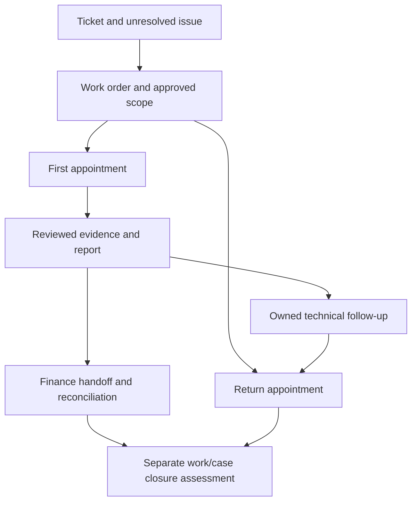

# BP-07 — Service Operations Functional & Build Blueprint

**Edition:** v01 · **Date:** 5 September 2026 · **Scope:** PP-01 planned-service synthetic prototype.

**Status:** Proposed functional specification ready to guide implementation planning. No screens, rules or workflows described here are currently implemented. [Package](../prototype/README.md) · [Dictionary](../contracts/service-data-dictionary.md) · [API](../contracts/service-api.md) · [Acceptance](../testing/prototype-acceptance.md).

## 1. Functional objective

A coordinator should be able to establish what a customer needs, authorise a clear scope, prepare the technician, reserve suitable attendance, handle changes and close the work with useful evidence. A technician should have a concise view of what to do, where, for whom, with what prerequisites, and what is already known. Finance receives reviewed quantities and exact evidence with a traceable outcome.

The system distinguishes reported symptoms, suspected causes, attempted fixes, verified findings, completed work and outstanding actions. It does not generate unsupported technical diagnoses or allow a general dispatch override to bypass mandatory safety/biosecurity or customer operating controls.

## 2. Navigation and visual design requirements

Initial navigation: **My Work, Customers & Sites, Service Requests, Work Orders, Schedule, My Jobs, Finance Handoffs, Documents, Administration**. Menu visibility follows permissions; hidden navigation is not a server security control. Future module names must not appear as working features until there is usable functionality.

Use one visual system: readable typography, consistent spacing, restrained colour, clear data hierarchy, labelled status chips, accessible forms and a persistent record context header. Record headers show customer/site, primary identity, operational state, owner, current revision and the next permitted action. A secondary information area shows history, related records and source-as-at. Show an obvious synthetic-environment label without placing implementation jargon in ordinary task flows.

Desktop coordination prioritises dense but readable tables and day/week planning. Technician views prioritise the next job, pack changes, quick time/parts capture and clear save status. Phones use cards and progressive disclosure rather than horizontally compressed desktop tables. A meaningful empty state gives the permitted next action; an unavailable state states what failed and offers recovery.

## 3. Screen catalogue

| ID / screen / route | Primary user and content | Main actions and gates | State/error behaviour |
|---|---|---|---|
| SC-01 My Work `/work` | Scoped tasks, preparation blockers, review items, follow-up and exceptions | Open source record; filter owner/due/type; complete own activity with outcome | Missing due dates separate; failed query does not display zero overdue |
| SC-02 Customers `/customers` | Organisation, contacts, relationship owner, sites and ERP mapping status | Search/create synthetic record; review duplicate candidates; open related work | Same-name companies shown with distinct keys; no automatic merge |
| SC-03 Site and asset `/sites/:id` | Operator/contact/access, timezone, equipment hierarchy, configuration and history | Add reviewed context; open asset; create request; propose effective-dated change | Unknown asset/operator flagged; original history remains tied to work-time context |
| SC-04 Service intake `/service/tickets/:id` | Requester/channel/time, symptoms, impact, priority, scope/coverage questions | Save incomplete intake; request information; triage; create/link work order | Stage-specific blockers; urgent label alone cannot authorise work |
| SC-05 Work order `/service/work-orders/:id` | Approved scope, exclusions, assets, coverage, visits, readiness, reports and Finance | Draft/revise scope; authorise; propose visit; create pack; assess closure | Approved scope read-only; change creates revision; visit completion does not close ticket |
| SC-06 Pack workbench `/service/packs/:id` | Nine required sections, source manifest, check results, recipients and revision | Prepare; submit/check/return; generate; issue; amend/withdraw | Missing section/source blocks issue; generation progress distinct from issue |
| SC-07 Planner `/schedule` | Resource rows, day/week ranges, unassigned demand, availability, travel and readiness | Drag/drop or keyboard move; preview conflicts; confirm/move/reassign/cancel | Stale version rejected; old booking retained on failed move; no colour-only status |
| SC-08 Appointment `/service/appointments/:id` | Crew roles, start/end/timezone, customer window/contact state and pack acknowledgement | Propose/change; review readiness; record contact; open field view | Distinguish requested/tentative/confirmed dates; show outstanding crew responses |
| SC-09 My Jobs `/my-jobs` | Assigned next/current visits, offline availability, required pack changes | Open/download job; acknowledge current issue; request change | Cached timestamp/revision visible; no unsupported current-status badge offline |
| SC-10 Field job `/my-jobs/:id` | Read-before-attending, scope/checklist, timer/entries, parts, readings/photos and unresolved work | Start attendance; save evidence; submit completion; prepare report draft | Local/server save states separate; missing attachment/input prevents final submission |
| SC-11 Review and report `/service/reports/:id` | Entry revisions, completed/remaining scope, findings, customer-safe preview and responses | Return entries; review; generate/issue; record customer response; create follow-up | Material edits create new revision; signature never transfers to altered content |
| SC-12 Finance queue `/finance/handoffs` | State, age, company/account, reviewed quantities, reports, mappings and differences | Review/return/approve; claim processing; record outcome; reconcile | OutcomeUnknown held; incomplete account mapping or double consumption blocks |
| SC-13 Account view `/customers/:id/account` | Permitted transaction rows and authoritative source remaining balances | Filter company/currency/status; inspect source/as-at; open permitted ERP reference | Incomplete/unavailable/not-defined shown explicitly; no inferred balance from page subtotal |
| SC-14 Documents `/documents/:id` | Version, owner/access, related object, issue purpose and exact output | Open authorised version; inspect manifest; request updated source | Missing/deleted source resolves to retained issue or owned exception, not another file |
| SC-15 Exceptions and administration `/admin` | Sync conflicts, document failures, policy/template versions, audit and integration mode | Assign/retry eligible failure; inspect receipts; publish permitted config | Business approval permission separate from system administration; secrets never rendered |

## 4. Reusable component catalogue

| ID | Component | Required behaviour |
|---|---|---|
| CMP-01 | Record header and status | Human number plus stable link; separate status families; owner and revision |
| CMP-02 | Customer/site/asset selector | Scoped search; explicit company/operator distinctions; unknown/review pathway |
| CMP-03 | Readiness panel | Each criterion with evidence, assessor, version, outcome and permitted exception |
| CMP-04 | Timeline | Chronological events with actor, source, date, confidence and historical revision links |
| CMP-05 | Revision banner | Show source/presented/current issue difference, change summary and required action |
| CMP-06 | Schedule change dialogue | Original/proposed crew/time, timezone, checks, reason and affected pack/contact tasks |
| CMP-07 | Sync indicator and queue | Saved locally/queued/uploading/synced/failed/conflict/review; per-entry recovery |
| CMP-08 | Field entry editor | Type-specific fields, units, asset/task attribution, save feedback and correction lineage |
| CMP-09 | Report presentation | Exact rendered revision, scope/audience label and customer response choices |
| CMP-10 | Financial source panel | Company/currency/definition/cutoff/completeness, approved quantities and target links |
| CMP-11 | Validation summary | Focusable summary with field links; preserve input and expose a specific corrective action |
| CMP-12 | Audit/operation receipt | Permission-filtered actor/time/reason/outcome and correlation ID; no raw confidential payload |

All commands must provide keyboard access, visible focus and an accessible name. Do not rely on hover, colour or dragging as the only interaction.

## 5. Record model and lifecycle separation

Use the dictionary's exact enum values. Ticket represents the issue; work order represents authorised scope; appointment represents attendance; report represents reviewed communication; handoff represents financial processing. One may finish while another remains open.

A work order can address multiple linked tickets; an appointment can involve multiple assets/scope items and crew members. A pack is scoped to one appointment in PP-01, with a work-order link. A report is scoped to one appointment; consolidated multi-visit reports are later scope. A handoff may include approved source entries from multiple completed visits of the same work order/company/account, with explicit line allocations.

## 6. State-transition register

The table expands every master TR-01–TR-16. Additional branches use the same parent TR identity. Actors must have both permission and record scope; a role label alone does not satisfy delegation.

| Source TR | Command and permitted transition | Guards | Atomic result, refusal and recovery |
|---|---|---|---|
| TR-01 | Ticket `New/NeedsInformation → Triaged`; `New → NeedsInformation` | Coordinator; requester/site or controlled unresolved marker; impact, priority rationale and triage owner | Save question/follow-up for missing context; no work authorisation implied |
| TR-02 | Work order `Draft → Authorised` | Service reviewer; approved scope revision, account model, coverage/billing basis, asset identity/approved identification plan, required controls | Freeze scope; record authoriser/policy; external authority uses validated route later; refusal retains draft |
| TR-03 | Appointment `Proposed → Confirmed` | Dispatcher; Authorised/InProgress order; complete time/crew, availability/skills/travel/customer window, preparation plan/readiness assessment | Reserve all crew atomically; record notification task; pack may still be in preparation, but dispatch/start remains gated |
| TR-04 | Pack `Draft/Returned → Checked` or `Draft → Returned` | Reviewer; exact source manifest, required sections and readiness/control evidence; technical approval where applicable | Freeze checked revision; returned comments retained; further content change returns to Draft and clears check |
| TR-05 | Pack `Checked → Issued` | Issuer; confirmed appointment/version, current approved scope, successful exact output and current recipients | Commit issue/distribution events and content identity; generation/upload failure leaves Checked with failed attempt |
| TR-06 | Create pack acknowledgement event | Current assigned recipient; exact issued manifest presented | Store actor/assignment/issue/version/time; opening/download is a separate event; repeat same operation is idempotent |
| TR-07 | Issued pack → new Draft revision; prior issue becomes Superseded when successor is issued | Issuer/owner; material-change assessment, reason, affected appointments/crew | Set dispatch hold immediately for a material pending change; preserve old issue; recheck/reissue and new acknowledgement |
| TR-08 | Confirmed appointment → new Confirmed version, or retain existing booking with change request | Dispatcher; expected version and all confirmation guards re-evaluated | Crew reservations change atomically; pack becomes review-required and dispatch held; unsuccessful move retains old booking and proposal |
| TR-09 | `Confirmed → InProgress` | Assigned technician; current applicable pack acknowledged by required crew, readiness passed/permitted exceptions, scope/control conditions | Record start and authority snapshot. Offline start is a provisional intent; server adjudicates on reconnect |
| TR-10 | Local entry intent → `Synced/Conflict/ReviewRequired` | Authenticated command/recovery capability; schema, operation identity, actor, assignment, source versions and payload validity | Idempotent server receipt; changed payload rejected; stale/reassigned evidence preserved in restricted review; no automatic billability |
| TR-11 | Appointment `InProgress → CompletedPendingReview`; report `Draft/Returned → Submitted`; entries `Draft/Returned → Submitted` | Technician; complete required evidence, explicit time/parts declarations, unresolved items and upload receipts | Atomic submission references exact entries. Missing upload or incomplete field reports precise blocker; local submission intent can queue but is not server Submitted |
| TR-12 | Report `Submitted → Reviewed/Returned`; entries `Submitted → Approved/Returned`; appointment → Completed only when accepted | Reviewer; evidence/attribution, scope outcomes, amendments and financial classification responsibilities evaluated | Approved versions frozen; return reason visible. Report can be Returned while visit stays CompletedPendingReview. Corrected approved entry creates successor and re-review |
| TR-13 | Report `Reviewed → Issued`; acknowledgement event on exact revision | Issuer; customer-safe preview, exact durable output, permitted audience | Distribution state separate. Reservations/Declined/Unavailable/Disputed create owned follow-up. New material version does not inherit previous response |
| TR-14 | Handoff `Draft → ReadyForReview → Approved/Returned → AwaitingERP/OutcomeUnknown → ReconciliationRequired → Reconciled` | Service submitter then Finance permissions; reviewed source, billing decision, verified company/account and unique allocations | Manual/API/simulation recorded. Returned → Draft new version; unknown outcome lookup only. Reconciled requires exact target mapping or reviewed no-posting disposition |
| TR-15 | Ticket `Triaged → Active/Waiting → Resolved → Closed`; work order `Authorised → InProgress → WorkComplete → Closed` | Service owner; reviewed attendance, unresolved work disposition/owner, required report/customer evidence and reconciled or documented non-posting Finance outcome | Partial work stays open. Closed ticket → Active with reason; closed order remains historical and additional work uses linked new order. No old report rewritten |
| TR-16 | Appointment `Proposed/Confirmed → Cancelled` | Dispatcher; reason, customer/resource/pack impacts and recorded actual-work check | Release future reservations, preserve issue/history, create contact tasks. If actual work already occurred, use completion/review with incomplete outcome rather than erasing attendance |

Returned completion resubmission uses the same exact-entry checks while the appointment remains CompletedPendingReview; it does not require a new physical start. A report-only correction after accepted attendance retains Completed attendance and creates a new report review cycle. Reopening physical work requires an explicit return appointment or new work authority.

Additional terminal actions: ticket cancellation requires a reason and checks for linked active work; an unstarted Authorised order can be Cancelled only after future appointments are cancelled and any financial/actual evidence is dispositioned. Issued pack/report withdrawal records reason and affected recipients; it never deletes retained output. Cancelling a handoff is permitted only before any possible external effect; otherwise investigate/reconcile and use a linked correction.

## 7. Intake, scope and coverage rules

An incomplete ticket can be saved with a triage owner and explicit unknowns. Before work authorisation, identify the service location, requester/contact, impact, permitted tasks, exclusions, asset identification basis, coverage assessment, billability decision route and escalation owner. Commercial account mapping is compulsory before financial release; an authorised diagnostic identification plan can cover an unknown serial without pretending the asset is verified.

Scope items carry expected outcome, affected asset(s), task category, required competency, document references, completion evidence and any shutdown/access condition. If onsite findings exceed scope, the technician records an additional-work request and a safe stopping point. A reviewer issues a new scope revision or linked work order. A technician note is not approval for extra charges or crop-sensitive shutdown.

Coverage choices are Unknown, Covered, NotCovered, Disputed or NotApplicable. Assessment records source agreement/version, effective dates, exclusions, assessor and reason. Coverage does not independently decide customer charging or supplier liability. Unknown/disputed coverage may permit a specifically authorised diagnostic limit, but it blocks an assumed financial disposition.

## 8. Readiness and job-pack specification

Required pack sections: identification; customer arrangements; authorised scope; equipment/configuration; relevant history; exact technical references; parts/tools/readiness; site/safety/biosecurity/operating controls; completion requirements. Each is present or carries an allowed not-applicable/exception outcome with assessor and evidence.

Readiness criteria have outcomes Unknown, Pass, Blocked, PermittedException or NotApplicable. Each criterion identifies its policy version, blocking stage and whether exceptions are allowed. A missing mandatory control remains Blocked. PP-01 synthetic policies allow a documented non-critical tool collection plan before dispatch; they never allow a generic override of competency, mandatory isolation, site access or shutdown authority.

Booking confirmation evaluates readiness but may carry a permitted preparation plan. **Dispatch/start requires a current issued pack, required crew acknowledgements and current readiness clearance.** This avoids a circular dependency where a pack requires a confirmed appointment but confirmation requires the pack already issued.

Check freezes the pack content revision. Issue records exact rendered object/hash, source manifest, current scope/appointment versions, template version and recipient assignments. Acknowledgement binds each technician to that issue. A crew lead cannot acknowledge for other technicians without a separately specified policy, which is absent in PP-01.

In PP-01 every confirmed date/time/crew change creates a pack review requirement. Reissue the schedule/recipient snapshot even if technical scope is unchanged; record the change category. For a material scope/control change, place a dispatch hold as soon as the change is raised. An already InProgress visit receives an urgent-change task/direct-contact requirement; the UI must not imply work stopped merely because a server flag changed.

See the [document contract](../contracts/documents-and-issues.md) for generation, distribution, retention and OUT-09/OUT-10/OUT-14 layout content.

## 9. Scheduling specification

### 9.1 Views and interaction

Day and week views show technician rows, named timezone, work/leave blocks, travel buffers, proposed/confirmed visits and preparation states. Multi-week range is a paged read/navigation capability; a sophisticated optimisation engine is excluded. Multi-day work is represented by explicit daily appointments under the same order, preserving individual crews, packs and evidence.

Unassigned demand shows proposed duration, required skills, location, earliest/latest permitted window and readiness. A proposed card does not reserve time. Dragging or using the keyboard Move action opens the same change dialogue. Display old/new time, crew, customer-window impact and checks before confirmation. Saving a proposal and confirming a booking are separate actions.

The synthetic test policy uses 15-minute display increments, but stores exact instants. A configurable manually entered travel buffer is required when the planner cannot verify travel; there is no live map/travel API in PP-01. Do not infer journey time from straight-line distance. End time must exceed start, and travel reservations cannot overlap leave/another appointment.

### 9.2 Policy evaluation order

1. Verify actor, order state, expected appointment/assignment/policy versions and correct site timezone.
2. Validate date/time/customer access window and working calendar, including actual offset at the visit date.
3. Validate every crew member, crew role, availability and required competency validity through appointment end.
4. Evaluate travel/buffer reservations, resource overlaps and unavailable time.
5. Evaluate material, technical, access and preparation readiness; distinguish booking warnings from dispatch blockers.
6. Present permitted exceptions and required reasons; mandatory constraints cannot be bypassed.
7. Re-run guards and atomically write the booking/reservations/version/audit/outbox at confirmation.

For timezone ambiguity/non-existent local times, request an explicit valid instant/offset rather than silently moving the booking. Queensland and daylight-saving states use their actual IANA zones. Store customer-requested dates separately from confirmed attendance.

### 9.3 Changes and communication

A project-date change or technician request creates a ScheduleChangeRequest with proposed time, source version, reason and owner. Dispatcher acceptance runs the same checks as an interactive move. Rejection records reason; it does not edit the source project's schedule. No Smartsheet connector is built in PP-01.

A changed appointment creates internal communication tasks and, where policy requires, a customer-contact task. The prototype records synthetic/direct-contact outcomes; it sends no email/SMS/calendar invitations. Record Attempted, Confirmed, NoResponse or Failed independently of the booking state. Offline recipients require direct contact for urgent material changes; inability to contact remains visible.

## 10. Field work, time and materials

The job opens with read-before-attending: site/access, scope/exclusions, latest known pack, open issues, prior work and unsuccessful fixes, equipment/configuration, contacts and escalation. Internal financial notes are excluded from technician DTOs, cached packs and search.

Labour entries distinguish Travel, Labour, Break, Waiting and Other with reason for Other. Record start/end, derived elapsed seconds and displayed minutes, asset/task allocation and narrative as required. One person cannot have overlapping time intervals without a reviewed explicit correction; timer state is not a second source of actual labour. Stopping a timer creates a draft entry; planned duration never creates actual time. Cross-midnight intervals retain instants and site timezone. Local clock anomalies are flagged at review rather than silently corrected.

PP-01 retains exact elapsed seconds and derives displayed minutes; Finance allocation uses the explicitly approved unit/conversion basis. Material quantities use exact decimals. Billing rounding/rates are Finance policy and not inferred from recorded time. Reviewed duration and billable quantity are separate from original capture. An approved entry is immutable; correction creates a successor referencing the original and invalidates affected report/handoff reviews.

Material entry types are Consumed, Returned, Required and Removed. Each has item/reference or controlled unidentified description, quantity/UOM, asset/task, source/stock reference where available and notes. Consumed is not ERP-posted. Returned is not an ERP credit; Removed may require disposal/return follow-up. Required creates an owned readiness/demand action and never automatically purchases stock. Serial/lot traceability is included where the configured item requires it.

Photos/readings/checklist evidence link to the visit, actor, asset/task and capture time. A reading requires numeric/text value, unit and context; an image is not a passed test. Failed/NotPerformed checklist items require reason and follow-up disposition. Safety-critical failure blocks a false complete-scope outcome even if attendance itself can be reviewed as finished.

## 11. Offline and mobile matrix

| Activity | Desktop online | Phone online | Disconnected behaviour |
|---|---|---|---|
| Customer/global search | Scoped full view | Purposeful scoped view | Only previously downloaded assigned context |
| Schedule confirm/move | Full planner + keyboard | Limited form action if authorised; no assumed planner parity | Read cached own visit; queue change request intent only |
| Pack reading | Exact authorised revision | Primary workflow | Cached issue/hash/as-at; clearly last-known |
| Pack acknowledgement/start | Authorised online command | Primary field action | Store intent against cached versions; provisional until server acceptance |
| Time/parts/observations/checklist | Full capture | Primary quick forms | IndexedDB save; visible upload queue and per-entry state |
| Photos | Upload/stage | Capture/select/stage | Save only within available quota; show durable save result |
| Scope/pack/report approval | Role-controlled | Review if usable/authorised | Unavailable; no local approval fiction |
| Customer response | Exact presented issue | Attended capture with identity/response | Cached issued report response or explicitly labelled draft evidence; never imply final review |
| Finance/account | Authorised detailed view | Limited intentional view | No financial cache or offline processing |

Sync UI values: LocalSaved, Queued, Uploading, Synced, Failed, Conflict, ReviewRequired. Synced means the server accepted the evidence record, not that Service approved it or MYOB processed it. Quarantined stale work displays ReviewRequired and is excluded from approved totals.

Cancellation/reassignment may be unknown while disconnected. The app retains original evidence and flags it on reconnect; it cannot guarantee immediate revocation or remote deletion. Expired cached data is not labelled current. Do not auto-delete unsent work on logout/expiry/upgrade; follow the controlled recovery policy. See BP-02 and PT-11/PT-12/PT-24.

## 12. Submission, reports and customer response

Completion requires explicit accounting for work performed and remaining work, time/material declarations (including an explicit no-time/no-parts reason where permitted), required evidence and outstanding actions. Upload receipt dependencies must be complete before server submission. Technicians may save incomplete drafts freely; submit returns precise blockers.

A reviewer approves/returns entries and the report. The report binds the exact approved entry revision set. A subsequent correction creates a new report draft and marks any dependent Finance handoff as review-required through its allowed transition; processed Finance work uses a linked correction, not mutation.

The customer report shows date/site/equipment, personnel as permitted, authorised/completed work, findings/readings, parts where appropriate, exclusions, remaining issues and next actions. Exclude internal margin/rates, private notes, restricted staff information and unreviewed diagnosis. Preview and issued output must use the same data snapshot and template version.

Customer response values: Accepted, AcceptedWithReservations, Declined, Unavailable, Disputed. Record the exact issued revision or explicitly labelled draft snapshot, presented time, respondent name/role, capture actor and remarks. A signature image is optional evidence, not proof of identity or an approval of extra charges. Reservations/dispute require an owned follow-up; Unavailable records a contact action. Material changes require a new presentation and response; old responses remain tied to the old content.

Issued/sent/delivered/acknowledged are distinct. Customer distribution is simulated or a recorded manual task in PP-01. There is no automated outbound communication.

## 13. Finance and closure

Service submits approved evidence to the [minimum Finance contract](../contracts/finance-handoff.md). Finance determines billability/coverage, approved quantities and target mapping. The work order can reach WorkComplete when physical scope is dispositioned and reports reviewed; Closed additionally requires required follow-up/financial/customer evidence dispositions. An unresolved return visit keeps the order InProgress unless a reviewer explicitly closes the original scope with a linked authorised new order.

A ticket can remain Waiting while attendance is complete. Resolve requires a recorded resolution or accepted disposition of the issue; close is a separate owner action. Reopening retains history and creates additional authorised work when needed. Do not erase prior reports or reuse their signatures.

## 14. Business-rule register

| ID | Enforceable rule | Master relation | Proof |
|---|---|---|---|
| SR-01 | Account selection uses explicit ERP company/entity mapping; ambiguous names cannot authorise financial release | BR-01/BR-02; DAT-01 | PT-02/PT-20 |
| SR-02 | Unknown asset is a controlled identification plan before authorisation, not a guessed serial | DAT-03; D-011 | PT-03 |
| SR-03 | Scope approval freezes its revision; extra work requires reviewed authority | BR-05/BR-23 | PT-05 |
| SR-04 | Ticket, work order, visit, report and Finance lifecycles remain independent | BR-14 | PT-14/PT-17 |
| SR-05 | Confirmed crew bookings reserve all resources atomically and reject version/overlap conflicts | BR-10; TR-03/TR-08 | PT-08/PT-09 |
| SR-06 | Project changes create requests; dispatcher owns confirmed booking changes | BR-09 | PT-10 |
| SR-07 | Dispatch/start needs exact issued pack, required acknowledgement and allowed readiness | BR-11/BR-12 | PT-04/PT-06 |
| SR-08 | Material pack change holds dispatch immediately and requires new issue/acknowledgement | BR-12/BR-13 | PT-07/PT-24 |
| SR-09 | Local save and server acceptance are distinct; retries cannot duplicate entries | BR-13/BR-19 | PT-11/PT-12 |
| SR-10 | Original approved evidence is immutable; corrections preserve lineage and invalidate dependent review | BR-05/BR-16 | PT-13/PT-23 |
| SR-11 | Recorded/approved/billable/posted labour and material quantities are separate | BR-16/BR-18 | PT-13/PT-17 |
| SR-12 | Report response binds exact presented bytes/revision and cannot approve unrelated charges/work | BR-15 | PT-15/PT-16 |
| SR-13 | Source quantity cannot be consumed twice across active Finance allocations | BR-16/BR-19 | PT-17/PT-19 |
| SR-14 | Unknown external outcomes block blind repeat processing | BR-19 | PT-19 |
| SR-15 | Stale/incomplete/undefined finance data cannot display verified zero | BR-20/BR-21 | PT-20/PT-21 |
| SR-16 | Access applies to query, file, preview, export, notification and cache | BR-22 | PT-01/PT-18/PT-24 |
| SR-17 | Site/asset movement changes future context; historical issued context remains unchanged | DAT-02/DAT-03 | PT-25 |
| SR-18 | Coverage, billability, warranty claim and supplier credit remain independent | BR-24 | PT-05/PT-17 |
| SR-19 | Cancellation preserves actual evidence and external consequences | TR-16 | PT-26 |
| SR-20 | Template/policy/software updates are versioned and do not silently reinterpret in-flight work | Section 19.7 | PT-23/PT-28 |

## 15. Validation and error catalogue

Messages below are proposed user-facing text. Include a correlation ID in expandable details, not a raw stack trace. Preserve input where safe and return field-level errors as well as a summary.

| ID / code | Trigger | Message | Recovery |
|---|---|---|---|
| VAL-01 ACCOUNT_MAPPING_REQUIRED | Unverified/missing company/account at financial release | Select a verified billing account and ERP company. | Open mapping review |
| VAL-02 ASSET_IDENTITY_REQUIRED | Scope lacks verified asset or approved identification plan | Confirm the equipment or add an approved identification plan. | Return to scope |
| VAL-03 SCOPE_NOT_AUTHORISED | Confirm/start against unauthorised scope | This work needs scope authorisation before it can proceed. | Request reviewer |
| VAL-04 READINESS_BLOCKED | Mandatory criterion missing/failed | Resolve the highlighted readiness items before dispatch. | Show each criterion; only allowed exception action |
| VAL-05 VERSION_CONFLICT | Expected record/policy version stale | This record changed while you were editing. Review the latest version before saving. | Preserve proposal and show differences |
| VAL-06 RESOURCE_CONFLICT | Crew reservation overlap | A selected technician is unavailable during this booking. | Show conflicting period if authorised |
| VAL-07 SKILL_OR_TRAVEL_INVALID | Competency/calendar/travel check fails | Review the crew, travel allowance and working-time requirements. | Highlight specific checks |
| VAL-08 TIME_INVALID | End ≤ start or invalid local-time offset | Enter a valid start and finish time for the site's timezone. | Keep original entries |
| VAL-09 PACK_REVISION_REQUIRED | Missing/current issue or crew acknowledgement | The current job pack must be issued and acknowledged before work starts. | Show applicable revision/recipients |
| VAL-10 UPLOAD_INCOMPLETE | Submission references uncommitted attachment | Some evidence has not finished uploading. Your draft is saved. | Retry named attachment |
| VAL-11 LOCAL_SAVE_FAILED | Quota/local write failure | This entry could not be saved on this device. Keep this screen open and retry or use the recovery option. | Avoid false saved status |
| VAL-12 OPERATION_REUSED | Same operation ID, different payload | This submission identifier was already used for different content. | Preserve data; create reviewed new operation |
| VAL-13 ASSIGNMENT_CHANGED | Offline capture against stale assignment | Your assignment changed. Captured work has been retained for review. | Restricted queue or approved local recovery |
| VAL-14 REVIEW_REQUIRED | Unapproved evidence/report used downstream | Review the highlighted entries and report revision before continuing. | Open review |
| VAL-15 QUANTITY_ALREADY_ALLOCATED | Finance over-allocation | Some reviewed quantities are already assigned to another handoff. | Show permitted remaining quantity |
| VAL-16 EXTERNAL_OUTCOME_UNKNOWN | Timeout/uncertain manual/API outcome | Confirm the ERP outcome before attempting this action again. | Lookup/reconcile only |
| VAL-17 RECONCILIATION_MISMATCH | Missing/different target mapping | The handoff does not reconcile. Review the highlighted differences. | Keep ReconciliationRequired |
| VAL-18 SOURCE_UNAVAILABLE | Source failed/partial/undefined | Current source information is unavailable or incomplete. | Show last successful as-at; refresh/contact owner |
| VAL-19 DOCUMENT_ACCESS_OR_VERSION | Missing/unauthorised exact issue | This document version is unavailable to you. Contact the document owner. | No alternate confidential file/title disclosure |
| VAL-20 RESPONSE_REVISION_CHANGED | Customer response attached to altered report | Present the revised report and record a new customer response. | Preserve original response |
| VAL-21 ACTUAL_WORK_RECORDED | Cancel would erase actual attendance | Work has already been recorded. Submit the attendance for review instead of cancelling it. | Complete with remaining-work disposition |
| VAL-22 ACCESS_DENIED | Server scope/permission fails | You do not have access to this action or record. | No existence/details leakage |
| VAL-23 PAYLOAD_VERSION_UNSUPPORTED | Offline schema cannot be accepted | This saved entry needs an update before it can synchronise. Your original entry has been retained. | Migration/recovery queue |
| VAL-24 REQUIRED_FIELD | Missing/invalid stage field | Complete the highlighted fields before continuing. | Focus first error |

## 16. Included follow-up and deferred service features

An Activity records owner, linked customer/site/asset/work, due date or explicit due-date-needed flag, purpose, status and outcome. Categories include TechnicalFollowUp, CustomerContact, MaterialAction, FinanceQuery and RelationshipReview. Service observations can create a reviewed relationship action; they do not automatically create a committed deal value.

Manual agreement references and coverage review are included. Automatic recurrence, meter-based triggers, SLA timers, warranty adjudication, renewals, supplier recovery and asset decommission automation remain PPO-015. Their source IDs are retained in the [traceability register](../prototype/traceability.csv). A manually scheduled return visit is supported without pretending that recurrence exists.

## 17. Completion evidence and build handoff

Each included screen/state/rule maps to PT scenarios and the implementation plan. A developer must demonstrate full persisted flows and failure handling, not just screenshots. Document checks verify the specification structure; they do not execute these rules. See the [acceptance pack](../testing/prototype-acceptance.md) for independent expected outcomes and the [ordered plan](../delivery/prototype-implementation-plan.md) for P01–P12.
