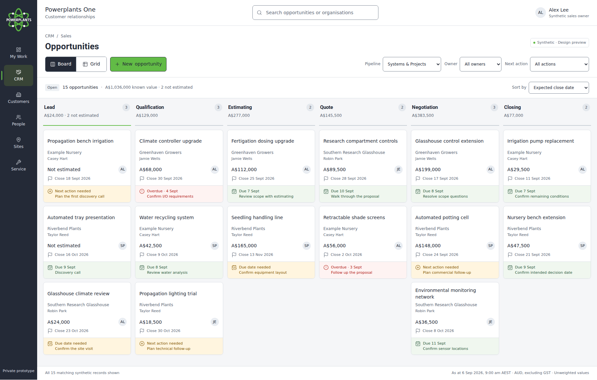
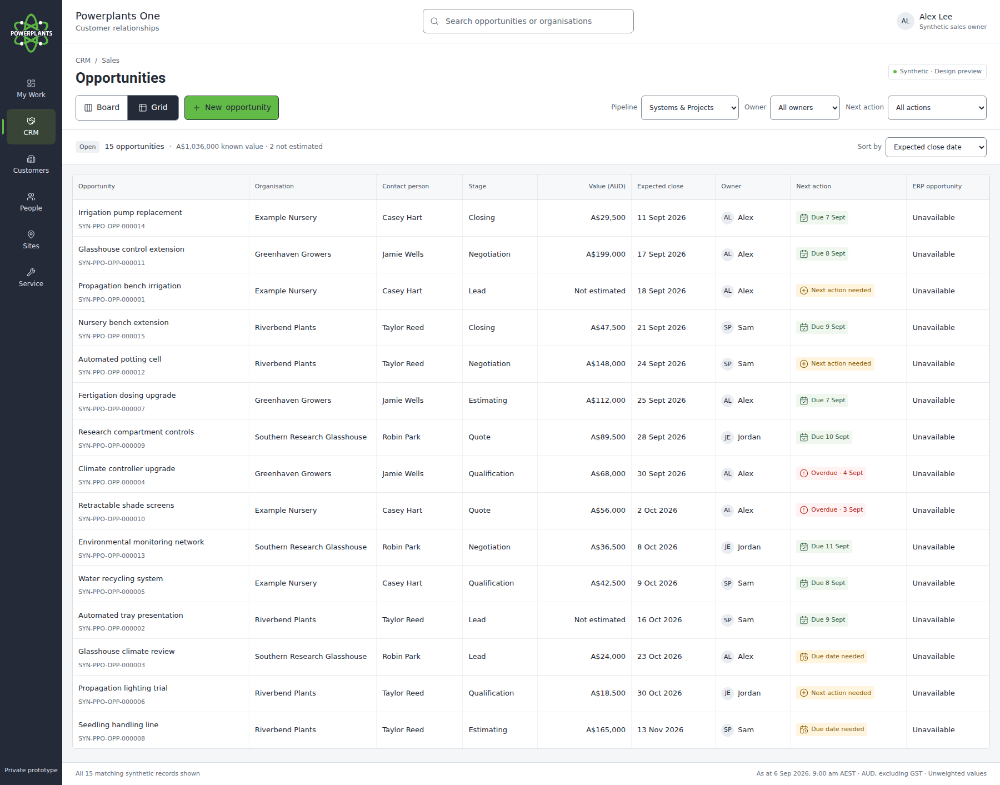

# Branded CRM Board and Grid mockups

**Revision:** r01 · **Date:** 6 September 2026 · **Status:** Synthetic design only · **Parent:** BP-03 C02 / PPO-009.

[Open the standalone preview source](../crm-board-grid-mockup.html) · [Shared UI specification](../../standards/ui-style-specification.md) · [Screen specification](../crm-screen-specification.md) · [I2 guidance](../../delivery/crm-i2-ui-guidance.md) · [Handover](../../delivery/crm-ui-design-handover.md).

Download `crm-board-grid-mockup.html` and open it in a browser. GitHub displays its source; the downloaded file needs no server, network, external font, API or browser storage. Switch Board/Grid, filter, search, sort, open an opportunity or add a temporary synthetic example. Reload resets every change. The remaining navigation labels indicate the proposed shell; they do not navigate to implemented screens.

Both original desktop captures show the same 15 Systems & Projects examples: A$1,036,000 in known fictional values and two not estimated. The second illustrative pipeline contains three more records. Amounts are AUD excluding GST, unweighted design examples, not forecasts. The six stage labels are reference-layout choices; they do not alter I1 or prove account configuration.

The [manifest](manifest.json) preserves the original capture and logo hashes, export hash, inspected repository baseline and supplied brand-PDF fingerprint. The PDF and operational Pipedrive screenshots are not copied into Git. The original [CRM screen/state wireframes](../crm-wireframes.html) and [18-capture gallery](../crm-visuals/README.md) remain a separate functional/state reference with provisional styling.
