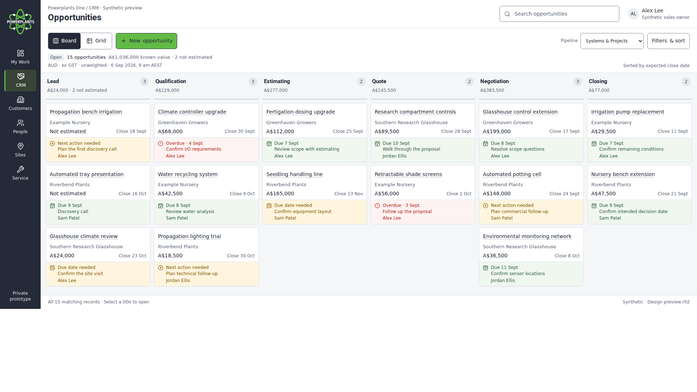
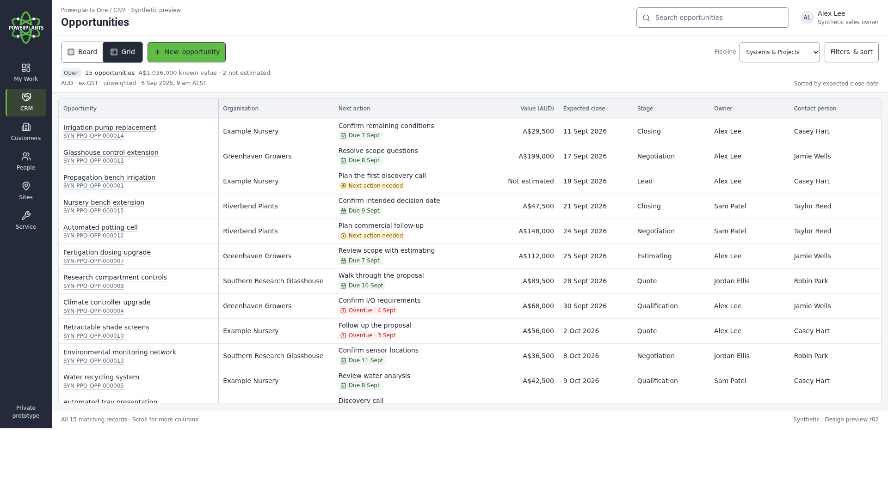

# Branded CRM Board and Grid mockups

**Revision:** r02 · **Date:** 6 September 2026 · **Status:** Synthetic design review · **Parent:** BP-03 C02 / PPO-009.

[Interactive Board/Grid source](../crm-board-grid-mockup.html) · [Shared UI specification](../../standards/ui-style-specification.md) · [Screen specification](../crm-screen-specification.md) · [I2 guidance](../../delivery/crm-i2-ui-guidance.md) · [Revision handover](../../delivery/crm-ui-design-handover.md).

Download `crm-board-grid-mockup.html` and open it in a browser. GitHub displays its source; the downloaded file needs no server, network, external font, API or browser storage. Switch views, choose a pipeline, expand Filters & sort, clear active criteria, open an opportunity or add a temporary synthetic example. On phone, choose a stage directly or use previous/next. Reload resets changes. Other navigation labels show the proposed shell only.

## Revised designs

The r02 revision responds to the UI audit: compact header, continuous desktop pipeline, direct phone stage selection, frozen Grid headings and identity, actual next actions and full owners, explicit creation context, retained filters, focused errors and long-text wrapping. Counts, currency/tax basis and fixed sample time stay together.

[Phone Board](phone-board-r02.png) · [Phone Grid](phone-grid-r02.png) · [Eight branded state illustrations](states.html) · [State illustration capture](states-r02.png).

The default view still contains the same 15 Systems & Projects examples: A$1,036,000 in known fictional values and two not estimated. Products & Parts contains three more records. All amounts are AUD excluding GST and unweighted. The six reference stages do not change I1 or establish accepted operational configuration. Unknown values are never substituted with zero. Contact, age and unavailable ERP reference remain in detail; the Grid retains the visible SYN-PPO reference.

The [revision review evidence](revision-review.json) records actual local browser measurements and checks. The 150-record load review is a temporary derivative used by the check, not the default fixture or a backend performance claim. The [manifest](manifest.json) identifies every current and original asset by hash. The full CI run retains additional edge-case captures separately.

## Preserved first issue

[Original r01 Board](board.png) · [Original r01 Grid](grid.png). These bytes remain unchanged and are historical evidence, not the latest design. The supplied logo is also unchanged. The company PDF and operational Pipedrive screenshots are not copied into Git.

The original [CRM screen/state wireframes](../crm-wireframes.html) and [18-capture gallery](../crm-visuals/README.md) remain separate functional references with provisional styling. Branded state examples are static illustrations; permissions, server recovery and durable saves must be implemented and verified in the appropriate increment.
