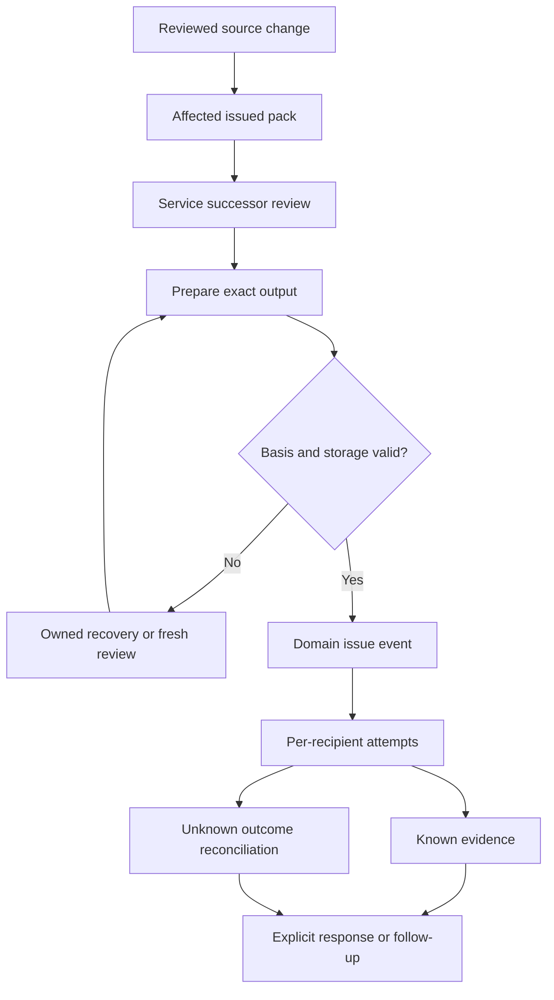

# DK-03 — Output, Issue & Distribution Centre

**Working copy note, 17 September 2026.** This is the stable repository copy of the issued r01 build plan. Stages B1-B6 have since been delivered as a standalone design: the [HTML](../reference/ui/output-distribution/PPO-Output-Issue-and-Distribution-Centre-r01.html), its [detailed report](../reference/ui/output-distribution/PPO-Output-Issue-and-Distribution-Centre-Report-r01.md), the [decision and receiving handover](../decisions/output-issue-distribution-design.md) and the [executed verification](../testing/evidence/output-distribution-r01/README.md). The plan text below is unchanged; where the build departed from it, the report records the departure. Owner acceptance, application integration and deployment remain separate.

**Contents**

1. [Purpose and recommended outcome](#1-purpose-and-recommended-outcome)
2. [Verified baseline and source treatment](#2-verified-baseline-and-source-treatment)
3. [Scope and design conformance](#3-scope-and-design-conformance)
4. [Ownership across PPO](#4-ownership-across-ppo)
5. [Users and proposed capability model](#5-users-and-proposed-capability-model)
6. [Information architecture and page layout](#6-information-architecture-and-page-layout)
7. [Detailed screen behaviour](#7-detailed-screen-behaviour)
8. [Record model and required information](#8-record-model-and-required-information)
9. [State and event semantics](#9-state-and-event-semantics)
10. [Primary end-to-end demonstration](#10-primary-end-to-end-demonstration)
11. [Recipient selection and distribution rules](#11-recipient-selection-and-distribution-rules)
12. [Revision, supersession and withdrawal controls](#12-revision-supersession-and-withdrawal-controls)
13. [Exceptions, interruption and recovery matrix](#13-exceptions-interruption-and-recovery-matrix)
14. [Interaction, accessibility and persistence](#14-interaction-accessibility-and-persistence)
15. [Synthetic fixture catalogue](#15-synthetic-fixture-catalogue)
16. [Proposed build structure and implementation approach](#16-proposed-build-structure-and-implementation-approach)
17. [Application integration receiving plan](#17-application-integration-receiving-plan)
18. [Delivery sequence and exit criteria](#18-delivery-sequence-and-exit-criteria)
19. [Planned verification and acceptance matrix](#19-planned-verification-and-acceptance-matrix)
20. [Open decisions and working assumptions](#20-open-decisions-and-working-assumptions)
21. [Deliverables, completion and immediate next step](#21-deliverables-completion-and-immediate-next-step)
22. [Source register](#22-source-register)

## 1. Purpose and recommended outcome

Powerplants One needs a shared workspace that answers four practical questions: **What exact document was produced? Was it authorised for its stated purpose? Who received that revision? What action is still outstanding?**

DK-03 will bring generated outputs, controlled issues, distribution attempts and recipient responses into one coordinated workspace. It will support the existing quotation, Engineering, Service, Projects and restricted Finance workflows while preserving their individual decision rules.

The recommended first deliverable is a self-contained, interactive HTML prototype with a detailed companion report. It will demonstrate complete synthetic journeys, retained history, meaningful failure recovery and responsive layouts. It will not require live email, SharePoint, MYOB or customer access to review the design.

The centre will extend the DK-01/DK-02 Document Register & Linked Library package. That package locates exact source revisions, records technical review evidence and identifies affected work. DK-03 will use that context to explain output preparation, domain-owned release, distribution evidence and follow-up. A technical review in DK-02 will not automatically authorise a quotation, drawing transmittal or job pack. [S03] · [S04]

This report is the build plan requested in this turn. The proposed screens, commands, fixtures and verification cases below describe future work; they are not claims that the DK-03 HTML or application module has been built.

### Intended business benefits

- Give coordinators one reliable view of outputs that require preparation, review, release, distribution or follow-up.
- Make the exact revision, issue purpose, customer/site context and recipient evidence immediately visible.
- Reduce incorrect assumptions that generating, approving, emailing or opening a document completes the same business step.
- Preserve the relationship between a changed source, a replacement document and any affected work or recipients.
- Make failed and uncertain operations recoverable without duplicate issues, messages or acknowledgements.
- Provide a reusable pattern across the seven PPO domains without creating an additional business domain.

## 2. Verified baseline and source treatment

| Source or decision | Position used for this plan | Consequence |
|---|---|---|
| Repository access and branch | GitHub access verified; `main` inspected at `a5406a81c02d37c4a23e75c1b71c7653fcec0d80` on 17 September 2026. | Sources are pinned to the inspected commit rather than an assumed current branch. |
| Application shell | The inspected main commit merges Application Shell r17 through PR #224. | DK-03 will provide the workspace interior; the application shell owns global navigation and branding. |
| README and STATUS | Both were read. STATUS retains a 14 September aggregate baseline and some earlier publication wording. | Live commit and PR evidence take precedence for newer publication facts; historical status text is not rewritten by this report. |
| DK-01/DK-02 | PR #226 is open and unmerged at inspection; head `eba0f3842639c2bbdf86e3af8f12d319c9f37071`. Its handover explicitly identifies DK-03 next. | Reuse this exact design reference, preserving its separate acceptance and integration status. |
| Document controls | The maintained document, issue and distribution contract is edition r07. | Retain its identity, release, audience, recovery and response semantics. |
| Output scope | BP-01 §16 contains DOC-01–DOC-06 and the OUT-01–OUT-18 catalogue. | Use existing scope IDs and output types; do not invent a new catalogue. |
| Page coverage | DK-03 is an existing P1 page with DK-01 as its recorded dependency. | This plan packages retained scope, rather than adding a new module merely for a layout. |
| Visual reference | Theme & Style Board r20; local source bytes matched the live Git blob `462dac4943fb4350cf5739787a1d29e7e096716d`. | Reuse the inspected r20 primitives and page patterns. The board's composition proposals do not override accepted application behaviour. |
| Naming | PPO-STD-001 r04 and ADR-0005 remain the adopted naming basis. | Separate stable identity, display label, revision, status and external provider keys. |
| Architecture | ADR-0003 retains the TypeScript/Next.js modular monolith, PostgreSQL, domain services, durable operations/outbox and replaceable adapters. | The prototype introduces no new production architecture or provider assumption. |

The inspected r20 file has SHA-256 `c68a499e857b1705d47bd6598d4b2e89526bf0861a0d234394c3da023f19b617`. It was inspected as source for this planning task; rendered DK-03 visual verification remains a future build activity. [S06]

Throughout this plan, **retained control** means supported by the maintained PPO source; **proposal** means a recommended DK-03 design choice; **synthetic behaviour** means a local demonstration; and **receiving requirement** means an obligation for later application or provider integration. Proposed role names, issue policies and deadlines are not approved company policy.

## 3. Scope and design conformance

| Required declaration | DK-03 treatment |
|---|---|
| Existing scope | DK-03 — Output, issue and distribution centre. |
| Parent scope | DOC-01–DOC-06; no changes to the 78 parent requirement identities. |
| Primary r20 page type | Document & evidence workspace. |
| Supporting page types | Work queue + persistent detail; Register / worklist; Review / comparison; short Form / guided workflow interactions. |
| Reused components | r20 typography, tokens, controls, tabs, tables, status labels, focus treatment and form patterns; DK-01/DK-02 document identity, revision context, source inspection and docked snapshot patterns. |
| Exact source families | Theme r20; `docs/design/document-library/` at the pinned PR #226 commit; its documented shared Supplier Pricing asset lineage; ES-05 quotation issue design. |
| Incoming handover | Permitted business record, exact source/template/output identities, selected scope, review evidence, issue purpose, intended audience and source availability. |
| Outgoing handover | Exact output/issue manifest, domain-owned release result, per-recipient distribution evidence, exact response references and owned follow-up. |
| Declared new composition | Six coordinated views, separate operation/issue/recipient facts, an output bundle manifest and an owned recovery workspace. These are proposed DK-03 arrangements. |
| Source authority | SharePoint remains intended business-document authority; native CAD tools retain authoring/dependencies; MYOB remains intended ERP authority. |
| Verification | Deterministic generation, meaningful model/browser cases, visual inspection and retained evidence; runtime and owner acceptance stated separately. |

The build must follow the HTML module conformance standard. The full source manifest will identify the actual reused files and hashes after the builder has inspected the receiving checkout; this plan does not invent missing shared-asset filenames. [S04] · [S06] · [S07] · [S08]

### First HTML release includes

The prototype will include a searchable work queue, exact output inspection, readiness evidence, domain-specific action previews, local simulated release and distribution, per-recipient tracking, explicit acknowledgement records, failed/unknown recovery, revision history and a scoped review export. A guided demonstration will exercise these features through normal business controls.

### Deferred boundaries

Live source retrieval, email/SMS sending, customer portal access, signatures, operational template publication, CAD authoring, ERP transactions and production retention are outside the HTML build. DK-06 owns template management; DK-05 owns knowledge authoring/publication; ES-06 owns quotation response and negotiation. DK-03 may display references to those outcomes but does not implement their business authority.

Full offline issue or distribution is also outside this build. Existing offline pack and report rules remain authoritative, including the distinction between cached information, a queued intent and a server-accepted outcome. [S03] · [S10]

## 4. Ownership across PPO

The centre will be a shared coordination surface over domain-owned records. It must not add a second approval rule or a second issue record for the same domain operation.

| Origin or receiver | Information DK-03 will show | Decision that remains with that domain |
|---|---|---|
| DK-01/DK-02 | Exact source identity, availability, review purpose, findings, applicability and affected records. | Technical source review and document relationship maintenance. |
| Estimating / ES-05 | Exact quotation revision, selected options, approved scope/terms/template and issue/distribution evidence. | Commercial approval and quotation release. ES-06 retains customer acceptance and negotiation. |
| Engineering | Published drawing/calculation references, purpose, exact issue set, technical decision and transmittal recipients. | Approval for review, procurement, installation or another authorised purpose; these purposes are not interchangeable. |
| Service job packs | Work order, appointment, pack revision, current readiness, crew assignments and per-assignment responses. | Pack checking, issue, withdrawal and acknowledgement semantics. Acknowledgement does not itself authorise attendance or work. |
| Service reports | Reviewed visit evidence, exact customer presentation, issue and response references. | Review of service findings, report release and customer response capture. |
| Projects / Quality | Progress updates, commissioning evidence and staged handover manifests, with outstanding obligations. | Project release, technical/test acceptance, customer handover and completion decisions. |
| Finance | Restricted supporting evidence and its original handoff/reconciliation context. | Finance review and processing. OUT-14 has no customer distribution route. |
| SH-06 approvals inbox | Exact pending review or returned submission and its domain destination. | Receiving approval remains in the domain screen. |
| My Work / notifications | Owned follow-up, due date or Date needed, and exact originating issue/recipient. | Completion of the underlying action; reading a notice cannot complete it. |
| Customer 360 / Deal Workspace | Permitted issued documents and distribution summaries linked to the customer/deal. | Customer, sales outcome, order conversion and delivery-responsibility decisions. |

In the standalone prototype, cross-module destinations will be labelled **Domain workflow preview** unless they actually open an included compatible artifact. A button must not imply that an external module was changed. Later runtime integration will call the established domain services with current permissions and concurrency checks. [S03] · [S04] · [S10]

## 5. Users and proposed capability model

The role switcher will exist only inside the demonstration controls. These profiles illustrate behaviour; they do not appoint Powerplants employees or confer operational authority.

| Preview profile | Demonstrated scope | Typical actions |
|---|---|---|
| Output coordinator | Selected customer/site/project outputs. | Inspect readiness, prepare output requests, confirm proposed recipients and own follow-up. |
| Domain reviewer / issuer | The selected domain and permitted records only. | Open the domain review preview, record a fixture decision for the exact basis, and simulate permitted release. |
| Distribution coordinator | Permitted released issues and approved audiences. | Prepare a distribution attempt, record simulated outcomes and reconcile an uncertain attempt. |
| Service technician / recipient | Assigned pack issues and their own response context. | Read an exact issued pack and record an explicit fixture acknowledgement. |
| Finance reviewer | Restricted Finance evidence and approved related context. | Inspect exact OUT-14 evidence; no customer-send control. |
| Read-only viewer | A bounded permitted subset. | Inspect available evidence and history; no mutation controls. |

The future capability design must distinguish reading metadata, reading content, preparing output, reviewing, issuing, distributing, recording a response, withdrawing and recovering an operation. A user's ability to open DK-03 cannot grant all these actions. Self-review treatment must come from the applicable domain policy; an unconfigured policy must be shown as **Not configured**, with the affected action unavailable.

## 6. Information architecture and page layout

### Six local views

| View | Main question | Core content |
|---|---|---|
| **1. Output queue** | What needs my attention? | Generated and pending outputs, ownership, readiness, issue/distribution summary and next action. |
| **2. Output & issue detail** | What exact content and business basis is this? | Preview, source/template identities, bundle manifest, applicability and separate event facts. |
| **3. Readiness & domain review** | What is preventing the intended release? | Evidence checklist, changed sources, audience checks, review findings and domain decision preview. |
| **4. Distribution & responses** | Who received which issue, and what evidence exists? | Per-recipient attempts, channel facts, explicit responses, due dates and follow-up. |
| **5. Exceptions & recovery** | What failed or remains uncertain, and how can it be recovered? | Owned exceptions, original operation, safe next action, reconciliation and retained results. |
| **6. History & change impact** | What changed, and who or what is affected? | Immutable revision/issue history, supersession, withdrawals, source changes and prepared domain actions. |

### Workspace composition

The header will show the module title, concise purpose, visible **Synthetic preview** context, last-read time, Review guide and Export review copy. DK-03 will not introduce a competing company masthead, global search, account menu or navigation rail.

The Output queue will use a compact single-row toolbar where width allows. Filters wrap coherently at smaller widths. The primary content will be a readable table with selected-record context; selecting a title or row opens a right-side snapshot, with an explicit **Open full detail** action.

The full detail view will put the document identity, revision and issue purpose above the preview. On wide screens, a supporting context column will hold the source, audience and linked records. The manifest and history remain close to the preview rather than hidden behind an unrelated settings area.

### Proposed geometry and responsive behaviour

| Available width / mode | Arrangement |
|---|---|
| Wide desktop | Flexible main content; up to a 448 px docked snapshot where the remaining content stays readable. Full document detail may use a 292 px context column. |
| Narrow desktop / tablet | Collapse the secondary context below the preview or into a drawer. Do not squeeze a queue, preview, context column and snapshot into four narrow columns. |
| Phone | Labelled cards replace wide tables. Detail opens as a full-width view; evidence snapshots become a modal sheet with explicit close/back behaviour. |
| Long content / short viewport | Main content remains scrollable; sticky controls must not cover the selected row, focused field or document text. |

The 448 px and 292 px dimensions reuse adjacent source patterns; their breakpoint application is a proposal to verify. Breakpoints should follow available module width, including the application shell, rather than assume viewport width equals content width.

Use r20 navy `#242a37`, green `#62bb46`, paper `#f5f6f8`, muted text `#667181` and divider `#e1e5eb`; reuse embedded Roboto with Verdana fallback. Core control/card radii are 6 px / 7 px. Status meaning must use text and icons as well as colour. [S06] · [S07] · [S08]

## 7. Detailed screen behaviour

### 7.1 Output queue

Default to **Needs attention**, with additional views for All permitted, My outputs, Awaiting domain review, Ready for distribution, Awaiting response and Exceptions. These are filters over the same permitted records, not separate copies.

Search will cover title, readable reference, customer, site, growing area, linked work/project/deal and output type. Filters will include originating domain, output type, owner, exact location, generation state, current/historical issue status, distribution exception, response requirement and date range.

Proposed columns are output title/reference; type and domain; customer/site; revision and issue purpose; preparation/review position; distribution/response summary; owner; next action; and relevant date. Less frequently used source identifiers belong in the snapshot. Counts must state their population and must not display zero while loading, failed or unknown.

A parent row will represent an output record with its selected/current issue. Expanding it reveals retained revisions and attempts. An interrupted operation must not create several apparent business documents. Sorting and return navigation preserve search, filters, selected issue and scroll position.

### 7.2 Output & issue detail

Show the output reference, selected content revision, issue UUID/reference, owning domain, issue purpose and customer/site/location before the preview. Display **Draft**, **Historical**, **Superseded** or **Withdrawn** outside the immutable document bytes, with an explanation of current use.

The evidence panel will show the original business revision, selected scope/options, source versions, template identity/version, output format, actual byte count/hash where available, creation time, preparation time, actual issue time, issuer and confidentiality. A content hash establishes byte identity only; it does not prove approval, retention or authenticity.

An issue set may contain several exact documents. Each manifest item needs its own identity, revision, purpose where applicable, availability and hash. One revised drawing must not silently replace the corresponding item in an earlier transmittal or handover pack.

The r01 prototype will provide actual local HTML preview/download and a structured manifest export. A PDF option will appear only if real synthetic PDF bytes are included and verified. Otherwise it will say **PDF not included in this preview**. Browser print will not be represented as an approved controlled PDF renderer.

### 7.3 Readiness & domain review

Readiness will be an explanation of the selected output's current evidence. Checks will cover source availability; exact source/review basis; template/version; applicable domain policy; intended purpose; required evidence; audience/classification; and unresolved blocking changes.

Each check will show its status, reason, evidence reference, owner and action. Use **Met**, **Needs action**, **Unknown** and **Not applicable with reason**. An unknown source or unconfigured rule must not count as passed. A simple completion percentage will not substitute for the decision.

**Open domain review** will lead to a labelled domain preview containing the relevant controls. The quotation case will require its commercial basis; the pack case will retain appointment/readiness/assignment context; the Engineering case will distinguish issue purposes. The prototype will not invent one universal approval threshold.

Any preparation or release action will recheck the selected source, policy, audience and local model version. A changed basis retains the original attempt and requires explicit refresh/review. Form entries and reasons survive a failed local save.

### 7.4 Distribution & responses

Use one recipient row per exact issue and recipient context. Show contact identity, organisation/role, audience purpose, approved destination, channel, attempt state, latest supported evidence, response requirement, due date and follow-up owner.

A recipient may have multiple attempts. Expanding the row exposes each original attempt and its evidence without overwriting a previous failure or uncertain outcome. A summary such as **2 of 3 recipients have delivery evidence** must identify its denominator and must not imply that the third received the document.

Provide **Prepare distribution**, **Simulate attempt**, **Record evidence**, **Reconcile outcome** and **Prepare follow-up** only where appropriate. No first-release bulk send or generic Approve all action is proposed. A later batch feature would require independent per-recipient results and domain rules.

Record an acknowledgement only from an explicit synthetic recipient response to the selected exact presentation. It must not be inferred from delivery, download, open tracking or a coordinator completing a task. Quotation acceptance and Service customer-response decisions are displayed through their owning domain references.

### 7.5 Exceptions & recovery

Show exception reference, affected output/issue/recipient, category, age, owner, date needed, original operation and safe next action. The detail should explain what is known, what is unknown and which evidence would resolve the situation.

The central recovery choices are retry a known failed original operation, look up/reconcile an unknown original outcome, obtain missing exact evidence, refresh stale authority, or prepare a successor revision. A generic retry button must not be offered for every exception.

A storage-success/finalisation-failure fixture will locate the original retained bundle and continue the same operation after revalidation. An uncertain delivery fixture will reconcile the original attempt before another send is permitted. Resolved cases retain their cause, evidence, action and resolution actor/time.

### 7.6 History & change impact

The timeline will distinguish source changes, review decisions, generation attempts, issue events, distribution attempts, responses, withdrawals and follow-up. Filters will narrow the history without changing it.

Revision comparison will summarise changed scope, source documents, template, audience or rendered content. Opening an earlier event presents its exact basis and current historical status, rather than substituting the latest version.

The impact panel will show affected quotations, job packs, project deliverables and recipients where permitted. Creating a follow-up produces a **Prepared** local handover only. It does not automatically replace a pack, reschedule a visit, accept a variation or change Finance processing.

## 8. Record model and required information

The following concepts are proposed design records. During runtime integration, map them onto existing domain entities and operation records before proposing new tables or endpoints.

| Concept | Required information | Integrity boundary |
|---|---|---|
| Output record | UUID, readable reference, type, title, domain, company, linked record UUIDs, owner, scope/location, classification. | A display title or filename is never the primary key. |
| Source basis | Business revision, selected scope/options, exact document provider/item/version, source hashes, review references, applicability and source time. | Preserve historical snapshots and missing/unknown values. |
| Template basis | Template ID/version, definition fingerprint, applicability and relevant policy version. | No silent replacement by a newer template. |
| Preparation operation | Original operation ID, actor, expected versions, reserved identity/time, source/template/audience fingerprints, attempt state and recoverable result. | Retry retains original intent; a changed intent requires a distinct checked operation. |
| Output bundle | Exact HTML/PDF/attachment items as available, content hashes, byte sizes, format, storage verification and manifest. | Generated content is distinct from an authorised issue. |
| Controlled issue | Existing domain issue identity, output revision/bundle, purpose, exact authorising decision, issuer, actual issue time and original audience. | Immutable original issue; later status is a linked event/projection. |
| Distribution attempt | Original operation/attempt ID, issue, recipient, channel/destination snapshot, actor, timestamps and evidence. | No duplicate send on recovery; no inferred delivery. |
| Recipient response | Respondent and recorded role, capture actor, issue/presentation hash, explicit response, time, remarks and evidence reference. | Does not transfer to a successor; identity assurance is stated honestly. |
| Follow-up | Source issue/recipient/exception, reason, proposed receiving domain/owner, due date or Date needed, preparation/receipt state. | Reading a notification is separate from receiving or completing this work. |
| Recovery case | Original operation, known result, uncertainty, owner, evidence, action and resolution. | Original evidence remains recoverable; correction is additive. |

All fixture records will use UUIDs with clearly synthetic readable references. Data keys will use the adopted snake_case convention; code types will use PascalCase. Store timestamps with explicit timezone information and display the relevant site timezone. Do not mix preparation, source-as-at, issue and delivery times into one Updated value. Money or ERP figures, if displayed as contextual references, retain their own currency, source and visibility rules. [S03] · [S09]

## 9. State and event semantics

DK-03 must not model the whole journey as one status field. Generation, domain review, issue currency, distribution and recipient response are related but separate dimensions. Not every domain follows the same preparation order, and not every channel supplies delivery or open evidence.

| Fact or dimension | Evidence needed | What it must not imply |
|---|---|---|
| Preparing output | A recorded original preparation request. | Generated, approved or issued content. |
| Generated | Verified retained output bytes, source/template basis and hash. | Authorised release. |
| Reviewed / approved / checked | Exact domain decision, actor, purpose and basis. | Issue, technical suitability for every purpose, or customer acceptance. |
| Issued | Domain-authorised immutable issue event and durable exact bundle. | Message sent or document received. |
| Current / superseded / withdrawn | Current projection from retained domain events and applicability. | Permission to overwrite or delete historical bytes. |
| Sent | Channel action evidence, or a clearly marked synthetic/manual event. | Delivered. |
| Delivered | Supported channel evidence for that recipient and attempt. | Opened or acknowledged. |
| Opened / downloaded | Supported observation with its limitations. | That a person understood, accepted or acknowledged the content. |
| Acknowledged | An explicit response bound to the exact issue/presentation and respondent context. | Quotation acceptance, project completion, work authorisation or Finance approval. |
| Outcome unknown | An original operation whose effect cannot yet be established. | Failed, successful or safe to repeat. |
| Not required / not supported | An explicit applicable rule or channel capability. | A missing required step has been completed. |

Acknowledgement may be recorded without open-tracking evidence if the domain has valid explicit response evidence. The centre must not fabricate intermediate facts to draw a visually complete progress line. Similarly, an acknowledgement due date is not automatically an operational expiry or a block on work.

Reserved output-preparation timestamps must remain distinct from actual issue timestamps. Do not modify an issued PDF afterwards to add an issue time, signature or response mark. [S03]

## 10. Primary end-to-end demonstration

The principal walkthrough will follow a revised irrigation drawing used by an issued technician job pack. The scenario will use fictional organisations, people and equipment and will link to the retained DK-01/DK-02 design concepts.

1. Open existing pack issue r04, which references drawing r02. Show its exact issue, assigned recipients and original acknowledgements.
2. Inspect a reviewed drawing r03 and its stated applicability. The earlier pack still references r02; it does not update automatically.
3. Prepare the affected Service action with the exact drawing review and change summary. The receiving Service preview assesses pack readiness and appointment/crew context.
4. Create successor pack revision r05 and complete the illustrative domain check. Show which former evidence remains relevant and which requires a fresh decision.
5. Prepare the exact successor output. Demonstrate an interrupted finalisation after local synthetic storage has retained the bundle.
6. Recover the original operation, revalidate the basis and simulate its single release. Preserve the original generated bytes and preparation time; record issue time separately.
7. Prepare the approved recipient attempts. Simulate one supported delivery result and one uncertain attempt.
8. Reconcile the uncertain attempt against its original operation before allowing any new distribution intent.
9. Record one explicit new acknowledgement. The earlier pack r04 acknowledgement remains attached to r04 and does not satisfy the new pack r05 request. Drawing r03 and pack r05 retain independent revision identities.
10. Show the remaining recipient follow-up, complete history and unchanged predecessor. Export a scoped review copy of this exact synthetic evidence.



The diagram shows coordination and recovery. It does not replace the separate fact model or permit issuance while domain conditions are unmet.

## 11. Recipient selection and distribution rules

The prototype will select recipients from fictional contact/assignment records. The reviewer will see the person's identity, organisation, role, destination and why the document is relevant. A free-text name or an inferred email address will not be sufficient evidence of the intended recipient.

For packs, preserve the existing assignment-based identity and acknowledgement model. For customer reports, retain the exact selected customer presentation and contact basis. For quotation and Engineering outputs, use the domain-specific approved audience and purpose.

| Situation | Planned behaviour |
|---|---|
| Recipient details change before release | Mark the preparation stale; revalidate audience and required domain approval before finalising. |
| Recipient changes after issue | Preserve the original audience snapshot; require a new authorised distribution decision and any domain-required successor. Do not rewrite the issue. |
| Same content needs another legitimate distribution | Retain the same issue/bytes, create a new authorised distribution intent with reason, and preserve prior attempts. |
| Original attempt has unknown outcome | Offer original-result lookup/reconciliation; do not automatically send again. |
| Delivery evidence is unsupported | Display Not supported or Not recorded accurately; retain available sent evidence. |
| A response is recorded manually | Preserve capture actor, stated respondent, method, time, exact presentation and evidence strength. Do not claim independently verified identity. |
| Response is due but no date is configured | Display Date needed; do not invent an overdue threshold. |
| Confidentiality or current access fails | Refuse the attempted access/distribution and show a safe reason without disclosing restricted content. |

No real message, invitation, sharing grant or customer notification will be produced by the HTML. All synthetic action labels and exports will make this clear. [S03]

## 12. Revision, supersession and withdrawal controls

Changing rendered content, technical source, scope, selected options, applicable template or customer-facing meaning requires the appropriate successor and fresh domain review. Cosmetic changes still create new bytes and must not reuse the former content hash or acknowledgement.

An issued original remains immutable. The centre displays current supersession or withdrawal status in its surrounding interface, with reason, actor and time. It must retain authorised access to the historical issue and must never regenerate it as a recovery technique.

For a multi-document issue set, distinguish an individual document successor from a newly issued set. Preserve both manifests. A missing historical version must resolve to a permitted retained exact snapshot or an owned missing-evidence case; selecting the newest available file is not acceptable recovery.

The impact view will identify affected recipients and business references. Follow-up remains owned by the receiving domain. No cross-module automatic replacement, scheduling change, contractual acceptance or Finance correction will occur through a revision comparison alone. [S03] · [S04]

## 13. Exceptions, interruption and recovery matrix

| Condition | User-visible treatment | Recovery and preservation rule |
|---|---|---|
| Required exact source missing | Missing version; affected output held. | Locate a permitted retained exact snapshot or request owned source recovery. No latest-version fallback. |
| Source service unavailable | Source unavailable; last successful read visible. | Retry reading; do not treat cached context as a fresh readiness verdict. |
| Partial queue/source read | Partial results, affected source and last-known time. | Preserve available permitted results and qualify counts. |
| Source/template changes during preparation | Basis changed; release unavailable. | Keep original attempt/bytes and obtain a fresh reviewed basis. |
| Render fails before verified bytes exist | Generation failed with owner and safe reason. | Retry original intent if still valid; never label Generated before verification. |
| Bytes retained but finalisation response lost | Finalisation outcome unknown. | Locate original result/bundle; recheck guards before completing the same operation. |
| Content hash or byte count mismatches | Integrity check failed. | Quarantine/refuse the affected content in the simulation; retain evidence and require recovery. |
| Distribution known to have failed | Failed attempt with evidence. | Retry through the allowed original-operation policy, preserving failed evidence. |
| Distribution result unknown | Outcome unknown; no automatic retry. | Reconcile exact operation/provider reference first. |
| One recipient fails in a set | Mixed per-recipient results. | Recover that recipient's attempt without repeating successful effects. |
| Permission revoked or company scope changes | Access no longer available. | Revalidate every read and command; do not disclose original private payloads through recovery. |
| Local browser save fails | Not saved; keep form input. | Retry local save or export permitted draft evidence; no success toast. |
| Another tab changes the record | Newer local version available. | Pause stale writes and refresh/review without silently discarding draft input. |
| Local state is malformed | Recovery notice; writes paused. | Preserve original local data for recovery; explicit scoped reset only. |
| Historical issue withdrawn | Withdrawn with reason and affected references. | Preserve permitted historical access and prepare domain follow-up. |

A coordinator-friendly message must explain the business effect and next action. Raw stack traces, tokens and provider secrets must not appear in user-visible errors or exports.

## 14. Interaction, accessibility and persistence

Every visible action must either perform the documented local behaviour or explain its unavailable dependency. Search, filters, snapshots, exact issue selection, revision comparison, forms, recovery, response records and export must work through normal controls rather than only through a scenario switcher.

Use semantic tables and controls, labelled fields, visible focus and meaningful error associations. Provide keyboard row/detail access, Escape to close overlays, focus return to the invoking control and predictable tab order. Do not make hover, drag or colour the only way to use a feature.

At 320 px and 390 px, content should reflow without page-level horizontal scrolling. A large technical drawing may have an explicitly labelled viewer pan/zoom area; that exception must not force the entire workspace to scroll horizontally. Long labels, filenames, references, recipient names and unknown values must remain readable.

Use a distinct versioned local storage namespace, proposed as `ppo.output-distribution.r01`, with a separate view-preferences key. Show **Saved in this browser**, **Unsaved changes** and **Save failed** accurately. File-origin persistence varies by browser; a local static-server launch option should be documented for consistent verification.

Local storage will retain immutable fixture history by application convention, but it is not a secure audit store or a transactional multi-user database. All embedded fixtures are inspectable by a person with the HTML file. No live or restricted operational data may be embedded. Switching preview identity will clear inappropriate selections and snapshots; the UI demonstration does not prove server security.

Reset will affect only this module's local state after a clear scoped confirmation. Review export will contain the permitted selected context and actual local artifact hashes. It will be labelled a review copy, not a production backup or an import/restore format. [S06] · [S07]

## 15. Synthetic fixture catalogue

Use approximately ten deliberately different output records, with retained predecessors and recipient attempts where needed. The count is a build proposal, not a fixed business requirement.

| Case | Existing output type | Demonstration purpose |
|---|---|---|
| 1. Irrigation upgrade quotation | OUT-06 | Exact approved commercial basis and named audience; receipt acknowledgement distinct from acceptance. |
| 2. Drawing issue set | OUT-08 | Multiple exact drawing revisions, issue purpose and a successor that affects an issued pack. |
| 3. Technician job pack | OUT-09 | Appointment/crew context, retained predecessor and fresh per-assignment acknowledgement. |
| 4. Customer service report | OUT-10 | Customer-safe presentation, exact response and outstanding follow-up. |
| 5. Project progress update | OUT-11 | Reporting cutoff, source freshness and distribution to an approved stakeholder group. |
| 6. Commissioning record | OUT-12 | Failed/retested evidence and partial scope; issue does not imply complete acceptance. |
| 7. Staged handover pack | OUT-13 | Mixed document bundle, missing exact item and outstanding obligations. |
| 8. Finance evidence | OUT-14 | Finance-only access and no customer distribution; original handoff basis retained. |
| 9. Internal estimate output | OUT-02 | Internal cost confidentiality and refusal of an inappropriate external audience. |
| 10. Unconfigured release case | OUT-08 or OUT-11 | Missing domain authority/policy; inspection works but issue remains unavailable. |

Distribute the failure scenarios across these records: stale source, stored-but-unfinalised bundle, uncertain send, unsupported delivery tracking, missing historical revision, withdrawn issue, duplicate retry, local save failure and cross-tab conflict. Include several facilities at one site and equipment that serves more than one growing area. Location containment must not be treated as document applicability or audience permission.

All source excerpts, technical statements, contacts and identifiers will be fictional. The report will not invent operational Priva instructions, CREMS formulas, company approval thresholds, legal clauses or customer acknowledgement wording. [S03] · [S05]

## 16. Proposed build structure and implementation approach

The HTML will use the established maintainable source-and-builder pattern within the PPO repository.

| Planned path | Responsibility |
|---|---|
| `docs/design/output-distribution/model.js` | Fixture identities, command validation, immutable snapshots, event/state derivation and recovery rules. |
| `docs/design/output-distribution/workspace.js` | View controller, filters, selection, forms, overlays, local save/recovery and export. |
| `docs/design/output-distribution/workspace.css` | Module-scoped composition and responsive treatment using pinned shared primitives. |
| `docs/design/output-distribution/template.html` | Accessible assembly host and static fallback explanation. |
| `docs/design/output-distribution/source-manifest.json` | Exact source commits, hashes, reused asset provenance and declared departures. |
| `docs/design/output-distribution/README.md` | Build, launch, review, reset and verification instructions. |
| `scripts/build-output-distribution.py` | Deterministic assembly of the self-contained HTML from source and approved shared assets. |
| `scripts/check-output-distribution-model.mjs` | Meaningful command, identity, state and recovery verification. |
| `scripts/check-output-distribution-browser.mjs` | Native-browser journeys, keyboard, responsive layout and screenshots. |
| `docs/reference/ui/output-distribution/PPO-Output-Issue-and-Distribution-Centre-r01.html` | Issued review artifact. |
| `docs/reference/ui/output-distribution/PPO-Output-Issue-and-Distribution-Centre-Report-r01.md` | Detailed report of what was actually built, including actual verification and limitations. |
| `docs/decisions/output-issue-distribution-design.md` | Maintained design decisions and receiving handover. |
| `docs/testing/evidence/output-distribution-r01/` | Original test results, artifact hashes, screenshots and concise evidence index. |

These paths are proposed and have not been created by this report task. Before adding them, check the current checkout for an existing family and preserve its identity if present. A stable repository working copy of this plan may be filed as `docs/delivery/output-issue-distribution-build-plan.md`; issued report copies retain rNN revision metadata and filenames.

The builder will embed assets so the review file makes no external font, image, analytics or provider request. Use the repository's existing pinned toolchain; adding a dependency needs a concrete requirement and current supported-version verification.

Hash actual encoded output bytes. Do not display invented hashes or call metadata-only fixtures verified content. If hashing or durable local storage is unavailable, show the limitation and refuse the dependent demonstration action. Keep output rendering separate from staff controls; document scripts or untrusted HTML must not execute in the staff workspace. [S03] · [S07] · [S09]

## 17. Application integration receiving plan

Application integration is a later bounded increment after the HTML design is reviewed. Its first step should be a **read-only consolidated register and exact detail over existing pack/report output records**, retaining links to the existing domain actions. Expand commands only once the shared read model and domain-service boundaries are proven.

The inspected repository already contains document and report services, render workers and pack/report screens, including `src/documents/packs.ts`, `src/documents/worker.ts`, `src/reports/service.ts`, `src/reports/worker.ts`, `src/components/pack-screens.tsx` and `src/components/report-screens.tsx`. These are receiving inspection targets, not approval to refactor their contracts from a planning document.

| Receiving area | Requirement before runtime release |
|---|---|
| Read model | Preserve tenant/company/record scope, exact domain issue IDs, permission-filtered totals and complete/partial source reporting. |
| Commands | Delegate to owning services; retain original operation IDs, expected versions and current authorisation checks. No universal approval endpoint. |
| Output storage | Verify exact bytes and durable retrievability before issue. Reconcile storage/database split outcomes without regeneration. |
| Concurrency | Use database constraints and atomic transitions for original operations, domain issues and per-recipient effects. Browser checks are insufficient. |
| Worker / outbox | Retain durable operation and result lookup, owned failures and restart recovery. |
| UI integration | Reuse the live shell and established components; scope styles to prevent effects on other workspaces. |
| Provider integration | Verify actual provider identity, supported outcome evidence, permission behaviour and retry/reconciliation semantics. Do not invent MYOB or Graph endpoints. |
| Historical retrieval | Apply current permissions while retaining exact original content and source identity. |
| Offline coexistence | Show cached source-as-at and current status honestly; do not add offline issue or sending. |
| Operations | Verify retention/restore, monitoring ownership, release evidence and recovery procedures for the actual increment. |

Any required migration will follow the repository's migration registry and affected-suite rules. An HTML design does not justify a schema change before reconciling the existing services. Deployment to Azure remains a separate requested release activity. [S01] · [S03] · [S11]

## 18. Delivery sequence and exit criteria

| Stage | Work | Observable exit |
|---|---|---|
| **B1 — Source and boundary lock** | Refresh main/open PRs; inspect DK-01/DK-02, ES-05, pack/report controls and r20; record exact asset provenance and proposed domain profiles. | Source manifest and conformance table identify scope, reuse, departures and receiver ownership. |
| **B2 — Fixture and command model** | Build output/source/issue/recipient identities, separate event dimensions, original-operation recovery and successor rules. | Normal, stale, unknown, restricted and duplicate cases behave correctly without a UI. |
| **B3 — Core workspace** | Build queue, snapshot, full detail, source/manifest inspection, navigation and responsive layout. | A user can find and inspect exact current/historical records and return without losing context. |
| **B4 — Complete journeys** | Add readiness/domain previews, local release/distribution/response simulation, recovery, impact and export. | The principal walkthrough completes through ordinary UI controls with retained predecessors and per-recipient evidence. |
| **B5 — Robustness and visual review** | Exercise native browser, keyboard, narrow/short layouts, local save failure, identity changes and cross-tab conflict; inspect original screenshots. | Material defects fixed; remaining limitations explicit; no borrowed verification claims. |
| **B6 — Review package** | Publish HTML, actual-feature report, decision/handover, evidence and affected index/register updates through a dedicated branch and reviewable PR when the build is authorised. | Artifact bytes and source match; checks recorded; owner acceptance, merge, runtime integration and deployment remain individually stated. |

No delivery duration is asserted before the current receiving branch and available verification environment are known. Source refresh is necessary at B1 because several adjacent design PRs remain open. Build ownership is a proposed development responsibility, not a departmental appointment.

## 19. Planned verification and acceptance matrix

The case IDs below are **local DK-03 verification labels**, not new parent requirements or replacements for the existing acceptance catalogue. They will be recorded as planned until executed against the actual artifact.

| Local case | Scenario and observable result | Parent / boundary |
|---|---|---|
| DK03-T01 | Search/filter/sort and return preserve exact record, issue, selection and scroll context. | DOC-01; worklist usability. |
| DK03-T02 | Renamed display title does not change source identity; missing exact versions never substitute latest. | DOC-01/02; AT-20. |
| DK03-T03 | Actual preview/download bytes match the selected local manifest; hash mismatch refuses the affected operation. | DOC-02/03; PT-18/PT-23. |
| DK03-T04 | Domain review binds exact source/template/purpose/audience; an unconfigured rule cannot issue. | DOC-02/03; domain authority. |
| DK03-T05 | Source, template or recipient changes between preparation and finalisation retain the stale attempt and prevent release. | DOC-02/03. |
| DK03-T06 | Repeating the same preparation/recovery operation creates one issue result, with original bytes and timestamps. | DOC-02/03; duplicate prevention. |
| DK03-T07 | Storage-success/finalisation-failure reconciles the original bundle without regenerating it. | DOC-02/03; PT-18/PT-23. |
| DK03-T08 | Generated, reviewed, issued, sent, delivered, opened and acknowledged facts stay distinct. Unsupported facts remain absent. | DOC-05; AT-36. |
| DK03-T09 | Partial recipient results retain successful attempts; recovering one recipient does not repeat other effects. | DOC-05. |
| DK03-T10 | Unknown send result cannot be blindly retried; reconciliation retains the original attempt and evidence. | DOC-05; original-operation recovery. |
| DK03-T11 | Explicit acknowledgement binds the selected issue/presentation and recipient/assignment; it does not create quotation acceptance or work authority. | DOC-02/05; domain response boundary. |
| DK03-T12 | A successor receives no inherited approval or response; predecessor bytes and responses remain unchanged. | DOC-02; AT-20/AT-36. |
| DK03-T13 | A changed item in a bundle produces the appropriate successor manifest; earlier set remains exact. | DOC-01/02/03. |
| DK03-T14 | OUT-14 has no customer-distribution action; inappropriate internal-cost disclosure is refused in UI and review export. | DOC-06; Finance confidentiality. |
| DK03-T15 | Restricted preview identity cannot see forbidden fixture titles, snapshots or exported data; role changes clear selected context. | DOC-06; illustrative only, server proof separate. |
| DK03-T16 | Missing source, unavailable provider and partial read show honest counts, source-as-at, owner and next action. | DOC-01/06. |
| DK03-T17 | Withdrawal retains history and prepares explicit impact follow-up without modifying other modules. | DOC-02/05. |
| DK03-T18 | Failed local save preserves input and reports failure; corrupt state pauses writes; scoped reset leaves other modules untouched. | Recovery and usability. |
| DK03-T19 | Stale cross-tab edit is refused with draft recovery; application-convention limits are documented. | Concurrency proposal. |
| DK03-T20 | Keyboard-only queue/detail/dialog/response/recovery journey completes with correct focus and labelled errors. | Accessibility. |
| DK03-T21 | All six views work at 1440, 1024, 820, 390 and 320 px, plus short viewport/long content; no unintended page overflow. | Responsive usability. |
| DK03-T22 | HTML makes no provider calls; simulated events and local exports remain visibly synthetic. | Environment and authority boundary. |
| DK03-T23 | Multi-site and served-area fixtures preserve exact applicability; same labels do not merge identities or confer permission. | DOC-01/04/06. |
| DK03-T24 | Deterministic assembly reproduces the issued HTML; report features and limitations match what the browser actually demonstrates. | Artifact integrity and handover. |

### Verification methods

Run focused model tests for the controls above, then native-browser tests of the complete principal journey and selected exceptions. Inspect original desktop and phone screenshots for all six views, including a full output preview, long recipient names, uncertain outcome recovery, historical/withdrawn context and a restricted placeholder. Record page/console errors and failed assertions honestly.

Where repository files are changed, run the applicable assurance commands:

```sh
python3 scripts/check_foundation.py
python3 scripts/check_prototype.py
python3 scripts/check_naming.py
```

These scripts verify documentation/package integrity; they do not prove runtime permissions, actual delivery, accessibility conformance or business acceptance. Broader application tests become necessary when runtime code changes, or when a concrete shared-asset risk requires them. Physical-device, screen-reader, authenticated server, restart and provider tests belong to the relevant receiving release and must not be claimed from HTML-only checks.

### Acceptance demonstration

The review package should enable Dean to complete the principal ten-step walkthrough without guidance from the developer. He should be able to explain which revision applies, identify missing evidence, recover the interrupted operation, distinguish unknown delivery from failure, see which acknowledgement remains outstanding and retrieve the exact predecessor. Observed usability findings should be recorded separately from scripted test results.

## 20. Open decisions and working assumptions

| Decision | Recommended treatment for the HTML | What remains for operational implementation |
|---|---|---|
| Domain reviewer/issuer authority and self-review | Label fixture profiles and rules as illustrative; include a Not configured case. | Confirm capabilities, scope, delegation and separation per domain. |
| Issue purpose and release prerequisites | Use purpose-specific fixtures with explicit checks. | Adopt actual Engineering, Service, Commercial and Projects rules. |
| Required recipients and response deadlines | Use supplied fictional contacts/assignments and stated fixture dates; allow Date needed. | Confirm audience policies, escalation and response wording. |
| Channels and evidence meaning | Use local simulated events; show unsupported evidence honestly. | Verify actual sending, delivery and tracking capabilities and permissions. |
| Template publication and field rules | Pin fixture template versions; show newer versions without silently adopting them. | DK-06 and domain template acceptance remain separate. |
| Acknowledgement and customer response wording | Neutral synthetic wording, exact presentation identity and clear limits. | D-024/domain policy and any required identity/signature assurance. |
| Retention, holds and deletion | Preserve demonstration originals; no arbitrary retention duration. | D-012, actual repository configuration and restore evidence. |
| SharePoint source/issued storage | Fictional stable provider identities and explicit source availability. | Verify IDs, permissions, version retrieval, issued-copy preservation and move behaviour. |
| Cross-module command placement | Domain action previews; no duplicate domain decision records. | Reconcile existing APIs/services before introducing shared command surfaces. |
| Native PDF rendering | Include real verified fixture bytes only if supplied by the build. | Use and verify the existing controlled renderer for runtime output. |

These open operational decisions do not prevent the proposed synthetic HTML from being built. They must remain visible as design assumptions and cannot be silently converted into live policy. The current user request authorises this report; the HTML build remains the next bounded task.

## 21. Deliverables, completion and immediate next step

The eventual HTML build package should contain:

1. The self-contained DK-03 HTML with six working views and the principal walkthrough.
2. A professional companion Markdown report describing actual features, information, interaction rules, calculations of summary counts, module handovers and limitations.
3. Maintainable source, deterministic builder and exact source/asset manifest.
4. Focused model/browser verification, original screenshots and artifact hashes.
5. A maintained design/receiving handover and affected HTML index, document register and status updates.
6. A dedicated reviewable PR, with actual check results and publication state when that build is undertaken.

Completion of that package will mean **HTML design and verification complete to the recorded scope**. Owner design acceptance, application implementation, integrated acceptance, merge and Azure deployment remain distinct outcomes.

For this planning task, the deliverable is this r01 report. Current source and boundary review has been completed. No DK-03 HTML, application code, migration, provider connection, repository change or deployment is included, and none of the planned DK03-T cases has been executed.

The next bounded task is **B1–B4: build the standalone DK-03 workspace around the revised-drawing → successor job-pack → recipient evidence journey**, followed by B5–B6 verification and the complete review package. The build should begin by refreshing the adjacent PR state and pinning the exact reusable source family.

## 22. Source register

Sources below were inspected for this report. Fixed-commit links retain the source basis even if branches later change. PR state is a point-in-time observation on 17 September 2026.

| Ref | Source | Use in this plan |
|---|---|---|
| S01 | [Repository guidance at inspected main](https://github.com/deanrfiedler-gif/powerplants-one/blob/a5406a81c02d37c4a23e75c1b71c7653fcec0d80/AGENTS.md) | Scope, evidence, source protection, branches, migrations and verification discipline. |
| S02 | [README](https://github.com/deanrfiedler-gif/powerplants-one/blob/a5406a81c02d37c4a23e75c1b71c7653fcec0d80/README.md) and [STATUS](https://github.com/deanrfiedler-gif/powerplants-one/blob/a5406a81c02d37c4a23e75c1b71c7653fcec0d80/docs/STATUS.md) | Existing runtime, synthetic boundary and dated status limitations. |
| S03 | [Document, issue and distribution contract r07](https://github.com/deanrfiedler-gif/powerplants-one/blob/a5406a81c02d37c4a23e75c1b71c7653fcec0d80/docs/contracts/document-issue-distribution.md) | Exact outputs, domain issue, recovery, permissions, original bytes, recipients, responses and retention. |
| S04 | [DK-01/DK-02 receiving handover](https://github.com/deanrfiedler-gif/powerplants-one/blob/eba0f3842639c2bbdf86e3af8f12d319c9f37071/docs/decisions/document-register-linked-library-design.md) and [PR #226](https://github.com/deanrfiedler-gif/powerplants-one/pull/226) | Incoming document-review boundary and explicit DK-03 continuation. |
| S05 | [BP-01 §16 — Documents, knowledge and communications](https://github.com/deanrfiedler-gif/powerplants-one/blob/a5406a81c02d37c4a23e75c1b71c7653fcec0d80/docs/blueprints/BP-01-master-blueprint.md#16-documents-knowledge-and-communications) | DOC-01–DOC-06, output catalogue, audience and acceptance boundaries. |
| S06 | [Theme & Style Board r20](https://github.com/deanrfiedler-gif/powerplants-one/blob/a5406a81c02d37c4a23e75c1b71c7653fcec0d80/docs/reference/ui/theme-style-board/powerplants-one-theme-style-board-r20.html) | Tokens, typography, page types, composition and responsive design reference. |
| S07 | [HTML module conformance standard](https://github.com/deanrfiedler-gif/powerplants-one/blob/a5406a81c02d37c4a23e75c1b71c7653fcec0d80/docs/standards/html-module-conformance.md) | Required declaration, shell boundary, component reuse and explicit handovers. |
| S08 | [Document Library source guide](https://github.com/deanrfiedler-gif/powerplants-one/blob/eba0f3842639c2bbdf86e3af8f12d319c9f37071/docs/design/document-library/README.md) and [detailed report](https://github.com/deanrfiedler-gif/powerplants-one/blob/eba0f3842639c2bbdf86e3af8f12d319c9f37071/docs/reference/ui/document-library/PPO-Document-Register-and-Linked-Library-Report-r01.md) | Existing model/controller/builder pattern, asset lineage, snapshots and exact source inspection. |
| S09 | [PPO-STD-001 r04](https://github.com/deanrfiedler-gif/powerplants-one/blob/a5406a81c02d37c4a23e75c1b71c7653fcec0d80/docs/standards/naming-conventions.md) | Stable working names, issued revisions, synthetic references and preserved external identity. |
| S10 | [ES-05 quotation approval, issue and distribution design](https://github.com/deanrfiedler-gif/powerplants-one/blob/a5406a81c02d37c4a23e75c1b71c7653fcec0d80/docs/decisions/quotation-approval-issue-distribution-design.md) | Commercial ownership, exact quotation output and separate ES-06 response boundary. |
| S11 | [ADR-0003 — Prototype architecture](https://github.com/deanrfiedler-gif/powerplants-one/blob/a5406a81c02d37c4a23e75c1b71c7653fcec0d80/docs/decisions/ADR-0003-prototype-architecture.md) | Existing modular monolith, domain services, outbox and adapters. |
| S12 | [HTML Page Coverage Register r06](https://github.com/deanrfiedler-gif/powerplants-one/blob/a5406a81c02d37c4a23e75c1b71c7653fcec0d80/docs/reference/ui/module-page-register/PPO-HTML-Page-Coverage-Register-r06.html) | Existing DK-03 identity, P1 priority, DK-01 dependency and DOC parent mapping. |

The current conversation supplies the explicit DK-03 recommendation, the retained requirement for HTML-plus-report packages and the request to create this build plan. It does not supply operational approval policies or authorise external distribution.

[S01]: https://github.com/deanrfiedler-gif/powerplants-one/blob/a5406a81c02d37c4a23e75c1b71c7653fcec0d80/AGENTS.md
[S02]: https://github.com/deanrfiedler-gif/powerplants-one/blob/a5406a81c02d37c4a23e75c1b71c7653fcec0d80/README.md
[S03]: https://github.com/deanrfiedler-gif/powerplants-one/blob/a5406a81c02d37c4a23e75c1b71c7653fcec0d80/docs/contracts/document-issue-distribution.md
[S04]: https://github.com/deanrfiedler-gif/powerplants-one/blob/eba0f3842639c2bbdf86e3af8f12d319c9f37071/docs/decisions/document-register-linked-library-design.md
[S05]: https://github.com/deanrfiedler-gif/powerplants-one/blob/a5406a81c02d37c4a23e75c1b71c7653fcec0d80/docs/blueprints/BP-01-master-blueprint.md#16-documents-knowledge-and-communications
[S06]: https://github.com/deanrfiedler-gif/powerplants-one/blob/a5406a81c02d37c4a23e75c1b71c7653fcec0d80/docs/reference/ui/theme-style-board/powerplants-one-theme-style-board-r20.html
[S07]: https://github.com/deanrfiedler-gif/powerplants-one/blob/a5406a81c02d37c4a23e75c1b71c7653fcec0d80/docs/standards/html-module-conformance.md
[S08]: https://github.com/deanrfiedler-gif/powerplants-one/blob/eba0f3842639c2bbdf86e3af8f12d319c9f37071/docs/design/document-library/README.md
[S09]: https://github.com/deanrfiedler-gif/powerplants-one/blob/a5406a81c02d37c4a23e75c1b71c7653fcec0d80/docs/standards/naming-conventions.md
[S10]: https://github.com/deanrfiedler-gif/powerplants-one/blob/a5406a81c02d37c4a23e75c1b71c7653fcec0d80/docs/decisions/quotation-approval-issue-distribution-design.md
[S11]: https://github.com/deanrfiedler-gif/powerplants-one/blob/a5406a81c02d37c4a23e75c1b71c7653fcec0d80/docs/decisions/ADR-0003-prototype-architecture.md
[S12]: https://github.com/deanrfiedler-gif/powerplants-one/blob/a5406a81c02d37c4a23e75c1b71c7653fcec0d80/docs/reference/ui/module-page-register/PPO-HTML-Page-Coverage-Register-r06.html
