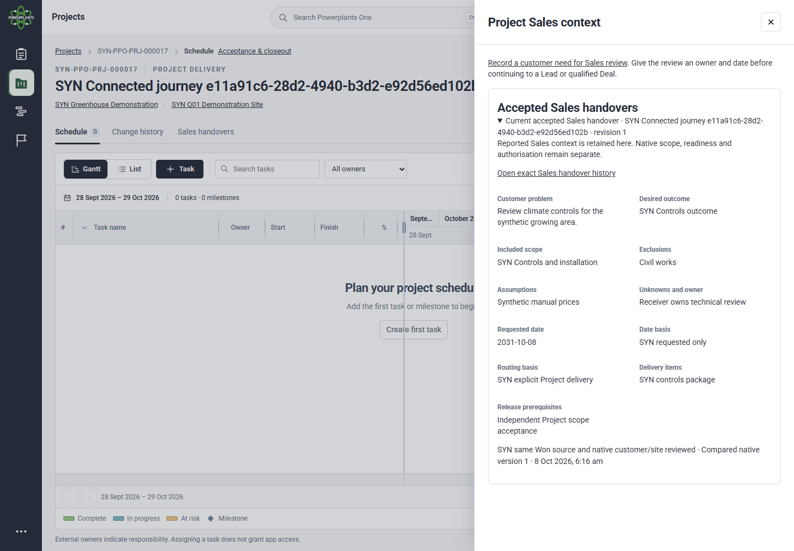
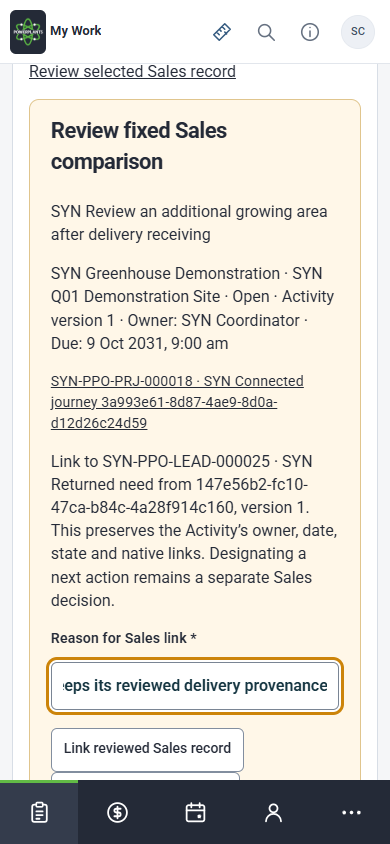

# Current-main connected journey execution

<!-- versioning: git; committed history is authoritative -->

Owner: Dean Fiedler. Executed by the implementation agent on 8 October 2026. Review: local synthetic verification passed; owner/device/visual acceptance pending.

Application baseline: main `4f883d145b18876840c5ce5522059c95448dc086`. [Decision](../../../decisions/integrated-journey-acceptance.md), [owner walkthrough](../../../delivery/integrated-journey-owner-walkthrough.md). The contribution adds a connected browser regression and reconciles current records. Application/migration/seed/grant/dependency bytes are unchanged.

## Scenario and evidence boundaries

`tests/browser/integrated-journey.spec.ts` follows a single original Lead and its Deal through accepted Sales brief, native Discovery, exact cost version, quotation review/release/response, explicit Won with lost-response recovery, native Project creation/receiving and owned return-to-Sales.

Initial Lead/action, handover content/acceptance, Discovery/cost and commercial preparation use existing HTTP commands with the appropriate seeded synthetic roles. Native browser actions perform Lead conversion, estimating link review, exact commercial disclosure, Won original recovery, Project creation/linking, follow-up capture, new Lead creation/linking and next-action planning. Restricted technician HTTP reads are checked for refusal. No endpoint, grant or authority is bypassed. This does not execute the entire PP-01 service/Finance narrative.

## Execution record

Windows; Node 24.21.0, npm 11.19.0, Playwright 1.63.0 and installed Chrome 154.0.8037.98. Private isolated PostgreSQL 16 cluster with database `ppo_synthetic_test`, loopback application and document store outside Git. Fresh migration/seed through 0076, renderer smoke check and compiled build passed. Initial changed-file lint and TypeScript passed.

Initial connected run: both desktop and phone reached Project receiving, then failed an over-broad test assertion because `observed_at` differs on each read. All saved/derived business fields matched. The corrected comparison excludes only that transport timestamp and still checks every business field.

The next connected run reached the Project's saved Sales context, then waited for a link inside the dialog it had just closed while checking Escape/focus return. This is a scenario-navigation error, not evidence that the application link is missing. The scenario must reopen the observed Sales handovers control before continuing.

Final connected run: **2 passed**, desktop 42.0 seconds and phone 35.4 seconds (2.7 minutes including startup). Both ran the complete same-record chain. The preceding combined run passed all **43 surrounding cases**, with the existing mobile column-resize skip and the two then-unfixed connected-scenario failures above. The six surrounding suites were `leads`, `sales-estimating-binding`, `commercial-continuity`, `outcome-sources`, `sales-delivery-binding` and `sales-followup`. These are separate runs, not a retrospectively green combined run.

The read-only reopen helper initially used the API-shaped workspace URL as a browser route, resulting in 404; the actual UI route is `/estimating/discovery/:id`. A subsequent startup exceeded its initial 60-second readiness allowance; the final helper allows four minutes and bounds individual readiness requests. An earlier manual launcher collided with the Playwright-owned listener. Final lifecycle execution used one owned server at a time. These are retained harness observations, not established application regressions.

Actual restart passed: the application stopped, both owned listeners were verified closed, and PostgreSQL restarted the same private cluster without reset, restore, migration or seed. **367 checked tables**, **75 migration ledger entries through 0076** (0016 remains reserved), and **19 stored files** were identical. Session rows and Session audit events are explicitly excluded from table comparison. Fresh application and database process identities differ. Both viewport journeys reopened all ten saved routes; each original Won receipt and exact quotation HTML/PDF remained identical. [Restart summary](restart-summary.json).

The final TypeScript check, changed-file ESLint, compiled build, foundation, prototype, naming and development-register checks are recorded separately from business acceptance. The live design register has 350 entries, 196 routes and 39 components; all 350 entry and 39 component reviews remain pending. No UI, guide, component or route changed, so no design review is claimed.

## Retained review artifacts

[Desktop saved IDs](desktop-entry-records.json), [phone saved IDs](mobile-entry-records.json), [restart/process/output evidence](restart-summary.json) and [artifact hashes](artifact-hashes.json) contain synthetic review data. Source application bytes remain main `4f883d1`. Later test metadata records the actual checkout automatically rather than hard-coding this baseline. Raw database snapshots, browser traces, local configuration and downloaded hosted files remain outside Git.

The following captures were visually inspected for this bounded handover. They are observed screenshots, not accepted design baselines or independent visual approval.





## Reproduction

After `npm ci`, current migrations/seeds and `npm run build`, use the isolated local configuration:

```sh
npx playwright test -c playwright.compiled.config.ts tests/browser/integrated-journey.spec.ts --project desktop-chromium --project mobile-chromium --no-deps --reporter=list
```

Retained LC-11–LC-17 browser scenarios in `leads`, `sales-estimating-binding`, `commercial-continuity`, `outcome-sources`, `sales-delivery-binding` and `sales-followup` verify surrounding recovery, stale-source and permission boundaries. Database resets must never overlap the retained journey or browser server.

Use `scripts/integrated-journey-reopen.ts before <absolute-private-Playwright-output> <absolute-private-reopen-output>` with `node --env-file=.env.local --import tsx`. The helper owns and stops its compiled application and saves exact output/receipt references for both retained entries. Run `scripts/step6-preservation.ts before-restart <absolute-private-preservation-output>` using the same Node options. Stop and restart only the owned retained PostgreSQL cluster, checking both listeners are closed. Run preservation `after-restart <same-private-output> before-restart exact`, then reopen `after <same-entry-output> <same-reopen-output>`. The latter asserts new application/database process identities, the same cluster, saved routes, exact original receipts and HTML/PDF bytes. Do not run database resets concurrently.

## Hosted observation

Externally initiated [Azure update 37677805712](https://github.com/deanrfiedler-gif/powerplants-one/actions/runs/37677805712) succeeded on source `4f883d1`, finishing 8 October 06:03:38 Brisbane time. Database verification/upgrade and web/worker image update steps passed. Workflow checks recorded health 200 and anonymous protected-route refusal 401. This task did not dispatch a duplicate update.

Dean completed invited Microsoft sign-in in the Browser panel. The implementation agent then reopened **SYN Runtime verification 2026-09-14**, Deal `2a656e78-783d-4f92-a0a5-3caef89a371f`: Scoping/Open, retained owner and action-date-needed state. Estimate `b8e79b69-d4b9-4cb4-b0a5-8b4c2411625b` / **SYN-PPO-EST-000001** retained saved version 2 and AUD 1.00. Quotation `34f0cc6e-05ea-493d-9189-2f0432610915` / **SYN-PPO-QUO-000001** retained Draft revision 1, one render attempt and AUD 1.00.

Its exact saved HTML visibly rendered the reference, revision, synthetic scope and non-offer wording. The downloaded PDF was 418,081 bytes with a valid PDF signature; independently calculated SHA-256 **`8c29d6b4be67c5e1fc6149c0365c228adf9d9c79945fb5c1952d01c0b0c2f1fa`** matched the app's recorded hash. The displayed HTML hash **`dae3ca87d54e81881ee46269a064b2c37cacd29453e557674c5c4ec82c104422`** was observed, not independently recomputed. Hosted records, invitation expiry and access scope were unchanged; no quotation was issued or distributed.

## GitHub disposition

#362's final head has 54 successful checks. For merged source `4f883d1`, [compiled browser assurance](https://github.com/deanrfiedler-gif/powerplants-one/actions/runs/37676316530) passed all desktop, mobile and retained proof jobs. [CRM assurance](https://github.com/deanrfiedler-gif/powerplants-one/actions/runs/37676316438) passed; its first visual job was cancelled during preparation and the requested incomplete-job rerun succeeded. Documentation, development register, Products, Email Calendar, E1 and quotation response/conversion/disposition/Supply follow-up also passed on this source. [Broad application assurance](https://github.com/deanrfiedler-gif/powerplants-one/actions/runs/37676316416) was still running at this checkpoint; its uncompleted jobs are not called passes.

This contribution's PR checks, remaining main-source jobs, owner/physical-device/screen-reader/visual acceptance, measured benefits, actual hosted worker execution and managed PostgreSQL minor remain separate obligations. No production-readiness claim is made.
